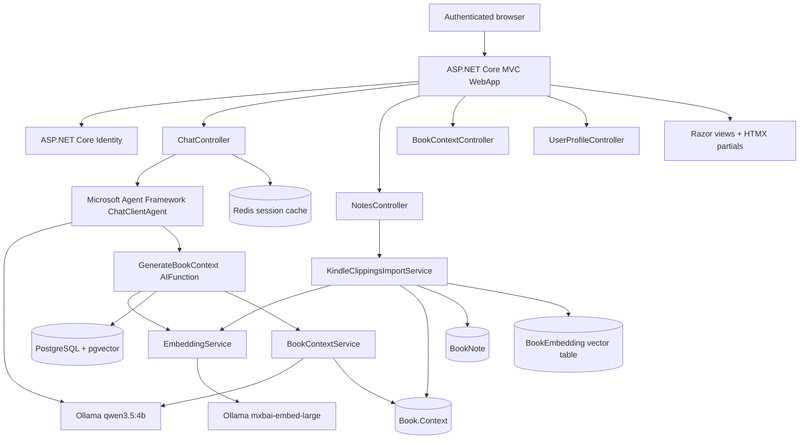
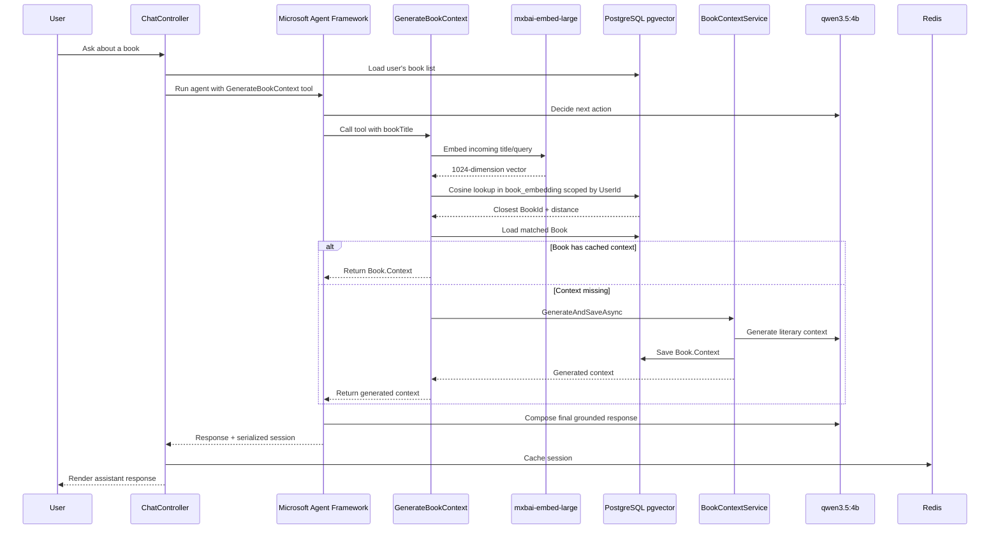

# Book Notes IA

Book Notes IA is a local-first AI reading assistant built with ASP.NET Core MVC on .NET 9. It imports Kindle clipping `.txt` files into a private per-user reading library, stores books and notes in PostgreSQL, uses Redis for Microsoft Agent Framework session cache, and answers book questions through a local Ollama model.

The project is also a study project for modern .NET AI application patterns: Microsoft Agent Framework orchestration, native agent tools, `Microsoft.Extensions.AI`, local embeddings, PostgreSQL pgvector search, EF Core migrations, Docker-first development, and regression tests that run against a real Postgres container.

## Stack

- .NET 9 MVC and Razor views
- Microsoft Agent Framework + `Microsoft.Extensions.AI`
- Ollama via OllamaSharp
- Chat model: `qwen3.5:4b`
- Embedding model: `mxbai-embed-large`
- PostgreSQL 18 with pgvector
- EF Core 9 and Npgsql
- Redis distributed cache
- ASP.NET Core Identity
- HTMX + Hyperscript + Shoelace
- Sass compilation with `AspNetCore.SassCompiler`
- Docker Compose

## Current Services

`docker compose` starts these services:

- `webapp` on `http://localhost:8080`
- `ollama` on `http://localhost:11434`
- `postgres` on port `5432`
- `redis` on port `6379`

The Ollama container pulls both `qwen3.5:4b` and `mxbai-embed-large`.

## Features

- Local AI chat powered by Ollama
- Microsoft Agent Framework session orchestration
- Native `GenerateBookContext` agent tool for book questions
- User login and registration with ASP.NET Core Identity
- Profile-driven assistant behavior
- Kindle clipping import into books and notes
- Per-user semantic book lookup with PostgreSQL pgvector
- Generated literary context saved on `Book.Context`
- Redis-backed chat/session caching
- Optional Unsplash home background image
- Sass-based styling with generated CSS kept out of git

## Architecture


```mermaid
flowchart TD
    Browser[Authenticated browser] --> MVC[ASP.NET Core MVC WebApp]
    MVC --> Identity[ASP.NET Core Identity]
    MVC --> ChatController[ChatController]
    MVC --> NotesController[NotesController]
    MVC --> BookContextController[BookContextController]
    MVC --> UserProfileController[UserProfileController]

    ChatController --> Agent[Microsoft Agent Framework ChatClientAgent]
    Agent --> ChatModel[Ollama qwen3.5:4b]
    Agent --> Tool[GenerateBookContext AIFunction]

    Tool --> EmbeddingService[EmbeddingService]
    EmbeddingService --> EmbeddingModel[Ollama mxbai-embed-large]
    Tool --> Pgvector[(PostgreSQL + pgvector)]
    Tool --> BookContextService[BookContextService]
    BookContextService --> ChatModel
    BookContextService --> Books[(Book.Context)]

    NotesController --> Import[KindleClippingsImportService]
    Import --> EmbeddingService
    Import --> Books
    Import --> Notes[(BookNote)]
    Import --> BookEmbeddings[(BookEmbedding vector table)]

    ChatController --> Redis[(Redis session cache)]
    MVC --> Views[Razor views + HTMX partials]
```

## Chat Book Lookup Flow

When a user asks about a book, the assistant should not guess from general model knowledge first. It should call the native Microsoft Agent Framework tool and use the user's saved library.


```mermaid
sequenceDiagram
    participant User
    participant Chat as ChatController
    participant MAF as Microsoft Agent Framework
    participant Tool as GenerateBookContext
    participant Embed as mxbai-embed-large
    participant DB as PostgreSQL pgvector
    participant Context as BookContextService
    participant LLM as qwen3.5:4b
    participant Redis

    User->>Chat: Ask about a book
    Chat->>DB: Load user's book list
    Chat->>MAF: Run agent with GenerateBookContext tool
    MAF->>LLM: Decide next action
    MAF->>Tool: Call tool with bookTitle
    Tool->>Embed: Embed incoming title/query
    Embed-->>Tool: 1024-dimension vector
    Tool->>DB: Cosine lookup in book_embedding scoped by UserId
    DB-->>Tool: Closest BookId + distance
    Tool->>DB: Load matched Book
    alt Book has cached context
        Tool-->>MAF: Return Book.Context
    else Context missing
        Tool->>Context: GenerateAndSaveAsync
        Context->>LLM: Generate literary context
        Context->>DB: Save Book.Context
        Context-->>Tool: Generated context
        Tool-->>MAF: Return generated context
    end
    MAF->>LLM: Compose final grounded response
    MAF-->>Chat: Response + serialized session
    Chat->>Redis: Cache session
    Chat-->>User: Render assistant response
```

## pgvector and Embeddings

The app uses pgvector to make book lookup semantic instead of relying only on fragile string matching. At import time, each new book gets an embedding for:

```text
{Title} by {Author}
```

Those vectors are stored in the `book_embedding` table as `vector(1024)`, matching `mxbai-embed-large`. The table includes:

- `UserId` for strict per-user isolation
- `BookId` with cascade delete
- denormalized `Title` and `Author`
- `Embedding` with an HNSW `vector_cosine_ops` index
- `CreatedAt`

At chat time, `BookContextAgentTool` embeds the user's requested title or phrase and runs a cosine-distance query scoped to the authenticated user's `UserId`. If the closest distance is at or below the configured threshold (`0.5`), the tool loads that book. If no vector match is good enough, it falls back to the older normalized string lookup so older imported books can still resolve.

Important implementation details:

- `Program.cs` builds an `NpgsqlDataSource` with `UseVector()`.
- Startup applies EF migrations and calls `ReloadTypes()` so Npgsql sees the `vector` extension after migrations create it.
- Docker uses the `pgvector/pgvector:0.8.2-pg18-trixie` image.
- PostgreSQL 18 stores data under a major-version-specific directory, so the compose volume mounts at `/var/lib/postgresql`, not `/var/lib/postgresql/data`.

## Project Structure

```text
book-notes-ia/
├── Specs/                    # Mission, roadmap, tech stack, feature specs
├── WebApp/
│   ├── Areas/Identity/       # ASP.NET Core Identity UI
│   ├── Controllers/          # MVC controllers
│   ├── Data/                 # EF Core DbContext
│   ├── Migrations/           # EF Core migrations
│   ├── Models/               # Domain models
│   ├── Services/             # AI, cache, import, context, embedding services
│   ├── Styles/               # Sass source files
│   ├── Views/                # MVC views and partials
│   └── wwwroot/              # Static assets
├── WebApp.Tests/             # xUnit tests, including Docker-backed Postgres tests
├── docker-compose.yml
├── docker-compose.test.yml
├── Makefile
└── README.md
```

## Setup

### 1. Clone the repository

```bash
git clone <repo-url>
cd book-notes-ia
```

### 2. Create your local env file

```bash
cp .env.example .env
```

If you do not want to use Unsplash right now, leave the keys empty. The app will use its built-in fallback.

```env
UNSPLASH_ACCESS_KEY=your_access_key_here
UNSPLASH_SECRET_KEY=your_secret_key_here
```

### 3. Build and start the stack

Use the Makefile targets because they auto-detect Docker or Podman sockets:

```bash
make docker-build
make docker-run
```

Platform-specific startup targets:

```bash
make docker-run          # Linux / SteamOS
make docker-run-mac      # macOS Apple Silicon
make docker-run-windows  # Windows + Docker Desktop/WSL2 + NVIDIA GPU
```

Open the app at:

```bash
http://localhost:8080/
```

## Usage

From the app you can:

- Sign in or create an account
- Import Kindle clipping `.txt` files
- Browse imported books and notes
- Ask the local AI assistant about books in your library
- Let the assistant generate and save literary context for a book
- Edit your profile to influence assistant responses

Useful commands:

```bash
make ollama-logs
make ollama-chat
docker exec -it ollama ollama list
docker compose exec webapp bash
docker exec -it redis redis-cli
```

## Testing

Run the full Docker-backed suite:

```bash
make test
```

The test compose file starts an isolated PostgreSQL pgvector service, restores the solution in an SDK container, and runs `WebApp.Tests`.

The pgvector e2e tests create isolated test databases, apply EF migrations, reload Npgsql types, seed `Book` and `BookEmbedding` rows, and verify that vector lookup resolves the expected book and persists generated context.

## Configuration

### Ollama

Configured in `WebApp/appsettings.json` and container env:

- `Ollama:OllamaURL`
- `Ollama:OllamaModel`

The chat model is `qwen3.5:4b`. The embedding model is configured in `Program.cs` as `mxbai-embed-large`.

### Database and Cache

Configured through connection strings:

- `ConnectionStrings:DefaultConnection`
- `ConnectionStrings:Redis`

At startup the app applies EF Core migrations automatically.

### Unsplash

Unsplash is optional. When `Unsplash:AccessKey` is configured, the app can fetch and cache a home background image. When it is missing, the app does not call Unsplash and falls back to a solid background color.

## Troubleshooting

### PostgreSQL 18 volume layout error

If Postgres says there is old data under `/var/lib/postgresql/data`, recreate the stack with the current volume config:

```bash
make docker-down
make docker-run
```

The compose file now mounts `pg18_data` at `/var/lib/postgresql`.

### Ollama is not responding

```bash
docker logs ollama
docker exec -it ollama ollama list
```

### Web app cannot connect to PostgreSQL

```bash
docker logs postgres
```

Verify the connection string matches `docker-compose.yml`.

### Redis issues

```bash
docker logs redis
```

### Rebuild everything clean

```bash
make docker-down
make docker-build
make docker-run
```

## Study Notes

This project is useful for studying a few connected implementation ideas:

- How Microsoft Agent Framework sessions are serialized and cached.
- How to expose application behavior as a native `AIFunction` tool.
- How local chat and local embeddings can use separate Ollama models.
- How pgvector turns a user phrase into a semantic lookup over application data.
- Why user-owned data must always be filtered by `UserId`.
- Why Npgsql needs pgvector type registration and type reload after migrations create the extension.
- How Docker-backed tests catch integration bugs that in-memory EF tests cannot.

## Git Guidelines

Branch names:

- `feat/branch-name`
- `hotfix/branch-name`
- `poc/branch-name`

Commit prefixes:

- `chore(scope): message`
- `feat(scope): message`
- `fix(scope): message`
- `refactor(scope): message`
- `tests(scope): message`
- `docs(scope): message`
