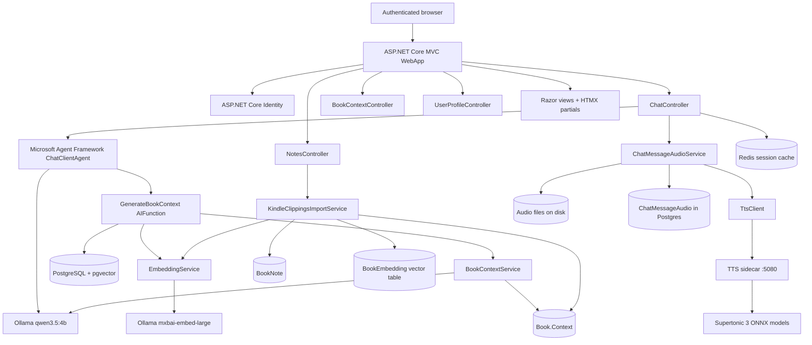
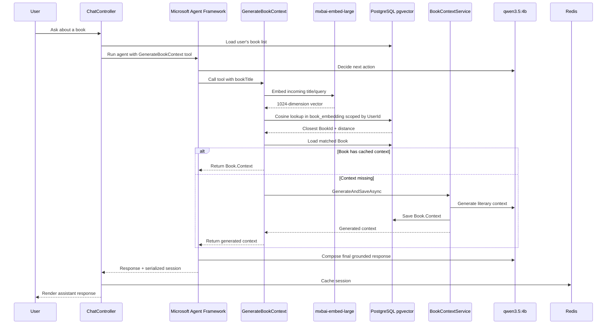

# Book Notes IA

Book Notes IA is a local-first AI reading assistant built with ASP.NET Core MVC on .NET 9. It imports Kindle clipping `.txt` files into a private per-user reading library, stores books and notes in PostgreSQL, uses Redis for Microsoft Agent Framework session cache, answers book questions through a local Ollama model, and reads assistant responses aloud using a local Supertonic 3 TTS sidecar.

The project is also a study project for modern .NET AI application patterns: Microsoft Agent Framework orchestration, native agent tools, `Microsoft.Extensions.AI`, local embeddings, PostgreSQL pgvector search, EF Core migrations, ONNX Runtime inference, Docker-first development, and regression tests that run against a real Postgres container.

## Stack

- .NET 9 MVC and Razor views
- Microsoft Agent Framework + `Microsoft.Extensions.AI`
- Ollama via OllamaSharp
- Free chat models: `qwen3.5:4b`, `llama3.2:3b`, `phi4-mini:3.8b`, `granite4:3b`
- Embedding model: `mxbai-embed-large`
- PostgreSQL 18 with pgvector
- EF Core 9 and Npgsql
- Redis distributed cache
- ASP.NET Core Identity
- HTMX + Hyperscript + Shoelace
- Sass compilation with `AspNetCore.SassCompiler`
- Supertonic 3 TTS via ONNX Runtime (local voice synthesis sidecar)
- Docker Compose

## Current Services

`docker compose` starts these services:

- `webapp` on `http://localhost:8080`
- `tts` on `http://localhost:5080` — Supertonic 3 voice synthesis sidecar
- `ollama` on `http://localhost:11434`
- `postgres` on port `5432`
- `redis` on port `6379`

The Ollama container pulls `qwen3.5:4b`, `llama3.2:3b`, `phi4-mini:3.8b`, `granite4:3b`, and `mxbai-embed-large` on first start — this makes the first startup heavier and slower than before. All four chat models support native tool calling, which the app relies on for book-context and notes lookup. The TTS sidecar mounts Supertonic 3 ONNX model assets from `services/TtsService.Api/assets/supertonic-3/` (not included in the repository — see Setup).

## Features

- Local AI chat powered by Ollama
- Microsoft Agent Framework session orchestration
- Native `GenerateBookContext` agent tool for book questions
- User login and registration with ASP.NET Core Identity
- Profile-driven assistant behavior (preferred language, tone, goals)
- Kindle clipping import into books and notes
- Per-user semantic book lookup with PostgreSQL pgvector
- Generated literary context saved on `Book.Context`
- Redis-backed chat/session caching
- Text-to-speech playback for every assistant response using a local Supertonic 3 voice model
- Audio play/pause controls inline in each chat message; audio cached per message so page refresh keeps it
- Assistant always responds in the user's preferred language regardless of the book's source language
- Optional Unsplash home background image
- Sass-based styling with generated CSS kept out of git

## Architecture


```mermaid
flowchart TD
    Browser[Authenticated browser] --> MVC[ASP.NET Core MVC WebApp]
    MVC --> Identity[ASP.NET Core Identity]
    MVC --> ChatController[ChatController]
    MVC --> NotesController[NotesController]
    MVC --> BookContextController[BookContextController]
    MVC --> UserProfileController[UserProfileController]

    ChatController --> Agent[Microsoft Agent Framework ChatClientAgent]
    Agent --> ChatModel[Ollama qwen3.5:4b]
    Agent --> Tool[GenerateBookContext AIFunction]

    Tool --> EmbeddingService[EmbeddingService]
    EmbeddingService --> EmbeddingModel[Ollama mxbai-embed-large]
    Tool --> Pgvector[(PostgreSQL + pgvector)]
    Tool --> BookContextService[BookContextService]
    BookContextService --> ChatModel
    BookContextService --> Books[(Book.Context)]

    NotesController --> Import[KindleClippingsImportService]
    Import --> EmbeddingService
    Import --> Books
    Import --> Notes[(BookNote)]
    Import --> BookEmbeddings[(BookEmbedding vector table)]

    ChatController --> AudioService[ChatMessageAudioService]
    AudioService --> TtsClient[TtsClient]
    TtsClient --> TtsSidecar[TTS sidecar :5080]
    TtsSidecar --> ONNXModels[Supertonic 3 ONNX models]
    AudioService --> AudioStorage[(Audio files on disk)]
    AudioService --> AudioDb[(ChatMessageAudio in Postgres)]

    ChatController --> Redis[(Redis session cache)]
    MVC --> Views[Razor views + HTMX partials]
```

## Chat Book Lookup Flow

When a user asks about a book, the assistant should not guess from general model knowledge first. It should call the native Microsoft Agent Framework tool and use the user's saved library.


```mermaid
sequenceDiagram
    participant User
    participant Chat as ChatController
    participant MAF as Microsoft Agent Framework
    participant Tool as GenerateBookContext
    participant Embed as mxbai-embed-large
    participant DB as PostgreSQL pgvector
    participant Context as BookContextService
    participant LLM as qwen3.5:4b
    participant Redis

    User->>Chat: Ask about a book
    Chat->>DB: Load user's book list
    Chat->>MAF: Run agent with GenerateBookContext tool
    MAF->>LLM: Decide next action
    MAF->>Tool: Call tool with bookTitle
    Tool->>Embed: Embed incoming title/query
    Embed-->>Tool: 1024-dimension vector
    Tool->>DB: Cosine lookup in book_embedding scoped by UserId
    DB-->>Tool: Closest BookId + distance
    Tool->>DB: Load matched Book
    alt Book has cached context
        Tool-->>MAF: Return Book.Context
    else Context missing
        Tool->>Context: GenerateAndSaveAsync
        Context->>LLM: Generate literary context
        Context->>DB: Save Book.Context
        Context-->>Tool: Generated context
        Tool-->>MAF: Return generated context
    end
    MAF->>LLM: Compose final grounded response
    MAF-->>Chat: Response + serialized session
    Chat->>Redis: Cache session
    Chat-->>User: Render assistant response
```

## pgvector and Embeddings

The app uses pgvector to make book lookup semantic instead of relying only on fragile string matching. At import time, each new book gets an embedding for:

```text
{Title} by {Author}
```

Those vectors are stored in the `book_embedding` table as `vector(1024)`, matching `mxbai-embed-large`. The table includes:

- `UserId` for strict per-user isolation
- `BookId` with cascade delete
- denormalized `Title` and `Author`
- `Embedding` with an HNSW `vector_cosine_ops` index
- `CreatedAt`

At chat time, `BookContextAgentTool` embeds the user's requested title or phrase and runs a cosine-distance query scoped to the authenticated user's `UserId`. If the closest distance is at or below the configured threshold (`0.5`), the tool loads that book. If no vector match is good enough, it falls back to the older normalized string lookup so older imported books can still resolve.

Important implementation details:

- `Program.cs` builds an `NpgsqlDataSource` with `UseVector()`.
- Startup applies EF migrations and calls `ReloadTypes()` so Npgsql sees the `vector` extension after migrations create it.
- Docker uses the `pgvector/pgvector:0.8.2-pg18-trixie` image.
- PostgreSQL 18 stores data under a major-version-specific directory, so the compose volume mounts at `/var/lib/postgresql`, not `/var/lib/postgresql/data`.

## Project Structure

```text
book-notes-ia/
├── Specs/                    # Mission, roadmap, tech stack, feature specs
├── WebApp/
│   ├── Areas/Identity/       # ASP.NET Core Identity UI
│   ├── Controllers/          # MVC controllers
│   ├── Data/                 # EF Core DbContext
│   ├── Migrations/           # EF Core migrations
│   ├── Models/               # Domain models
│   ├── Services/             # AI, cache, import, context, embedding, TTS audio services
│   ├── Styles/               # Sass source files
│   ├── Views/                # MVC views and partials
│   └── wwwroot/              # Static assets
├── WebApp.Tests/             # xUnit tests, including Docker-backed Postgres tests
├── services/
│   ├── TtsService.Api/       # Supertonic 3 TTS sidecar (ASP.NET Core, ONNX Runtime)
│   └── TtsService.Tests/     # xUnit unit tests for the TTS service
├── docker-compose.yml
├── docker-compose.test.yml
├── Makefile
└── README.md
```

## Setup

### 1. Clone the repository

```bash
git clone <repo-url>
cd book-notes-ia
```

### 2. Create your local env file

```bash
cp .env.example .env
```

If you do not want to use Unsplash right now, leave the keys empty. The app will use its built-in fallback.

```env
UNSPLASH_ACCESS_KEY=your_access_key_here
UNSPLASH_SECRET_KEY=your_secret_key_here
```

### 3. Build and start the stack

Use the Makefile targets because they auto-detect Docker or Podman sockets:

```bash
make docker-build
make docker-run
```

Platform-specific startup targets:

```bash
make docker-run          # Linux / SteamOS
make docker-run-mac      # macOS Apple Silicon
make docker-run-windows  # Windows + Docker Desktop/WSL2 + NVIDIA GPU
```

Open the app at:

```bash
http://localhost:8080/
```

## Usage

From the app you can:

- Sign in or create an account
- Import Kindle clipping `.txt` files
- Browse imported books and notes
- Ask the local AI assistant about books in your library
- Let the assistant generate and save literary context for a book
- Edit your profile to influence assistant responses

Useful commands:

```bash
make ollama-logs
make ollama-chat
docker exec -it ollama ollama list
docker compose exec webapp bash
docker exec -it redis redis-cli
```

## Testing

Run the full Docker-backed suite:

```bash
make test
```

The test compose file starts an isolated PostgreSQL pgvector service, restores the solution in an SDK container, and runs both `WebApp.Tests` and `TtsService.Tests`.

The `WebApp.Tests` pgvector e2e tests create isolated test databases, apply EF migrations, reload Npgsql types, seed `Book` and `BookEmbedding` rows, and verify that vector lookup resolves the expected book and persists generated context.

The `TtsService.Tests` unit tests cover voice and language resolution logic in the TTS sidecar; they have no external dependencies and run in milliseconds.

## Configuration

### Ollama

Configured in `WebApp/appsettings.json` and container env:

- `Ollama:OllamaURL`
- `Ollama:NumCtx`

The free chat models (`qwen3.5:4b`, `llama3.2:3b`, `phi4-mini:3.8b`, `granite4:3b`) are defined in `WebApp/Services/ChatAgentCatalog.cs`, the single source of truth for free-agent keys, labels, and model names — add a model there (plus a Docker pull entry) to introduce another free agent without touching controller or view code. Pick models that support native Ollama tool calling; the app attaches book-context and notes tools to every chat turn, and a model without tool support will error on send. The embedding model is configured in `Program.cs` as `mxbai-embed-large`.

### Database and Cache

Configured through connection strings:

- `ConnectionStrings:DefaultConnection`
- `ConnectionStrings:Redis`

At startup the app applies EF Core migrations automatically.

### Text-to-Speech

The TTS sidecar is configured in `docker-compose.yml` and `WebApp/appsettings.json`:

- `Tts:BaseUrl` — URL of the TTS sidecar (default `http://tts:5080`)
- `Tts:UsePlaceholder` — set to `true` to skip the ONNX models and return a placeholder tone (useful for testing without model assets)
- `Supertonic:AssetsPath` — path inside the TTS container where Supertonic 3 ONNX model files are mounted

The Supertonic 3 model assets must be placed at `services/TtsService.Api/assets/supertonic-3/` before running the stack. The assets directory is mounted read-only into the `tts` container.

- `AudioStorage:BasePath` — filesystem path inside the `webapp` container where generated WAV files are stored (default `/audio-storage`)

### Unsplash

Unsplash is optional. When `Unsplash:AccessKey` is configured, the app can fetch and cache a home background image. When it is missing, the app does not call Unsplash and falls back to a solid background color.

### Azure OpenAI (Premium agent)

The home page lets a signed-in user pick between four **Free** local agents (Qwen 3.5, Llama 3.2, Phi-4 Mini, Granite 4 — all via Ollama, no setup required) and the **Premium** agent (Azure OpenAI). Premium requires three values in `.env`:

```env
AZURE_OPENAI_ENDPOINT=https://<your-resource-name>.openai.azure.com/
AZURE_LLM_DEPLOYMENT_NAME=<your-deployment-name>
AZURE_OPENAI_API_KEY=<your-api-key>
```

How to find these in the [Azure AI Foundry](https://ai.azure.com) portal:

1. Open your project's **Overview** page.
2. Under **"Call this model"**, copy the **Azure OpenAI endpoint** — it looks like `https://<resource-name>.openai.azure.com/openai/v1`. Use only the base URL (scheme + host), e.g. `https://<resource-name>.openai.azure.com/`. Do **not** use the `/openai/v1` suffix, and do **not** use the **Project endpoint** (`services.ai.azure.com/api/projects/...`) — that's a different API (Foundry Agents), not the Chat Completions API this app calls.
3. Copy the **API key** shown on the same page.
4. Go to **Build → Deployments** and find your model. Use the **deployment name** shown there, not the underlying model name — they can differ (e.g. a `gpt-5.5` model can be deployed under any custom deployment name you chose).
5. Restart the stack after editing `.env` — environment variables are only read at container start:

```bash
make docker-down
make docker-run
```

If `AZURE_OPENAI_ENDPOINT`/`AZURE_LLM_DEPLOYMENT_NAME`/`AZURE_OPENAI_API_KEY` are left empty, only the Free agents are usable; selecting Premium will surface an error in chat instead of silently falling back to Ollama.

## Troubleshooting

### PostgreSQL 18 volume layout error

If Postgres says there is old data under `/var/lib/postgresql/data`, recreate the stack with the current volume config:

```bash
make docker-down
make docker-run
```

The compose file now mounts `pg18_data` at `/var/lib/postgresql`.

### Ollama is not responding

```bash
docker logs ollama
docker exec -it ollama ollama list
```

### Web app cannot connect to PostgreSQL

```bash
docker logs postgres
```

Verify the connection string matches `docker-compose.yml`.

### Redis issues

```bash
docker logs redis
```

### TTS sidecar not generating audio

Check that the Supertonic 3 ONNX model assets are present at `services/TtsService.Api/assets/supertonic-3/`:

```bash
ls services/TtsService.Api/assets/supertonic-3/
```

If the directory is empty or missing, the sidecar will log a startup warning and fall back to placeholder audio (a tone). Download or copy the model files into that directory and rebuild:

```bash
make docker-build
make docker-run
```

Check TTS sidecar logs:

```bash
docker logs tts
```

### Audio unavailable in chat

If the play button shows "Audio unavailable", the webapp failed to reach the TTS sidecar or the sidecar returned an error. Verify both containers are running:

```bash
docker ps
docker logs tts
docker logs webapp
```

### Premium agent (Azure OpenAI) fails to respond

Selecting Premium and sending a message can fail in a few distinct ways — check the `webapp` logs to see which one:

```bash
docker logs webapp
```

**`SocketException: Name or service not known (<host>:443)`** — DNS cannot resolve `AZURE_OPENAI_ENDPOINT`'s host. Usually means the resource name in `.env` is stale or mistyped. Re-check the endpoint in the Azure AI Foundry portal (see [Configuration → Azure OpenAI](#azure-openai-premium-agent)) and confirm it matches exactly, including the resource name.

**`HTTP 404 invalid_request_error: DeploymentNotFound`** — the endpoint itself is reachable and correct, but `AZURE_LLM_DEPLOYMENT_NAME` does not match any deployment on that resource. Go to **Build → Deployments** in the portal and copy the exact deployment name (not the model name) into `.env`.

**`HTTP 400 invalid_request_error: unsupported_value` for `temperature`** — some models (reasoning-family models like `gpt-5.x`/`o1`/`o3`) only support the default `temperature=1` and reject any explicit override. `Program.cs`'s Azure `IChatClient` registration does not set `Temperature` for this reason; if you see this error after modifying that registration, remove the `Temperature` override again.

In all three cases, the Free local agents are unaffected — Premium failures do not silently fall back to Ollama, they surface as an error message in the chat UI.

### Rebuild everything clean

```bash
make docker-down
make docker-build
make docker-run
```

## Study Notes

This project is useful for studying a few connected implementation ideas:

- How Microsoft Agent Framework sessions are serialized and cached.
- How to expose application behavior as a native `AIFunction` tool.
- How local chat and local embeddings can use separate Ollama models.
- How pgvector turns a user phrase into a semantic lookup over application data.
- Why user-owned data must always be filtered by `UserId`.
- Why Npgsql needs pgvector type registration and type reload after migrations create the extension.
- How Docker-backed tests catch integration bugs that in-memory EF tests cannot.
- How to run ONNX Runtime inference pipelines in .NET for multi-stage TTS synthesis.
- How to enforce LLM response language across tool results in multiple languages using system prompt structure.
- How to cache generated audio per message so TTS does not run on every page load.

## Git Guidelines

Branch names:

- `feat/branch-name`
- `hotfix/branch-name`
- `poc/branch-name`

Commit prefixes:

- `chore(scope): message`
- `feat(scope): message`
- `fix(scope): message`
- `refactor(scope): message`
- `tests(scope): message`
- `docs(scope): message`
