# Book Notes IA | Fábio R. Nóbrega  

This project is a **local AI web app playground** built with [.NET 9.0 MVC](https://learn.microsoft.com/en-us/aspnet/core/tutorials/first-mvc-app/start-mvc?view=aspnetcore-9.0&tabs=visual-studio) and [Microsoft Semantic Kernel](https://github.com/microsoft/semantic-kernel).  
It integrates with **Ollama** to run a **local LLM (Gemma 3 270M)** — fully offline, free, and ready for experiments with **htmx**, **hyperscript**, and **Shoelace** UI components.  


We use:  
- .NET SDK: 9.0.30  
- Semantic Kernel (AI SDK for .NET)  
- Ollama with [Gemma 3 (270M parameters)](https://ollama.com/library/gemma3:270m)
- SQLite (for local persistence)  
- Docker + Docker Compose  
- HTMX + Hyperscript + Shoelace (no heavy JS frontend)  

---

## Table of contents

* [Install](#install)  
* [Usage](#usage)  
* [Architecture](#architecture)  
* [Troubleshooting](#troubleshooting)  
* [Git Guideline](#git-guideline)  

---

## Install

Clone the repo and enter the project folder:

```bash
cd book-notes-ia
```

Make sure **Docker Desktop** is installed and running.  
Build and run the stack with:

```bash
make docker-up
```

This will start **2 services** with hot reload:

- **webapp** → .NET MVC + Semantic Kernel (port 8080)  
- **ollama** → local LLM server running Gemma 3 (port 11434)  

## Usage

Once running, open your browser at:  

```bash
http://localhost:8080/
```

From there you can:

- Interact with a **local AI model** using the MVC web UI.  
- See **live reload** — changes in `.cs`, `.cshtml`, or `.css` files trigger auto rebuilds via `dotnet watch run`.  
- The .NET app communicates directly with Ollama at `http://ollama:11434`.

You can also test Ollama directly:

```bash
docker exec -it ollama ollama run gemma3:270m
```

---

## Architecture

### Service Overview

```mermaid
flowchart LR
    user([🌐 Browser])
    web([🧩 WebApp<br/>.NET MVC + Semantic Kernel])
    ollama([🦙 Ollama Server<br/>Gemma3:270M LLM])

    user --> web
    web --> ollama
```



## Troubleshooting

WIP

## Git Guideline

Follow clear naming and commit conventions.

### Branches

- Feature:  `feat/branch-name`  
- Hotfix: `hotfix/branch-name`  
- POC: `poc/branch-name`  

### Commit prefixes

- Chore: `chore(context): message`  
- Feat: `feat(context): message`  
- Fix: `fix(context): message`  
- Refactor: `refactor(context): message`  
- Tests: `tests(context): message`  
- Docs: `docs(context): message`  
