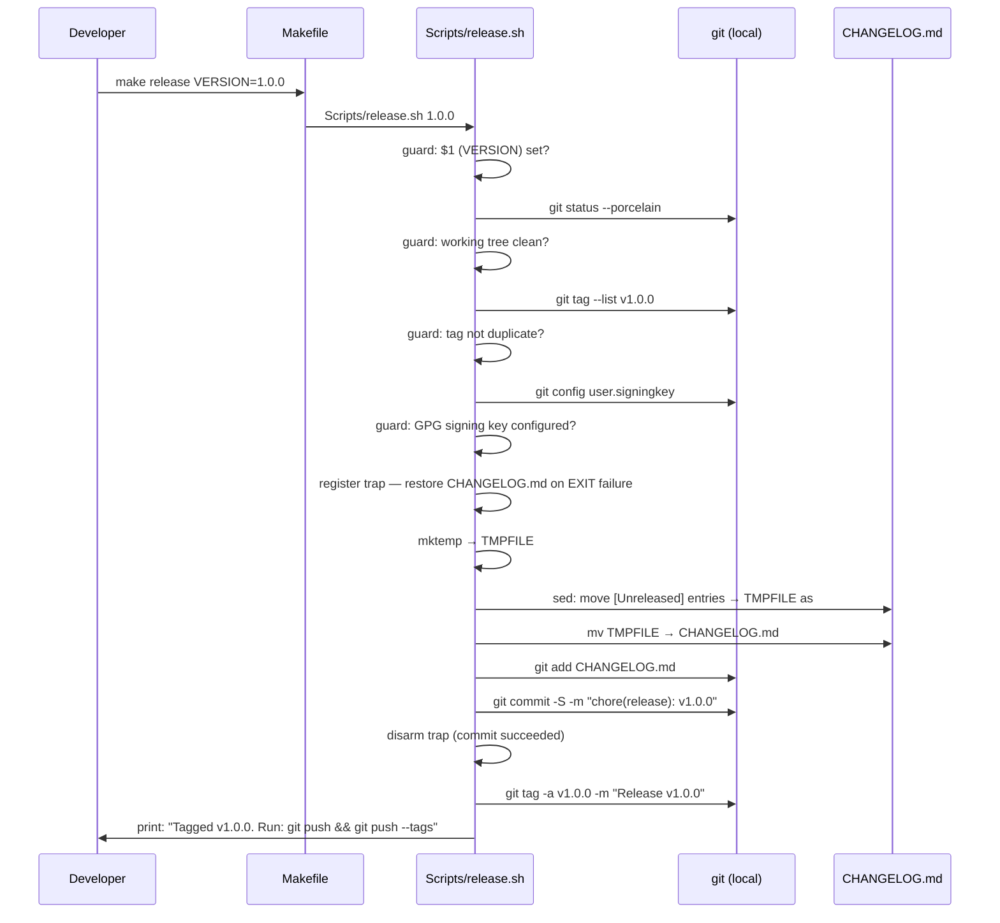

# Plan: Release Command

## Table of Contents

- [Summary](#summary)
- [Technical Approach](#technical-approach)
- [Component Breakdown](#component-breakdown)
- [Dependencies](#dependencies)
- [Flow](#flow)
- [Risk Assessment](#risk-assessment)

## Summary

A new `Scripts/release.sh` script handles guards, CHANGELOG mutation, commit creation, and tagging. The `Makefile` gains a thin `release` target that calls the script, following the same pattern used by existing targets that delegate to shell logic (`ollama-chat`, `docker-*`).

## Technical Approach

The existing `Makefile` defines all developer commands as thin wrappers over `$(COMPOSE)` or `docker exec`. The release command follows the same pattern: the `Makefile` `release` target invokes `Scripts/release.sh $(VERSION)`, passing the version as positional argument `$1`. The script owns all logic.

**CHANGELOG.md structure** — `CHANGELOG.md` has been rewritten to conform to Keep a Changelog 1.1.0. It uses `## [Unreleased]` (with brackets) as the top section header, followed by the seven standard subheadings. The sed boundary is unambiguous: all content between `## [Unreleased]` and the next `##` line (the start of the previous versioned section or EOF) is the unreleased block to move.

**Portable sed with temp file** — In-place `sed` syntax differs between macOS BSD sed (`sed -i ''`) and GNU sed (`sed -i`). The script avoids this by writing output to a temp file created with `mktemp` and atomically replacing `CHANGELOG.md` with `mv`. A `trap` statement registered at the start of the script restores `CHANGELOG.md` from the temp file if the script exits non-zero at any point after mutation (FR6 guard requirement).

**Guard order** — All guards run before any file is touched: VERSION set → working tree clean → tag not duplicate → GPG key configured. The CHANGELOG mutation is the first destructive operation and occurs only after all guards pass.

**GPG signing** — The commit is created with `git commit -S`. The pre-flight GPG guard checks `git config user.signingkey` and aborts early if it is empty, so `CHANGELOG.md` is never modified when signing would fail.

**Executable bit** — `Scripts/release.sh` is committed to the repository using `git add --chmod=+x Scripts/release.sh` so the executable bit is preserved across all clones without manual `chmod`.

The commit message `chore(release): vVERSION` matches the `chore(scope): message` prefix defined in the Git Guidelines section of `README.md`.

After moving the unreleased entries, `## [Unreleased]` is reset to the seven standard Keep a Changelog 1.1.0 subheadings (`### Added`, `### Changed`, `### Deprecated`, `### Removed`, `### Fixed`, `### Security`) with no entries, so the next release cycle starts with the canonical template in place.

## Component Breakdown

**Existing files to modify:**

- [Makefile](../../Makefile) — add a `release` target (`Scripts/release.sh $(VERSION)`) and include `release` in the `.PHONY` declaration.
- [CHANGELOG.md](../../CHANGELOG.md) — already rewritten to Keep a Changelog 1.1.0 format; mutated at runtime by the script on each release.

**New files to create:**

- `Scripts/release.sh` — full release logic: guard checks, CHANGELOG update via `mktemp` + `trap`, GPG-signed commit, annotated tag. Committed with `git add --chmod=+x`.

## Dependencies

- `git` available on the developer host (already required by the project).
- `sed` and `date` available on the developer host (standard on macOS and Linux).
- `mktemp` available on the developer host (standard on macOS and Linux).
- A GPG agent running on the developer host with at least one secret key configured (`git config user.signingkey` non-empty).
- A clean working tree at the time `make release` is invoked.
- The developer must run `git push && git push --tags` manually after the command completes.

## Flow

## Risk Assessment

| Risk | Evidence | Mitigation |
| --- | --- | --- |
| `sed` in-place syntax differs between macOS BSD sed and GNU sed | macOS ships BSD sed; Linux uses GNU sed | Use `mktemp` + `mv` pattern; no `-i` flag needed |
| `git commit -S` fails (GPG key missing, expired, or passphrase cancelled) after CHANGELOG.md is already mutated | Without recovery, FR3 blocks all retries with a dirty working tree | Pre-flight GPG guard (FR6) aborts before mutation; `trap` on EXIT restores CHANGELOG.md if commit still fails |
| `## [Unreleased]` section missing from CHANGELOG.md (e.g. after a broken manual edit) | Script sed pattern would produce a malformed file | Guard: `grep -q '^## \[Unreleased\]' CHANGELOG.md` before mutation; abort with error if not found |
| Developer runs the command on a non-main branch | No branch enforcement in the Makefile | Print a warning (`not on main`) but do not hard-block, to allow `hotfix/*` branches per Git Guidelines |
| `mktemp` temp file left behind if script is killed with SIGKILL | `trap` does not fire on SIGKILL | Temp file is in the system temp directory; OS cleans it on reboot; acceptable risk |
