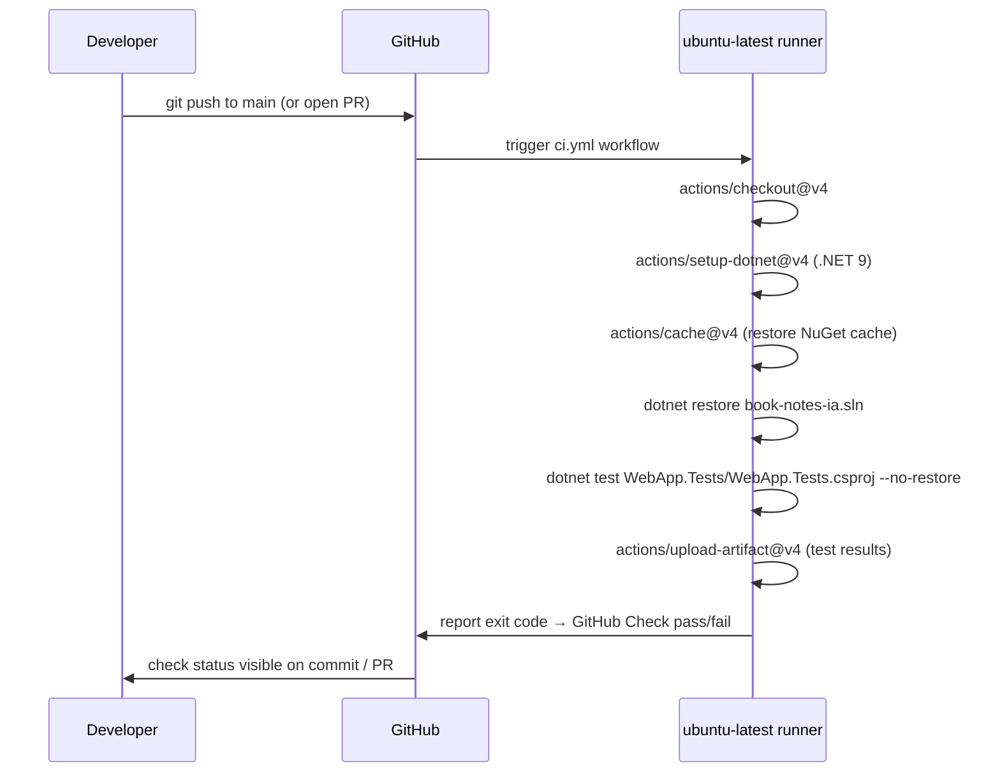

# Plan: CI Test Workflow

## Table of Contents

- [Plan: CI Test Workflow](#plan-ci-test-workflow)
  - [Summary](#summary)
  - [Technical Approach](#technical-approach)
  - [Component Breakdown](#component-breakdown)
  - [Dependencies](#dependencies)
  - [Flow](#flow)
  - [Risk Assessment](#risk-assessment)

## Summary

Add `.github/workflows/ci.yml` — a single GitHub Actions workflow that restores NuGet packages and runs `dotnet test WebApp.Tests/WebApp.Tests.csproj` on every push and pull request targeting `main`. No application code changes are required.

## Technical Approach

The existing test command in `docker-compose.test.yml` is:

```sh
dotnet restore book-notes-ia.sln && dotnet test WebApp.Tests/WebApp.Tests.csproj --no-restore --logger "console;verbosity=minimal"
```

This command runs entirely inside a `mcr.microsoft.com/dotnet/sdk:9.0` container with no network calls to PostgreSQL, Redis, or Ollama. All test dependencies are in-memory:

- `BookContextServiceTests` uses `Microsoft.EntityFrameworkCore.InMemory` and a `FakeOllamaService` stub.
- `ChatControllerTests` and `BookContextControllerTests` use controller-level mocks and do not start the ASP.NET Core host.

Because no external services are needed, the workflow can run `dotnet restore` and `dotnet test` directly on an `ubuntu-latest` runner without any service containers — matching the pattern used by standard .NET GitHub Actions workflows.

NuGet packages are cached by hashing `**/*.csproj` and `**/*.sln` files to avoid repeated restores on unchanged dependencies.

## Component Breakdown

**New files to create:**

- `.github/workflows/ci.yml` — GitHub Actions workflow definition. Triggers on `push` to any branch and `pull_request` targeting `main`. Steps: checkout → setup .NET 9 → cache NuGet → restore → test → upload results artifact.

**Existing files to modify:**

- None. The Makefile, docker-compose files, and solution are unchanged.

## Dependencies

- GitHub Actions runner: `ubuntu-latest` (provided by GitHub, no configuration needed).
- .NET SDK `9.0.x`: installed by `actions/setup-dotnet@v4`.
- NuGet package feed: `https://api.nuget.org/v3/index.json` (public; no auth token needed).
- `book-notes-ia.sln` and `WebApp.Tests/WebApp.Tests.csproj`: already present in the repository.

## Flow



## Risk Assessment

| Risk | Evidence | Mitigation |
| --- | --- | --- |
| Sass compiler (`AspNetCore.SassCompiler`) may attempt to download a native binary during `dotnet restore` on Linux | `WebApp/WebApp.csproj` references `AspNetCore.SassCompiler 1.93.2`; native tool download behavior varies by version | Run `dotnet restore` on the solution scope; if the Sass binary download fails, add a `<SassCompilerInstallSassAutomatically>false</SassCompilerInstallSassAutomatically>` property to the test project or disable it via an env var |
| NuGet restore time on cold runner (~60–90 s) may slow feedback | First run always cold; `nuget_cache` volume is Docker-local and unavailable to GitHub Actions | Cache `~/.nuget/packages` keyed on `**/*.csproj` hash via `actions/cache@v4`; subsequent runs restore in seconds |
| `Microsoft.Agents.AI` preview package availability on NuGet public feed | `1.0.0-preview.260212.1` is a preview package; if it is not on nuget.org, restore fails | Verify the package is on `nuget.org` before implementing; if not, add a `nuget.config` pointing to the correct feed |
