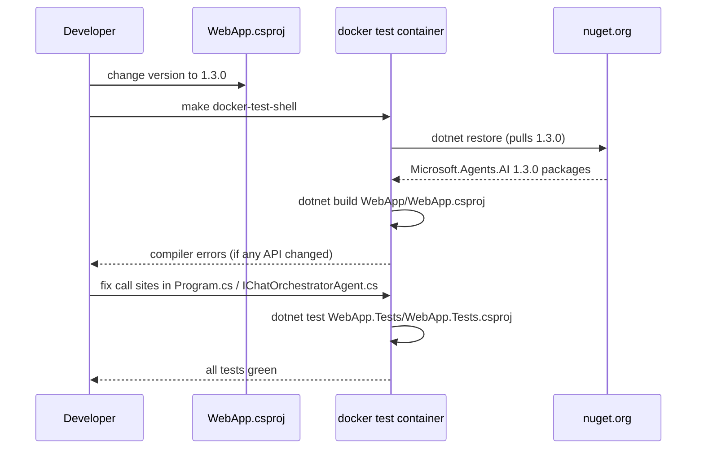

# Plan: Upgrade Microsoft.Agents.AI to 1.3.0

## Table of Contents

- [Plan: Upgrade Microsoft.Agents.AI to 1.3.0](#plan-upgrade-microsoftagentsai-to-130)
  - [Summary](#summary)
  - [Technical Approach](#technical-approach)
  - [Component Breakdown](#component-breakdown)
  - [Dependencies](#dependencies)
  - [Flow](#flow)
  - [Risk Assessment](#risk-assessment)

## Summary

Update the single `PackageReference` for `Microsoft.Agents.AI` in `WebApp/WebApp.csproj` from `1.0.0-preview.260212.1` to `1.3.0`, then adapt any API call sites in `WebApp/Program.cs` and `WebApp/Services/IChatOrchestratorAgent.cs` to compile cleanly. No architectural changes are required.

## Technical Approach

The full API surface consumed from `Microsoft.Agents.AI` is small and localized to two files:

- `WebApp/Program.cs` (line 6: `using Microsoft.Agents.AI;`): registers `AIAgent` as a singleton using `ChatClientAgent`.
- `WebApp/Services/IChatOrchestratorAgent.cs` (line 2: `using Microsoft.Agents.AI;`): implements `IChatOrchestratorAgent` using `AIAgent`, `AgentSession`, `ChatClientAgent` (constructor injection), `ChatClientAgentRunOptions`, and the agent's `DeserializeSessionAsync`, `CreateSessionAsync`, `RunAsync`, and `SerializeSessionAsync` methods.

The upgrade approach is:

1. Change the version string in `WebApp.csproj`.
2. Restore packages inside the Docker test container (`make docker-test-shell` → `dotnet restore`).
3. Compile (`dotnet build WebApp/WebApp.csproj`) and review any compiler errors.
4. Fix call sites if type names or method signatures changed between the preview and `1.3.0`.
5. Run `make test` to confirm the full test suite passes.

Because `WebApp.Tests` does not reference `Microsoft.Agents.AI` directly (it mocks at the `IChatOrchestratorAgent` boundary), no test-project changes are expected.

## Component Breakdown

**Existing files to modify:**

- [WebApp/WebApp.csproj](../WebApp/WebApp.csproj) — change `Version="1.0.0-preview.260212.1"` to `Version="1.3.0"` on the `Microsoft.Agents.AI` `PackageReference`.
- [WebApp/Program.cs](../WebApp/Program.cs) — fix any API call sites that changed in `1.3.0` (most likely none, but must be verified after restore).
- [WebApp/Services/IChatOrchestratorAgent.cs](../WebApp/Services/IChatOrchestratorAgent.cs) — fix any API call sites that changed in `1.3.0`.

**New files to create:**

- None required.

## Dependencies

- `Microsoft.Agents.AI 1.3.0` must be resolvable from `https://api.nuget.org/v3/index.json` with no additional NuGet source.
- All execution must happen inside the Docker test container (`make docker-test-shell`) per the AGENTS.md constraint — never `dotnet` on the host.

## Flow

## Risk Assessment

| Risk | Evidence | Mitigation |
| --- | --- | --- |
| Breaking API changes between `1.0.0-preview.260212.1` and `1.3.0` | Preview packages frequently rename or remove types before stable release; `ChatClientAgentRunOptions`, `AgentSession`, `DeserializeSessionAsync`, `SerializeSessionAsync` are all preview-era names | Build inside the container immediately after the version bump; treat compiler errors as the ground truth for what changed, then fix call sites |
| `1.3.0` not available on the default NuGet feed | Package was just published on 2026-04-24; NuGet CDN propagation can take minutes | If restore fails with "package not found", wait a few minutes and retry; confirm with `dotnet nuget list source` that `nuget.org` is the active source |
| Transitive dependency conflicts | `1.3.0` may pull in a different version of `Microsoft.Extensions.AI.Abstractions` than the currently pinned `10.3.0` | After restore, inspect `WebApp.Tests/obj/project.assets.json` for version conflicts; resolve by explicitly pinning the conflicting transitive package in `WebApp.csproj` if needed |
