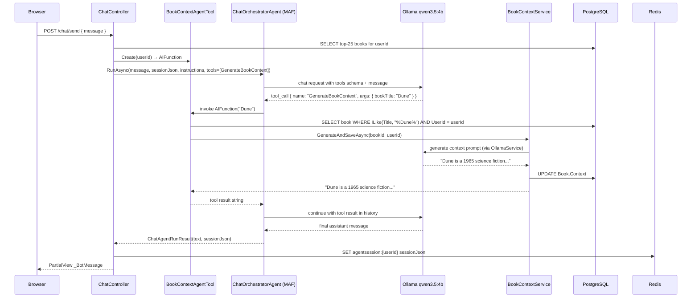

# Plan: MAF Agent-as-Tools Refactor

## Table of Contents

- [Plan: MAF Agent-as-Tools Refactor](#plan-maf-agent-as-tools-refactor)
  - [Summary](#summary)
  - [Technical Approach](#technical-approach)
  - [Component Breakdown](#component-breakdown)
  - [Dependencies](#dependencies)
  - [Flow](#flow)
  - [Risk Assessment](#risk-assessment)

## Summary

Replace the hand-rolled `ChatToolRouter` routing layer with native MAF function-calling. A new `BookContextAgentTool` service produces an `AIFunction` per request (bound to the authenticated `userId`) that is registered on `ChatClientAgent` via `ChatClientAgentRunOptions.ChatOptions.Tools`. The model invokes the function autonomously when appropriate; MAF executes it and folds the result into the conversation history. The `ChatController` loses its tool-dispatch switch and becomes a thin coordinator.

## Technical Approach

### Why the current approach is wrong

`ChatToolRouter` makes a second LLM call with a routing prompt before the agent runs. The result is a hard-coded string switch (`"GenerateBookContext"`) followed by manual execution and string-concatenation into `workingContext`. This pattern duplicates work that `IChatClient`'s function-calling already performs natively when `ChatOptions.Tools` is populated.

`ChatClientAgent` (from `Microsoft.Agents.AI 1.3.0`) delegates to the underlying `IChatClient` for the model turn. `OllamaSharp` exposes an OpenAI-compatible `/api/chat` endpoint that supports tool/function calling for `qwen3.5:4b`. When `ChatOptions.Tools` contains an `AIFunction`, the client sends the function schema in the `tools` field of the chat request; if the model responds with a tool call, the `IChatClient` pipeline executes the function and resumes the conversation — all within the single `agent.RunAsync()` call.

### Key types involved

| Type | Package | Role |
| --- | --- | --- |
| `AIFunction` | `Microsoft.Extensions.AI` | Wraps a delegate + JSON schema for a callable tool |
| `AIFunctionFactory.Create()` | `Microsoft.Extensions.AI` | Generates an `AIFunction` from a delegate using reflection |
| `AITool` | `Microsoft.Extensions.AI` | Base class for `AIFunction` |
| `ChatClientAgentRunOptions.ChatOptions.Tools` | `Microsoft.Agents.AI` | List of tools the agent passes to the model for this run |
| `ChatClientAgent` | `Microsoft.Agents.AI` | Concrete agent that wraps `IChatClient` and handles the tool loop |

### Tool parameter design

The `GenerateBookContext` function accepts `bookTitle` (a `string`) rather than a `Guid`. The LLM knows book titles from the system instructions (user's library list) but does not know GUIDs. The `BookContextAgentTool` resolves the title to a `Book` record using a case-insensitive `EF.Functions.ILike` query scoped to `userId`.

### Book list in system instructions

`ChatController.BuildOrchestratorInstructions` currently accepts a `workingContext` string. After the refactor it accepts the user's book list (fetched from `AppDbContext` in `Send()`) and formats it as a readable list. This tells the model which books are in the library so it can call the tool at the right moment. The `agentcontext:{userId}` cache key is removed entirely — tool results live in the conversation session JSON.

## Component Breakdown

**Files to delete:**

- `WebApp/Services/IChatToolRouter.cs` — contains `IChatToolRouter`, `ChatToolRouter` (internal), and `BookRoutingCandidate`. Replaced by native tool registration.
- `WebApp/Services/ChatToolRouteDecision.cs` — record used only by the deleted router.
- `WebApp/Services/GenerateBookContextToolResult.cs` — record used only by `GenerateToolResponseAsync`, which is removed in FR6.
- `WebApp.Tests/Services/ChatToolRouterTests.cs` — tests for the deleted service.

**New files to create:**

- `WebApp/Services/BookContextAgentTool.cs` — defines `IBookContextAgentTool` and `BookContextAgentTool`. Scoped service. `Create(string userId)` builds and returns an `AIFunction` via `AIFunctionFactory.Create()`. The delegate:
  1. Queries `AppDbContext.Books` for a case-insensitive title match owned by `userId` (`.Take(1)`).
  2. Returns a "not found in your library" message string if no match.
  3. Calls `IBookContextService.GenerateAndSaveAsync(book.Id, userId, ct)`.
  4. Returns the generated context string.
- `WebApp.Tests/Services/BookContextAgentToolTests.cs` — xUnit tests for `BookContextAgentTool`. Uses `InMemory` EF Core and `FakeBookContextService`. Verifies: matching title calls service and returns context; unmatched title returns "not found" message; userId isolation (other user's book not returned).

**Existing files to modify:**

- `WebApp/Services/IChatOrchestratorAgent.cs` — add `IReadOnlyList<AITool>? tools = null` parameter to `IChatOrchestratorAgent.RunAsync`. In `ChatOrchestratorAgent.RunAsync`, assign `runOptions.ChatOptions.Tools = tools?.ToList()` before calling `agent.RunAsync`.

- `WebApp/Services/IBookContextService.cs` — remove `GenerateToolResponseAsync` from the interface.

- `WebApp/Services/BookContextService.cs` — remove `GenerateToolResponseAsync` and the private `AppendContext` helper method. `GenerateAndSaveAsync` and the remaining public methods are unchanged.

- `WebApp/Controllers/ChatController.cs` — replace `IChatToolRouter _toolRouter` dependency with `IBookContextAgentTool _bookContextTool`. In `Send()`: remove `_toolRouter.RouteAsync()` call and the `if (routeDecision.Tool == "GenerateBookContext")` block; remove `workingContext` / `agentcontext:{userId}` cache reads and writes; add a DB query for the user's book list (up to 25 books, `Title` + `Author` only); pass `[_bookContextTool.Create(userId)]` as `tools` to `_agent.RunAsync`. Update `BuildOrchestratorInstructions` signature to accept `bookList` instead of `workingContext`.

- `WebApp/Controllers/BookContextController.cs` — the `Generate` action (`POST /api/books/{bookId}/context/generate`) currently calls `GenerateToolResponseAsync` and returns `GenerateBookContextToolResponse` (which includes `ToolName`, `AppendedContext`). Change it to call `GenerateAndSaveAsync` and return `Ok(new { context })` matching the shape of the `Get` action. Delete the `GenerateBookContextToolRequest` and `GenerateBookContextToolResponse` records from the bottom of this file. `NotesController` is not modified — its `GenerateContext` action already calls `GenerateAndSaveAsync` and is already correct.

- `WebApp/Program.cs` — remove `builder.Services.AddScoped<IChatToolRouter, ChatToolRouter>()`. Add `builder.Services.AddScoped<IBookContextAgentTool, BookContextAgentTool>()`.

- `WebApp.Tests/Controllers/ChatControllerTests.cs` — remove `FakeChatToolRouter` class and `IChatToolRouter router` parameter from `CreateController`. Update `FakeChatOrchestratorAgent` to capture `IReadOnlyList<AITool>?` tools from the `RunAsync` call. Update `Send_WhenToolIsSelected_*` test to verify tools are passed to the agent rather than asserting on `agentcontext:{userId}`. Remove `FakeBookContextService.GenerateToolResponseAsync` stub (method no longer on the interface). `FakeBookContextService.GenerateAndSaveAsync` remains.

- `WebApp.Tests/Services/BookContextServiceTests.cs` — remove the `GenerateToolResponseAsync_AppendsContextAndPersists` test if present, as the method is deleted from the service.

- `WebApp.Tests/Controllers/BookContextControllerTests.cs` — replace the two existing tests (`Generate_ReturnsToolPayloadWithAppendedContext`, `Generate_ReturnsNotFoundWhenBookDoesNotExist`) with updated versions that call `GenerateAndSaveAsync` instead of `GenerateToolResponseAsync`. The not-found test remains. Remove `FakeBookContextService.GenerateToolResponseAsync` and `LastGenerateContext` from the fake — they no longer exist on the interface.

## Dependencies

- `Microsoft.Extensions.AI` `10.5.0` — already referenced; provides `AIFunctionFactory`, `AIFunction`, `AITool`.
- `Microsoft.Agents.AI` `1.3.0` — already referenced; `ChatClientAgentRunOptions.ChatOptions.Tools` must accept `IList<AITool>`. Verify this property exists in 1.3.0 before implementation.
- `OllamaSharp` `5.4.16` — already referenced; the Ollama endpoint must support tool use for `qwen3.5:4b` (it does via the OpenAI-compatible API).
- `Microsoft.EntityFrameworkCore.InMemory` `9.0.4` — already referenced in tests; used by `BookContextAgentToolTests`.

## Flow

## Risk Assessment

| Risk | Evidence | Mitigation |
| --- | --- | --- |
| `qwen3.5:4b` via OllamaSharp may not reliably trigger function calls | Ollama's tool-use quality depends on the model; `qwen3.5:4b` supports it but may miss or over-call | Write a clear tool description and include the book list in system instructions; fall back gracefully (model answers without tool) |
| `ChatClientAgentRunOptions.ChatOptions.Tools` may not exist or may differ in MAF 1.3.0 | The spec targets 1.3.0 (upgrade spec `20260424212800`); API shape must be verified before coding | Read `Microsoft.Agents.AI` 1.3.0 package source or docs before touching `IChatOrchestratorAgent` |
| `EF.Functions.ILike` is PostgreSQL-specific and throws on InMemory provider in tests | `BookContextAgentToolTests` would fail on InMemory | Use `EF.Functions.Like` in the tool or apply the match in-memory after fetching; or use `.ToLower().Contains()` for portability |
| Removing `agentcontext:{userId}` breaks multi-turn context accumulation | Current code uses this key to pass prior tool results across turns | Tool results live in session JSON after this refactor; verify `ChatClientAgent` serializes tool results in `SerializeSessionAsync` output |
| `ChatControllerTests` requires a DB call for the book list now | `Send()` will query `AppDbContext` to build the book list for instructions | Inject a fake/in-memory `AppDbContext` in controller tests (as done in `ChatToolRouterTests`), or extract book-list fetching into a scoped service |
