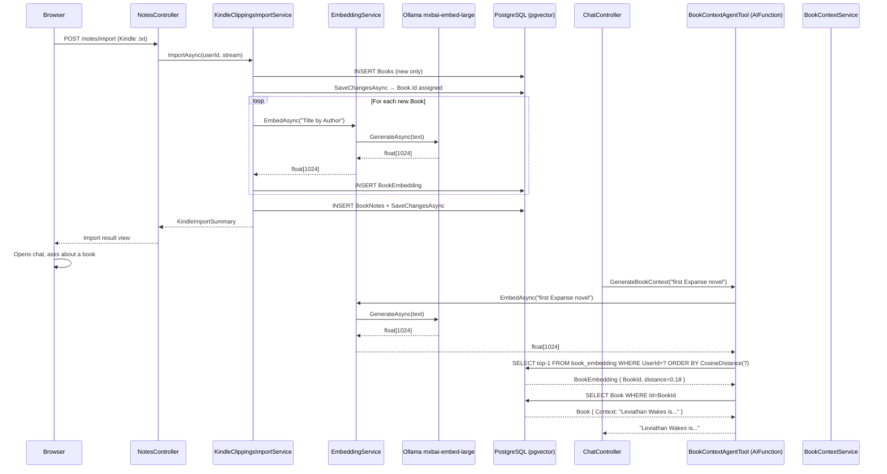

# Plan: RAG Book Lookup with pgvector

## Table of Contents

- [Plan: RAG Book Lookup with pgvector](#plan-rag-book-lookup-with-pgvector)
  - [Summary](#summary)
  - [Technical Approach](#technical-approach)
  - [Component Breakdown](#component-breakdown)
  - [Dependencies](#dependencies)
  - [Flow](#flow)
  - [Risk Assessment](#risk-assessment)

## Summary

Add pgvector-backed semantic book lookup to replace the fragile string-matching path inside `BookContextAgentTool`. A new `IEmbeddingService` wraps a dedicated `OllamaApiClient` instance pointed at `mxbai-embed-large`; `KindleClippingsImportService` calls it inline to store one `BookEmbedding` row per new book at import time; `BookContextAgentTool` embeds the incoming query and runs a cosine-distance query against that table, falling back to the existing string match for books without embeddings.

## Technical Approach

### Embedding API

`Microsoft.Extensions.AI` (already at version `10.5.0` in the project) defines `IEmbeddingGenerator<string, Embedding<float>>`. `OllamaApiClient` (OllamaSharp 5.4.16, already referenced) implements this interface and can be cast to it directly:

```csharp
IEmbeddingGenerator<string, Embedding<float>> generator =
    (IEmbeddingGenerator<string, Embedding<float>>)new OllamaApiClient(new Uri(ollamaUrl), "mxbai-embed-large");
```

The call to generate a vector is:

```csharp
var result = await generator.GenerateAsync(text, cancellationToken: ct);
float[] vector = result[0].Vector.ToArray();
```

No SemanticKernel package is needed. This follows the same singleton pattern as the existing `IChatClient` registration in `Program.cs`.

### pgvector in EF Core

`Pgvector.EntityFrameworkCore` provides the `Vector` type and the `CosineDistance` LINQ extension. It must be added to `WebApp.csproj`. The `UseNpgsql` call must be extended with `.UseVector()` and `AppDbContext.OnModelCreating` must call `HasPostgresExtension("vector")`.

The HNSW index is declared on the `BookEmbedding` entity using the Npgsql fluent API:

```csharp
entity.HasIndex(e => e.Embedding)
    .HasMethod("hnsw")
    .HasOperators("vector_cosine_ops");
```

If this DSL is not supported by Npgsql `9.0.4`, the migration can include a raw SQL `CREATE INDEX … USING hnsw` statement instead.

### Cosine lookup in `BookContextAgentTool`

```csharp
var queryVector = new Vector(await embeddingService.EmbedAsync(bookTitle, ct));

var closest = await db.BookEmbeddings
    .Where(e => e.UserId == userId)
    .OrderBy(e => e.Embedding.CosineDistance(queryVector))
    .Select(e => new { e.BookId, e.Embedding.CosineDistance(queryVector) })
    .FirstOrDefaultAsync(ct);

if (closest is null || closest.Distance > 0.5f)
{
    // fallback to BuildSearchTitles string match (existing code)
}
```

### Fallback path

Books imported before this spec's migration will have no `BookEmbedding` row. If the cosine query returns nothing or the top distance exceeds the threshold, the tool falls through to the existing `BuildSearchTitles` in-memory match against `AppDbContext.Books`. This makes the feature additive and non-breaking for existing data.

### Inline embedding at import time

`KindleClippingsImportService.ImportAsync` already separates new books from existing ones before the first `SaveChangesAsync`. After that call (when `Book.Id` is assigned), the service iterates the newly added books and calls `IEmbeddingService.EmbedAsync("{book.Title} by {book.Author}")` for each, inserting a `BookEmbedding` row. Existing books (already in `bookMap`) are skipped to avoid duplicates.

## Component Breakdown

**Files to delete:** None.

**New files to create:**

- `WebApp/Models/BookEmbedding.cs` — entity class: `Id` (Guid PK), `UserId` (string), `BookId` (Guid FK), `Title`, `Author`, `Embedding` (`Vector`, `vector(1024)`), `CreatedAt`.
- `WebApp/Services/EmbeddingService.cs` — defines `IEmbeddingService` (interface: `Task<float[]> EmbedAsync(string, CancellationToken)`) and `EmbeddingService` (implementation wrapping `IEmbeddingGenerator<string, Embedding<float>>`).
- `WebApp/Migrations/<timestamp>_AddBookEmbedding.cs` — EF migration adding the `book_embedding` table, HNSW index on `Embedding`, and plain index on `UserId`.
- `WebApp.Tests/Services/EmbeddingServiceTests.cs` — unit tests using a `FakeEmbeddingGenerator`.

**Existing files to modify:**

- `WebApp/WebApp.csproj` — add `<PackageReference Include="Pgvector.EntityFrameworkCore" Version="..." />`.
- `WebApp.Tests/WebApp.Tests.csproj` — add the same `Pgvector.EntityFrameworkCore` reference (needed for integration tests that hit Postgres).
- `WebApp/Data/AppDbContext.cs` — add `DbSet<BookEmbedding> BookEmbeddings`; call `HasPostgresExtension("vector")` and `.UseVector()` in `OnModelCreating`; add entity configuration for `BookEmbedding` (table name, FK, column type, indexes).
- `WebApp/Program.cs` — register a singleton `IEmbeddingGenerator<string, Embedding<float>>` using `OllamaApiClient` cast; register `IEmbeddingService` / `EmbeddingService` as scoped; update `UseNpgsql` call to chain `.UseVector()`.
- `WebApp/Services/KindleClippingsImportService.cs` — add `IEmbeddingService` constructor dependency; after the first `SaveChangesAsync`, embed and insert `BookEmbedding` for each newly created book.
- `WebApp/Services/BookContextAgentTool.cs` — add `IEmbeddingService` constructor dependency; replace the `BuildSearchTitles` in-memory loop with a cosine-distance EF query; retain `BuildSearchTitles` as fallback when the vector query returns nothing or exceeds the distance threshold.
- `docker-compose.yml` — update `postgres` image to `pgvector/pgvector:0.8.2-pg18-trixie`; add `ollama pull mxbai-embed-large` to the `ollama` service command.
- `docker-compose.test.yml` — update `postgres` image to `pgvector/pgvector:0.8.2-pg18-trixie`.
- `WebApp.Tests/Services/BookContextAgentToolTests.cs` — existing in-memory tests for the string-match path are replaced with Postgres-backed integration tests (reusing `PostgresTestDatabase`) that seed `BookEmbedding` rows with a `FakeEmbeddingService` that returns deterministic vectors, then verify cosine lookup resolves the correct book.
- `WebApp.Tests/Integration/AgentToolsPostgresTests.cs` — seed `BookEmbedding` rows for each `Book` seeded in existing integration tests so the lookup succeeds under the new path.

## Dependencies

- `pgvector/pgvector:0.8.2-pg18-trixie` Docker image — replaces `postgres:16-alpine`.
- `mxbai-embed-large` Ollama model — must be pulled in the `ollama` container at startup.
- `Pgvector.EntityFrameworkCore` NuGet package — exact version to be confirmed against Npgsql `9.0.4` compatibility matrix during implementation.
- `Microsoft.Extensions.AI` `10.5.0` — already present; provides `IEmbeddingGenerator<string, Embedding<float>>`.
- `OllamaSharp` `5.4.16` — already present; `OllamaApiClient` implements `IEmbeddingGenerator`.

## Flow



## Risk Assessment

| Risk | Evidence | Mitigation |
| --- | --- | --- |
| `OllamaApiClient` cast to `IEmbeddingGenerator` fails at runtime | Confirmed via NuGet page but not smoke-tested in this project | Smoke-test the cast in a throwaway endpoint or unit test before wiring into production code |
| `HasMethod("hnsw").HasOperators("vector_cosine_ops")` not supported in Npgsql `9.0.4` EF Core fluent API | Pgvector EF extension API varies across Npgsql versions | Fall back to raw SQL in migration: `migrationBuilder.Sql("CREATE INDEX ... USING hnsw ...")` |
| PG16 → PG18 volume incompatibility on existing dev machines | Major PostgreSQL upgrades require `pg_upgrade` or volume wipe | Document that existing `pg_data` volumes must be deleted before starting the updated stack; data is re-created by migrations |
| `mxbai-embed-large` pull adds significant startup time to `ollama` container | Model is ~670 MB; cold pull on first `docker compose up` takes minutes | Document the expected pull time; the compose healthcheck on the `webapp` service already waits for dependencies |
| Import request slows for large Kindle files | 50-book import = 50 sequential embedding calls to Ollama; each ~50–100 ms | Acceptable for an infrequent import action; document the expected latency; optimize in a future spec if needed |
| Cosine distance threshold `0.5` produces false positives or misses | Not empirically validated against real library data | Expose threshold as a configurable app setting rather than a magic constant so it can be tuned without code changes |
