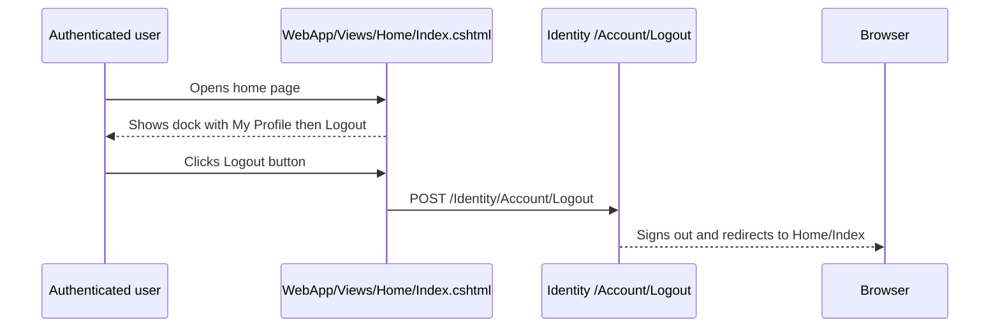

# Plan: Home Dock Logout

## Table of Contents

- [Plan: Home Dock Logout](#plan-home-dock-logout)
  - [Summary](#summary)
  - [Technical Approach](#technical-approach)
  - [Component Breakdown](#component-breakdown)
  - [Dependencies](#dependencies)
  - [Flow](#flow)
  - [Risk Assessment](#risk-assessment)

## Summary

Move the existing authenticated logout action from the global top navbar into the home page dock, directly after `My Profile`, and remove the layout's dependency on the top navbar partial. The implementation follows the existing Razor/tag-helper and Shoelace button patterns already present in `WebApp/Views/Shared/Components/_TopNavbar.cshtml` and `WebApp/Views/Home/Index.cshtml`.

## Technical Approach

`WebApp/Views/Shared/_Layout.cshtml` owns global composition and currently renders `<partial name="Components/_TopNavbar" />`. Remove that partial render so the top header no longer appears on every MVC view.

`WebApp/Views/Home/Index.cshtml` owns the bottom dock and already renders Shoelace mode buttons for chat, upload, notes, and profile. Add the required Identity injections from the navbar partial (`SignInManager<IdentityUser>` and, if needed by Razor conventions, `IdentityUser` using/imports), then render the logout form only when `SignInManager.IsSignedIn(User)` is true. Place the form after the `My Profile` `sl-button` inside the same flex row so the logout control becomes the last dock action.

The logout form should reuse the TopNavbar route and visual treatment: `asp-area="Identity"`, `asp-page="/Account/Logout"`, `asp-route-returnUrl="@Url.Action("Index", "Home", new { area = "" })"`, `method="post"`, an `sl-tooltip` with `Logout`, an `sl-button size="small"`, and `sl-icon name="box-arrow-right" slot="prefix"`. If the implementation keeps JavaScript submit behavior, ensure the form id remains unique on the page.

This feature does not touch SOLID service boundaries because it has no business logic, persistence, controller, or Microsoft Agent Framework path. Testability is preserved by keeping behavior in standard Razor tag helpers and verifying rendered markup plus the existing `make test` regression suite.

## Component Breakdown

**Existing files to modify:**

- `WebApp/Views/Shared/_Layout.cshtml` - remove the `_TopNavbar` partial render from the global layout.
- `WebApp/Views/Home/Index.cshtml` - add authenticated Identity logout form as the final home dock action after `My Profile`.

**Files to consider deleting:**

- `WebApp/Views/Shared/Components/_TopNavbar.cshtml` - remove once no layout or view references remain.

**New files to create:**

- None required.

## Dependencies

- ASP.NET Core Identity tag helpers and the existing Identity logout page.
- Shoelace components already loaded by `WebApp/Views/Shared/_Layout.cshtml`.
- HTMX/hyperscript chat mode behavior already present in `WebApp/Views/Home/Index.cshtml`.

## Flow

## Risk Assessment

| Risk | Evidence | Mitigation |
| --- | --- | --- |
| Logout becomes unavailable outside the home page. | `_TopNavbar.cshtml` is currently global through `_Layout.cshtml`; the requested target is `Index.cshtml`. | Accept as intentional scope, and keep the logout control visible on the home dock for signed-in users. |
| Duplicate form ids or JavaScript submit targeting the wrong element. | `_TopNavbar.cshtml` uses `id="logoutForm"` and an onclick lookup by id. | After moving the form, ensure only one logout form id remains, or use a unique id in the home page. |
| Dock layout overflows on mobile. | The existing home dock button row uses `overflow-x-auto`, `flex-nowrap`, and `shrink-0`. | Add the logout form/control inside the same row and preserve shrink behavior. |
| Identity routing or antiforgery breaks. | Logout uses Razor tag helpers in `_TopNavbar.cshtml` today. | Reuse the same tag-helper attributes and `method="post"` in `Index.cshtml`. |
