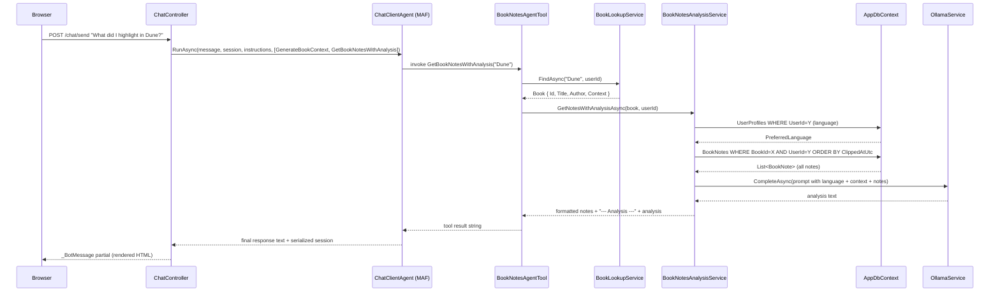

# Plan: Book Notes Agent Tool

## Table of Contents

- [Summary](#summary)
- [Technical Approach](#technical-approach)
- [Component Breakdown](#component-breakdown)
- [Dependencies](#dependencies)
- [Flow](#flow)
- [Risk Assessment](#risk-assessment)

## Summary

Adds `GetBookNotesWithAnalysis` as a second MAF `AIFunction` alongside the existing `GenerateBookContext`, following the same two-layer pattern: a focused service (`BookNotesAnalysisService`) owns DB access and Ollama analysis, and a thin tool adapter (`BookNotesAgentTool`) wraps it for the Microsoft Agent Framework.

## Technical Approach

The existing agent-tool pattern in this codebase is:

```text
ChatController
  └─ [IReadOnlyList<AITool>] ──► BookContextAgentTool (IBookContextAgentTool)
                                    ├─ IBookLookupService  (vector + string fallback)
                                    └─ IBookContextService (DB read + Ollama generate)
```

This feature extends that list with a second tool following the identical shape:

```text
ChatController
  └─ [IReadOnlyList<AITool>] ──► BookNotesAgentTool (IBookNotesAgentTool)
                                    ├─ IBookLookupService        (reused, no change)
                                    └─ IBookNotesAnalysisService (new: DB read + Ollama analyze)
```

**SOLID alignment:**

- `BookNotesAgentTool` has one responsibility: adapt `IBookNotesAnalysisService` output for the MAF `AIFunction` contract. It does not touch `AppDbContext` or `IOllamaService`.
- `BookNotesAnalysisService` has one responsibility: fetch the user's notes for a resolved book and generate a thematic analysis. It depends on `AppDbContext` (EF Core) and `IOllamaService`, matching how `BookContextService` works.
- High-level code (`ChatController`, `BookNotesAgentTool`) depends on interfaces only.
- `IBookNotesAnalysisService` is narrow — one method, no overlap with context generation or embedding.
- EF Core queries in `BookNotesAnalysisService` use `AsNoTracking`, are scoped by `UserId`, and are parameterized — no raw SQL required since `book_note` has no provider-specific operators.

**Note retrieval:** `AppDbContext.BookNotes.AsNoTracking().Where(n => n.BookId == book.Id && n.UserId == userId).OrderBy(n => n.ClippedAtUtc)` — pure LINQ, no cap, no raw SQL. All highlights for a single book are expected to fit within the Ollama context window.

**Language resolution:** `AppDbContext.UserProfiles.FirstOrDefaultAsync(p => p.UserId == userId)` — same pattern as `BookContextService.GenerateContextAsync`. Defaults to `"English"` if the profile is absent or `PreferredLanguage` is unset.

**Analysis generation:** A single `IOllamaService.CompleteAsync` call with a prompt containing the resolved language, the book's existing `Book.Context` (or "Not available."), the full formatted notes block, and two explicit questions. Response in the user's preferred language, plain-text ≤150 words.

**Tool output format:**

```text
Notes for "{Title}" by {Author} ({count} notes):

<note>First highlight content</note>
<note>Second highlight content</note>
...

--- Analysis ---
{analysis text}
```

The `<note>` tag format is the canonical representation for note content shared with `20260604140620-book-note-embeddings`. LLMs parse XML-style boundary tags reliably due to training data patterns, making each note boundary unambiguous to the agent.

## Component Breakdown

**New files to create:**

- `WebApp/Services/BookNotesAnalysisService.cs` — defines `IBookNotesAnalysisService` interface and `BookNotesAnalysisService` implementation. Owns the `AppDbContext.BookNotes` query (all notes, ordered by `ClippedAtUtc`), `UserProfile` language lookup, note formatting, and the Ollama analysis prompt. Returns the full combined string, or a "no notes found" message.

- `WebApp/Services/BookNotesAgentTool.cs` — defines `IBookNotesAgentTool` interface and `BookNotesAgentTool` implementation. Calls `IBookLookupService.FindAsync`; on match, delegates to `IBookNotesAnalysisService`; on miss, returns a "not found" string. Registers the `AIFunction` as `GetBookNotesWithAnalysis`.

**Existing files to modify:**

- `WebApp/Program.cs` — add two `AddScoped` registrations after the existing `IBookContextAgentTool` line:

  ```csharp
  builder.Services.AddScoped<IBookNotesAnalysisService, BookNotesAnalysisService>();
  builder.Services.AddScoped<IBookNotesAgentTool, BookNotesAgentTool>();
  ```

- `WebApp/Controllers/ChatController.cs` — four changes:
  1. Add `IBookNotesAgentTool _bookNotesTool` field.
  2. Add `IBookNotesAgentTool bookNotesTool` constructor parameter.
  3. Extend the tools list: `[_bookContextTool.Create(userId), _bookNotesTool.Create(userId)]`.
  4. Extend `BuildOrchestratorInstructions` to include guidance for `GetBookNotesWithAnalysis`.

- `WebApp.Tests/Integration/AgentToolsPostgresTests.cs` — two changes:
  1. Add `FakeBookNotesAgentTool` inner class (returns a stub `AIFunction`).
  2. Update `CreateController` to accept and pass `IBookNotesAgentTool`.

## Dependencies

- Running PostgreSQL with the `book_note` table created by migration `20260403204829_AddBooksAndBookNotes`. No new migration.
- Running Ollama (`qwen3.5:4b`) for the analysis `CompleteAsync` call.
- `IBookLookupService` (already registered and tested) — reused without changes.
- `IOllamaService` (already registered as `AddScoped`) — reused without changes.

## Flow



## Risk Assessment

| Risk | Evidence | Mitigation |
| --- | --- | --- |
| Ollama context window overflow for books with very large note sets | `book_note` has no upper bound; a user with hundreds of Kindle highlights for one book could exceed `qwen3.5:4b`'s context window | No cap is applied by design decision; if overflow occurs in practice, a configurable cap can be introduced as a follow-up spec |
| Breaking existing controller integration tests | `CreateController` in `AgentToolsPostgresTests.cs` (line 168) passes 5 args; adding `IBookNotesAgentTool` to the constructor makes it 6 | FR12 explicitly requires updating `CreateController` and adding `FakeBookNotesAgentTool` as part of this spec |
| User-data leakage if `UserId` filter is omitted | All other note queries in the codebase scope by `UserId`; a missing predicate would expose another user's notes | The `IBookNotesAnalysisService` query must always include both `BookId` and `UserId` predicates; covered by a dedicated integration test |
| Analysis quality degradation for short or sparse note sets | A book with 1–2 highlights produces a thin analysis | The prompt instructs Ollama to answer two specific questions; sparse input produces a shorter but valid answer; no fallback needed |
| Premature implementation before spec approval | Code was partially written before this spec was finalized | The spec drives the authoritative design; `BookNotesAgentTool.cs` (written early) must be refactored to introduce `IBookNotesAnalysisService` per FR1 and FR6 before the implementation is considered complete |
