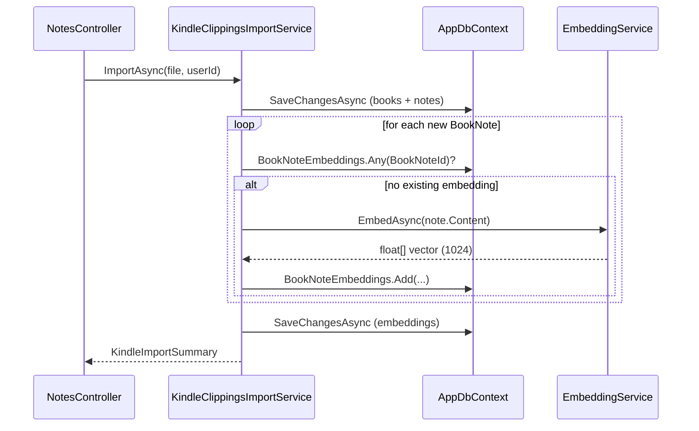
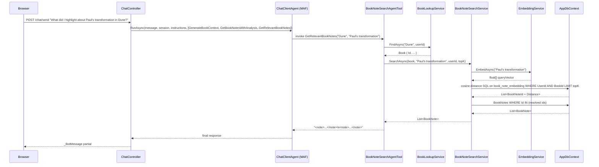

# Plan: Book Note Embeddings

## Table of Contents

- [Summary](#summary)
- [Technical Approach](#technical-approach)
- [Component Breakdown](#component-breakdown)
- [Dependencies](#dependencies)
- [Flow](#flow)
- [Risk Assessment](#risk-assessment)

## Summary

Extends the existing pgvector infrastructure — already used for book-level semantic lookup — down to the note level. Embeds each `BookNote.Content` at import time and adds a `GetRelevantBookNotes` MAF tool that retrieves only the highlights most semantically relevant to the user's current question within a specific book.

## Technical Approach

The existing pgvector pattern for books is:

```text
KindleClippingsImportService
  └─ IEmbeddingService ──► mxbai-embed-large
       └─ BookEmbedding (vector 1024, HNSW cosine)

BookContextAgentTool ──► BookLookupService
                              └─ cosine distance query on book_embedding
                                   scoped by UserId
```

This spec mirrors that pattern one level deeper:

```text
KindleClippingsImportService
  └─ IEmbeddingService ──► mxbai-embed-large
       └─ BookNoteEmbedding (vector 1024, HNSW cosine)

BookNoteSearchAgentTool ──► IBookLookupService (book resolution, reused)
                          └─ IBookNoteSearchService
                                └─ embed searchQuery via IEmbeddingService
                                └─ cosine distance query on book_note_embedding
                                     scoped by UserId AND BookId
                                └─ return top-K BookNote records as <note> tags
```

**SOLID alignment:**

- `BookNoteSearchService` owns the embedding call and the pgvector SQL — one responsibility.
- `BookNoteSearchAgentTool` is a thin adapter: resolve book → delegate to service → format output. No SQL, no embedding calls.
- `IBookNoteSearchService` is narrow: one method, no overlap with import, context generation, or the all-notes analysis service.
- High-level code depends on interfaces only; raw pgvector SQL is isolated in `BookNoteSearchService` behind the interface.

**pgvector query** (parameterized raw SQL, same pattern as `BookLookupService.FindClosestEmbeddingAsync`):

```sql
SELECT "BookNoteId", "Embedding" <=> @query_vector::vector AS "Distance"
FROM book_note_embedding
WHERE "UserId" = @user_id AND "BookId" = @book_id
ORDER BY "Embedding" <=> @query_vector::vector
LIMIT @top_k
```

After resolving `BookNoteId` values, the service fetches the full `BookNote` records via EF Core `DbSet` for content and metadata.

**Import deduplication:** Before embedding a note, check whether a `BookNoteEmbedding` row already exists for that `BookNoteId`. Skip if found. This prevents duplicate embeddings on re-import.

**Embedding failures at import:** Wrap the embedding + insert loop in a try/catch. Log the failure and continue — matching the fallback pattern in `BookLookupService.TryFindByEmbeddingAsync`. A failed embedding does not block the import or the note from being saved.

## Component Breakdown

**New model:**

- `WebApp/Models/BookNoteEmbedding.cs` — `Id`, `UserId`, `BookId`, `BookNoteId`, `Embedding` (Vector 1024), `CreatedAt`.

**New migration:**

- `WebApp/Migrations/<timestamp>_AddBookNoteEmbedding.cs` — creates `book_note_embedding` table, `UserId` index, `(UserId, BookId)` composite index, HNSW index on `Embedding` with `vector_cosine_ops`.

**New services:**

- `WebApp/Services/BookNoteSearchService.cs` — defines `IBookNoteSearchService` and `BookNoteSearchService`. Reads `topK` from `IConfiguration` key `BookNotes:TopKRelevantNotes` with fallback `20`. Embeds the query string, runs the cosine distance SQL, resolves `BookNote` records, and returns them. Depends on `AppDbContext`, `IEmbeddingService`, and `IConfiguration`.

- `WebApp/Services/BookNoteSearchAgentTool.cs` — defines `IBookNoteSearchAgentTool` and `BookNoteSearchAgentTool`. Parameters: `bookTitle` (string), `searchQuery` (string). Depends on `IBookLookupService` and `IBookNoteSearchService`. Formats matched notes as `<note loc="{LocationText}">{Content}</note>` lines.

**Existing files to modify:**

- `WebApp/Models/AppDbContext.cs` — add `DbSet<BookNoteEmbedding>`, configure HNSW index in `OnModelCreating`.

- `WebApp/Services/KindleClippingsImportService.cs` — after the existing book embedding step, add a note embedding step: for each new `BookNote`, check for an existing `BookNoteEmbedding` by `BookNoteId`, embed `Content` if missing, and persist. Wrap in try/catch with logging.

- `WebApp/Program.cs` — add `AddScoped<IBookNoteSearchService, BookNoteSearchService>()` and `AddScoped<IBookNoteSearchAgentTool, BookNoteSearchAgentTool>()`.

- `WebApp/Controllers/ChatController.cs` — inject `IBookNoteSearchAgentTool`, add to tools list, extend orchestrator instructions.

- `WebApp.Tests/Integration/AgentToolsPostgresTests.cs` — add `FakeBookNoteSearchAgentTool`, update `CreateController` to pass it, add integration test cases.

## Dependencies

- `20260604133551-book-notes-agent-tool` must be implemented first — establishes the `<note>` tag format, the two-tool registration pattern in `ChatController`, and the two-layer service/tool SOLID structure this spec replicates.
- Running PostgreSQL with the `pgvector` extension and `book_note` table (migration `20260403204829_AddBooksAndBookNotes`).
- Running Ollama with `mxbai-embed-large` — the same embedding model used for book-level embeddings.
- `IEmbeddingService` (already registered as `AddScoped`) — reused without changes.
- `IBookLookupService` (already registered and tested) — reused without changes.

## Flow

### Import-time embedding



### Chat-time retrieval



## Risk Assessment

| Risk | Evidence | Mitigation |
| --- | --- | --- |
| Import performance regression from per-note embedding calls | A clipping file with 500 notes would make 500 sequential `mxbai-embed-large` calls; current import makes one call per new book | Deduplication skip (FR12) prevents re-embedding on re-import; if latency is unacceptable, batch embedding can be introduced as a follow-up |
| Ollama unavailable at import time blocks note embedding | `IEmbeddingService` can throw if Ollama is unreachable | Wrap embedding loop in try/catch with `ILogger` warning; notes are saved regardless; embeddings can be backfilled when Ollama recovers |
| Missing backfill for pre-existing notes | Notes imported before this feature ships have no `BookNoteEmbedding` rows; `GetRelevantBookNotes` returns zero results for those books | Clearly documented in Out of Scope; a backfill script or admin endpoint can be added as a follow-up |
| Duplicate embeddings on re-import | `BookNote` uses `DedupeKey` to avoid duplicate notes, but `BookNoteEmbedding` has no equivalent guard at the DB level | FR12 requires an existence check by `BookNoteId` before embedding; a unique DB constraint on `BookNoteId` can be added as an additional guard |
| Breaking existing controller integration tests | Adding `IBookNoteSearchAgentTool` to `ChatController` constructor increases arity again | Requires updating `CreateController` in `AgentToolsPostgresTests.cs` and adding `FakeBookNoteSearchAgentTool` — same pattern as the prior spec |
