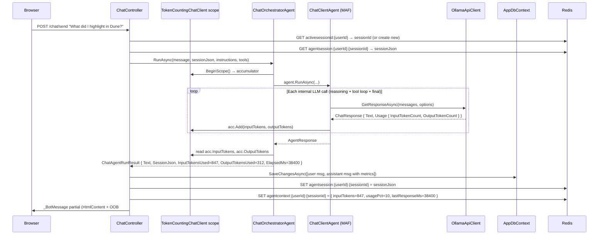

# Plan: Context Token Awareness

## Table of Contents

- [Summary](#summary)
- [Technical Approach](#technical-approach)
- [Component Breakdown](#component-breakdown)
- [Dependencies](#dependencies)
- [Flow](#flow)
- [Risk Assessment](#risk-assessment)

## Summary

Adds a `DelegatingChatClient` middleware that accumulates token usage across all Ollama calls in a turn, persists chat messages to a new `chat_message` DB table (decoupling display from the LLM session JSON), stores per-turn metrics in Redis, and surfaces a `<sl-progress-ring>` context indicator in the existing Shoelace-powered chat UI — while removing the two largest sources of token waste (book list + verbose profile section) from the orchestrator instructions.

## Technical Approach

### Token counting — `DelegatingChatClient` middleware

`Microsoft.Extensions.AI` provides `DelegatingChatClient` as a base for middleware in the `IChatClient` pipeline. The existing `Program.cs` pipeline is:

```text
OllamaApiClient → ConfigureOptionsChatClient → IChatClient (singleton)
```

The new pipeline inserts `TokenCountingChatClient` between `OllamaApiClient` and `ConfigureOptionsChatClient`:

```text
OllamaApiClient → TokenCountingChatClient → ConfigureOptionsChatClient → IChatClient (singleton)
```

`TokenCountingChatClient` overrides `GetResponseAsync`, calls `base.GetResponseAsync`, then reads `response.Usage?.InputTokenCount` and `response.Usage?.OutputTokenCount` (populated by OllamaSharp from `prompt_eval_count` and `eval_count` in the Ollama response), and adds them to an `AsyncLocal<TokenAccumulator?>` scoped to the current async call chain.

`ChatOrchestratorAgent.RunAsync` opens the scope (`TokenCountingChatClient.BeginScope(out var acc)`) before calling `agent.RunAsync`, then reads `acc.InputTokens` and `acc.OutputTokens` after. This captures every internal tool-calling iteration without the orchestrator needing to know how many calls the MAF agent made.

**SOLID:** `TokenCountingChatClient` has one responsibility. It does not write to Redis or know about sessions. The accumulator result flows out through `ChatAgentRunResult`.

### Chat message persistence — new `ChatMessage` model

Today `ChatController.Chat` parses the MAF session JSON via `TryGetSessionMessages`, which navigates two different JSON structure paths (`chatHistoryProviderState.messages` and `stateBag.InMemoryChatHistoryProvider.messages`). This is fragile and breaks if MAF changes its serialization format.

The new approach introduces a `ChatMessage` EF Core entity (owned by `AppDbContext`) that is written by `ChatController.Send` after every successful turn. `ChatController.Chat` queries this table instead of parsing Redis. The MAF session JSON in Redis remains the authoritative LLM context; the DB is the authoritative display store.

**Session grouping:** A user-scoped current-session pointer in Redis (`activesessionid:{userId}`) stores the active `SessionId` Guid. The MAF session JSON is stored in a session-scoped key that also includes the authenticated user: `agentsession:{userId}:{sessionId}`. This allows the same user to have multiple sessions without making a bare session Guid the lookup boundary. `ChatController.Reset` deletes the current `agentsession:{userId}:{sessionId}`, `activesessionid:{userId}`, `agentcontext:{userId}:{sessionId}`, and the current session's `ChatMessage` rows. The next request generates a new Guid and starts a fresh LLM/display session.

**SOLID:** `AppDbContext` gains one new `DbSet<ChatMessage>`. The controller coordinates the write; no service is introduced because the write is a simple two-row insert with no business logic.

### Context metadata in Redis — `agentcontext:{userId}:{sessionId}`

A lightweight Redis key stores the per-session context summary as JSON: `{ inputTokens, outputTokens, numCtx, lastResponseMs, usagePct }`. This is updated every turn from `ChatController.Send` using `ICacheHandler.SetAsync`. The UI reads it indirectly through the `BotMessageViewModel` returned by `ChatController.Send` — the controller computes `usagePct` from the token count and the configured `Ollama:NumCtx` value, then passes it to the partial view. The key includes `userId` and `sessionId` so one user's sessions cannot collide with another user's sessions.

### UI — `<sl-progress-ring>` OOB swap

`_BotMessage.cshtml` currently targets `#agent-response` with `hx-swap-oob="outerHTML"`. The partial is extended to also emit a second OOB element targeting `#context-ring`. The ring element is defined once in `Index.cshtml` near the chat input:

```html
<div id="context-ring" class="flex items-center gap-2 text-white/60 text-sm">
    <sl-progress-ring value="0" style="--size:32px; --track-width:3px; --indicator-width:5px;">
        <span class="text-xs">0%</span>
    </sl-progress-ring>
    <span>0s</span>
</div>
```

After each turn, the partial replaces this element with updated `value` and text. Shoelace animates the ring transition natively. This requires no new JavaScript.

### Profile compression

`BuildProfileInstructions` is rewritten around a private template constant. The method collects non-null, non-whitespace field values, substitutes them into the template, and returns `null` if no fields are set. The template lives in a `private const string` so it is a single-line change to tune the format.

### Book list removal

The `bookTitles` query and the section in `BuildOrchestratorInstructions` that formats and appends the book list are deleted. The tool description for `GenerateBookContext` and `GetBookNotesWithAnalysis` already tells the agent to call them "when the user asks about a book" — no book list enumeration is needed for this to work. The `IBookLookupService` embedding lookup handles resolution without the list.

## Component Breakdown

**New files to create:**

- `WebApp/Services/TokenCountingChatClient.cs` — defines `TokenAccumulator` (plain class: `int InputTokens`, `int OutputTokens`, thread-safe `Add`) and `TokenCountingChatClient : DelegatingChatClient` with `AsyncLocal<TokenAccumulator?>` and a static `BeginScope` factory.

- `WebApp/Models/ChatMessage.cs` — EF Core model: `Id`, `UserId`, `SessionId`, `Role`, `Content`, `DisplayOrder`, `CreatedAt`, `InputTokensUsed?`, `OutputTokensUsed?`, `ResponseTimeMs?`.

- `WebApp/Migrations/<timestamp>_AddChatMessage.cs` — generated via `dotnet ef migrations add AddChatMessage` inside the webapp container; creates `chat_message` table with composite index on `(UserId, SessionId, DisplayOrder)`.

**Existing files to modify:**

- `WebApp/Program.cs` — insert `TokenCountingChatClient` into the `IChatClient` pipeline via `.Use<TokenCountingChatClient>()` or manual `new TokenCountingChatClient(inner)`.

- `WebApp/Services/IChatOrchestratorAgent.cs` — extend `ChatAgentRunResult` record with `int InputTokensUsed`, `int OutputTokensUsed`, `long ElapsedMs`. Update `ChatOrchestratorAgent.RunAsync` to open a scope, call `agent.RunAsync`, read accumulator, measure elapsed, and return the extended result.

- `WebApp/Data/AppDbContext.cs` — add `DbSet<ChatMessage>` and configure `chat_message` table with composite index in `OnModelCreating`.

- `WebApp/Controllers/ChatController.cs` — six changes:
  1. Remove books query and `bookTitles` variable.
  2. Remove `TryGetSessionMessages` and its two parse paths from `Chat()`.
  3. In `Chat()`: read `activesessionid:{userId}` from Redis; query `ChatMessages` by `UserId` + `SessionId` ordered by `DisplayOrder`.
  4. In `Send()`: read/create session ID; read/write session JSON at `agentsession:{userId}:{sessionId}`; write two `ChatMessage` rows after successful run; write `agentcontext:{userId}:{sessionId}`; pass `BotMessageViewModel` to partial.
  5. In `Reset()`: delete the current `agentsession:{userId}:{sessionId}`, `activesessionid:{userId}`, `agentcontext:{userId}:{sessionId}`, and the current session's `ChatMessage` rows.
  6. Rewrite `BuildProfileInstructions` and `BuildOrchestratorInstructions` per FR9–FR10.

- `WebApp/Views/Chat/_BotMessage.cshtml` — change model from `string` to `BotMessageViewModel`; add OOB `#context-ring` swap.

- `WebApp/Views/Home/Index.cshtml` — add `<div id="context-ring">` element near the chat input area.

- `WebApp.Tests/Integration/AgentToolsPostgresTests.cs` — update `FakeChatOrchestratorAgent` to return the extended `ChatAgentRunResult`; update `CreateController` if needed.

## Dependencies

- `Microsoft.Extensions.AI` `DelegatingChatClient` — already present in the project.
- Shoelace `<sl-progress-ring>` — already loaded in `_Layout.cshtml` via CDN autoloader.
- Running PostgreSQL for the new `chat_message` table (migration applied at startup via `db.Database.Migrate()`).
- Running Redis for `activesessionid:{userId}`, `agentsession:{userId}:{sessionId}`, and `agentcontext:{userId}:{sessionId}` keys.
- `Ollama:NumCtx` from `appsettings.json` — already present, used to compute `usagePct`.

## Flow



## Risk Assessment

| Risk | Evidence | Mitigation |
| --- | --- | --- |
| `response.Usage` is null for some Ollama calls | OllamaSharp maps `prompt_eval_count` only on the final streaming chunk; intermediate calls in a multi-step agent turn may return null Usage | `TokenAccumulator.Add` guards with `?? 0`; missing Usage is silently treated as 0 — ring shows a lower bound rather than crashing |
| DB write latency added to every chat turn | Two rows inserted per turn after the Ollama call completes | The insert is a simple two-row `SaveChangesAsync`; at SteamDeck PostgreSQL latency (~2ms) this adds <5ms per turn — negligible vs 20–40s Ollama calls |
| Removing book list breaks book discovery | Agent currently uses the list to decide when to call tools | Tool descriptions instruct the agent to call tools for any book mention; `BookContextAgentTool` already uses embedding lookup independent of the list; existing integration tests verify this path |
| `activesessionid:{userId}` key missing on first request | New key, no existing value | `ChatController.Send` creates a new Guid, sets the pointer, and stores session data at `agentsession:{userId}:{sessionId}`; no session disruption |
| Existing tests break on `ChatAgentRunResult` extension | `FakeChatOrchestratorAgent` in `AgentToolsPostgresTests.cs` returns the current 2-field record | Record extension is additive; tests update the fake to include default values for the three new fields — one-line change |
| Profile sentence too terse for the model to follow | Single sentence is more compact than the current 10-line section | Template is a `private const string` — changing it requires editing one line; no migration or config change needed |
| `TryGetSessionMessages` removal breaks `Chat()` if DB has no rows | New session has no `ChatMessage` rows yet | `Chat()` returns an empty list, which renders the "Welcome" message — existing behaviour preserved |
