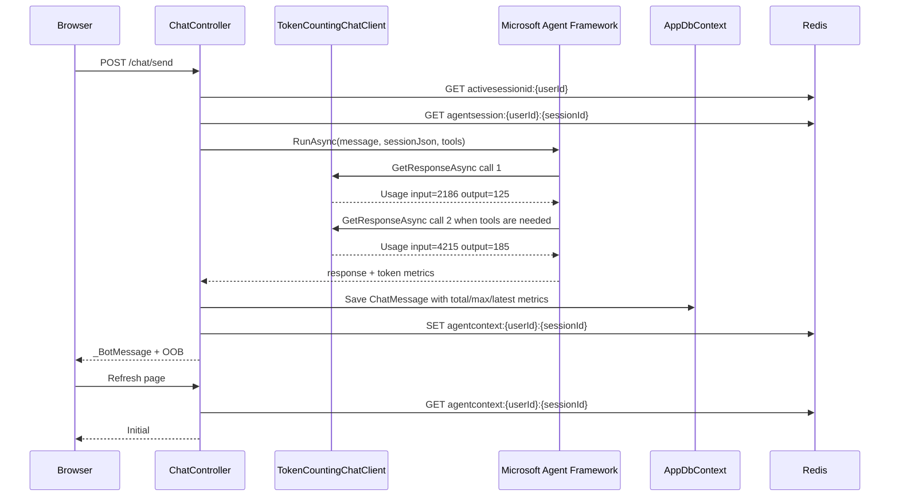

# Plan: Context Pressure Metrics

## Table of Contents

- [Plan: Context Pressure Metrics](#plan-context-pressure-metrics)
  - [Table of Contents](#table-of-contents)
  - [Summary](#summary)
  - [Technical Approach](#technical-approach)
  - [Component Breakdown](#component-breakdown)
  - [Dependencies](#dependencies)
  - [Flow](#flow)
  - [Risk Assessment](#risk-assessment)

## Summary

Refactor token tracking so the app stores both total model work and context-window pressure. The context ring will use `MaxPromptTokens / Ollama:NumCtx`, while DB and Redis persist the full per-turn diagnostic snapshot.

## Technical Approach

### Token metrics split

`WebApp/Services/TokenCountingChatClient.cs` already wraps the app-wide `IChatClient` pipeline and observes `response.Usage`. Today `TokenAccumulator.Add` only sums input and output tokens. The refactor keeps the same middleware and `AsyncLocal` scope pattern, but expands `TokenAccumulator` to track:

- `TotalInputTokensProcessed`: sum of all positive `InputTokenCount` values in the turn.
- `TotalOutputTokensGenerated`: sum of all positive `OutputTokenCount` values in the turn.
- `LatestPromptTokens`: most recent `InputTokenCount` observed.
- `LatestOutputTokens`: most recent `OutputTokenCount` observed.
- `MaxPromptTokens`: largest `InputTokenCount` observed.
- `MaxOutputTokens`: largest `OutputTokenCount` observed.
- `CallCount`: number of `GetResponseAsync` calls observed inside the scope.

This preserves the current SOLID boundary: token observation stays in `TokenCountingChatClient`, and the controller does not need to know how many Microsoft Agent Framework iterations happened.

### Result and persistence shape

`WebApp/Services/IChatOrchestratorAgent.cs` currently returns `ChatAgentRunResult` with `InputTokensUsed`, `OutputTokensUsed`, and `ElapsedMs`. Replace those two ambiguous token fields with the explicit metrics from the accumulator. `ChatController.Send` will persist those values onto the assistant `ChatMessage`.

`WebApp/Models/ChatMessage.cs` and `WebApp/Data/AppDbContext.cs` will be updated to remove `InputTokensUsed` and `OutputTokensUsed` and add the new nullable assistant-only metric columns. Since there is no production data, the implementation can either regenerate the current unshipped `AddChatMessage` migration or add a migration that drops/recreates `chat_message`.

### Context ring source

`WebApp/Controllers/ChatController.cs` currently computes `usagePct` from accumulated input tokens. Replace that with:

```text
ContextUsagePct = round(MaxPromptTokens * 100 / Ollama:NumCtx), clamped to [0, 100]
```

`_BotMessage.cshtml` can keep using `BotMessageViewModel.UsagePct`, but that value should now come from `ContextUsagePct`. This keeps the UI simple while making the value correct.

### Refresh persistence

`agentcontext:{userId}:{sessionId}` already stores a Redis snapshot for the active session. Update its payload to:

```json
{
  "totalInputTokensProcessed": 5196,
  "totalOutputTokensGenerated": 782,
  "latestPromptTokens": 3120,
  "maxPromptTokens": 4215,
  "modelCallCount": 2,
  "numCtx": 8192,
  "contextUsagePct": 51,
  "lastResponseMs": 83741
}
```

To preserve the ring after refresh, the page-render path must read this context snapshot. The most direct approach is to add a small context-ring view model or page model value for `WebApp/Views/Home/Index.cshtml`, because that view owns the initial `#context-ring` markup. The code should reuse the existing `activesessionid:{userId}` pointer and `agentcontext:{userId}:{sessionId}` key shape. If no snapshot exists, render `0%`.

The chat history partial `WebApp/Views/Chat/Chat.cshtml` can keep rendering messages from DB; it does not need to show token diagnostics.

### Logging

Update the `Turn stats:` log line in `ChatController.Send` to use the new field names. `promptChars` remains useful as a rough calibration hint, but it should be clear that token metrics are authoritative from Ollama usage and not inferred from characters.

## Component Breakdown

**Existing files to modify:**

- `WebApp/Services/TokenCountingChatClient.cs` — expand `TokenAccumulator` and update tests for totals/latest/max/call count.
- `WebApp/Services/IChatOrchestratorAgent.cs` — replace ambiguous `ChatAgentRunResult` token fields with explicit metrics.
- `WebApp/Models/ChatMessage.cs` — replace old token columns with new diagnostic/context-pressure columns.
- `WebApp/Data/AppDbContext.cs` — configure the new `ChatMessage` properties.
- `WebApp/Migrations/20260605114500_AddChatMessage.cs` and `.Designer.cs` or a new migration — produce the final `chat_message` schema with the new columns. No production backfill required.
- `WebApp/Migrations/AppDbContextModelSnapshot.cs` — reflect the new schema.
- `WebApp/Controllers/ChatController.cs` — compute `ContextUsagePct` from `MaxPromptTokens`, persist the new metrics, update Redis payload, update logs, and continue deleting the current context key on reset.
- `WebApp/Models/BotMessageViewModel.cs` — keep or rename `UsagePct`; if renamed, update all callers and `_BotMessage.cshtml`.
- `WebApp/Views/Chat/_BotMessage.cshtml` — keep rendering the OOB `#context-ring` from the context-pressure percentage.
- `WebApp/Views/Home/Index.cshtml` — render the initial ring from the stored Redis context snapshot on page refresh.
- `WebApp.Tests/Services/TokenCountingChatClientTests.cs` — verify totals, latest values, max values, null usage, and scope independence.
- `WebApp.Tests/Controllers/ChatControllerTests.cs` — update fake `ChatAgentRunResult` construction, Redis context assertions, reset assertions, and ring refresh behavior.
- `WebApp.Tests/Integration/AgentToolsPostgresTests.cs` — update DB metric assertions for assistant messages.

**New files to create:**

- Optional: `WebApp/Models/AgentContextSnapshot.cs` — typed Redis payload for `agentcontext:{userId}:{sessionId}` if the implementation prefers a named record over anonymous objects.
- Optional: `WebApp/Models/ContextRingViewModel.cs` — small view model if the initial ring rendering needs to pass more than a percentage.

## Dependencies

- `Ollama:NumCtx` from `WebApp/appsettings.json`.
- Ollama usage metadata exposed through `Microsoft.Extensions.AI` / OllamaSharp.
- Redis for `activesessionid:{userId}` and `agentcontext:{userId}:{sessionId}`.
- PostgreSQL/EF Core for `chat_message` schema updates.
- Existing Shoelace `<sl-progress-ring>` and HTMX out-of-band update behavior.

## Flow



## Risk Assessment

| Risk | Evidence | Mitigation |
| --- | --- | --- |
| `response.Usage` may be null | Existing `TokenCountingChatClient` already guards null usage | Keep null as zero and do not increment max/latest beyond observed positive values; tests cover null usage |
| `MaxPromptTokens` may still be lower than the next prompt after the assistant response is serialized | The ring reflects the highest prompt seen during the completed turn, not a predictive tokenization of Redis JSON | Document it as "last observed context pressure"; future summarisation/tokenization can refine it |
| Editing or replacing the current migration can disrupt local DB state | The migration is new and there is no production data | Spec explicitly allows dropping/recreating `chat_message`; manual verification should start from a clean local DB if needed |
| Refresh ring requires data outside the chat partial | `Index.cshtml` owns the initial ring markup | Add a small view model or helper path so the initial page render can read `agentcontext` before outputting the ring |
| UI could become noisy if diagnostics are exposed | User requested only the ring on UI | Persist diagnostics in DB/Redis and keep visible UI limited to the ring |
