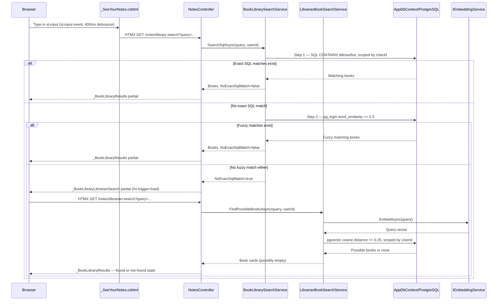

# Plan: Notes Library Search

## Table of Contents

- [Summary](#summary)
- [Technical Approach](#technical-approach)
- [Component Breakdown](#component-breakdown)
- [Dependencies](#dependencies)
- [Flow](#flow)
- [Risk Assessment](#risk-assessment)

## Summary

Add a notes library search path that keeps the current Razor partial card layout, adds a Shoelace search input in `#search-container`, and uses an authenticated `NotesController` endpoint for a three-step search: exact SQL CONTAINS → pg_trgm fuzzy match → pgvector librarian fallback. When both SQL steps return no results, the UI renders a librarian-searching state that automatically triggers a second endpoint for semantic/vector lookup.

## Technical Approach

`WebApp/Views/Home/_SeeYourNotes.cshtml` is the shell for the notes library header and search control. The book grid and empty states live in `WebApp/Views/Home/_BookLibraryResults.cshtml`. The search input uses `sl-input` with `<sl-icon slot="prefix" name="search"></sl-icon>` and HTMX attributes.

### HTMX wiring — no hyperscript

Hyperscript 0.9.x tokenises `-` as a subtraction operator, so `on sl-input` fails to parse. The final implementation uses HTMX's built-in JavaScript evaluation instead:

```html
hx-trigger="sl-input delay:400ms"
hx-vals="js:{query: document.getElementById('library-search-input').value}"
```

`hx-vals="js:..."` evaluates at request time (after the 400 ms debounce), reads the Shoelace element's `.value` property directly, and adds no custom JavaScript file. Shoelace fires `sl-input` after clearing too, so no separate `sl-clear` handler is needed. Hyperscript is not used anywhere in this feature.

The `hx-vals` attribute in `_BookLibraryLibrarianSearch.cshtml` must use **single-quote delimiters** (`hx-vals='{"query":"..."}'`) because `JsonSerializer` emits double-quoted JSON; mixing both quote styles within a double-quoted HTML attribute breaks the browser's attribute parser.

### Three-step search pipeline in `BookLibrarySearchService`

`SearchSqlAsync` runs three steps in order, stopping at the first hit:

1. **Blank query** → return all user books ordered by `UpdatedAt` descending. No SQL search.
2. **Exact SQL CONTAINS** → `WHERE lower(title) LIKE '%query%' OR lower(author) LIKE '%query%'`, scoped by `UserId`, ordered by `UpdatedAt` descending.
3. **pg_trgm fuzzy match** → `word_similarity(query, lower(title)) >= 0.3 OR word_similarity(query, lower(author)) >= 0.3`, ordered by descending similarity score. Requires `pg_trgm` extension and GIN indexes added via migration `20260606232130_AddPgTrgmExtension`.

The fuzzy step is guarded by `db.Database.IsRelational()` so in-memory EF Core test contexts skip it without error. `LibrarySearchResult.NoExactSqlMatch = true` is returned only when both SQL steps find nothing.

### Librarian endpoint (`LibrarianBookSearchService`)

When both SQL steps return nothing, the controller returns `_BookLibraryLibrarianSearch.cshtml`, which auto-triggers `GET /notes/librarian-search` via `hx-trigger="load"`. The librarian service embeds the query with Ollama `mxbai-embed-large` and queries `book_embedding` with pgvector cosine distance. Only results with cosine distance ≤ **0.25** are accepted. This threshold is intentionally tighter than the 0.5 used by `BookLookupService`: gibberish queries produce near-orthogonal embedding vectors (~1.0 distance) and must be rejected, while genuine semantic queries ("desert planet" → Dune) typically score below 0.15.

Both endpoints live in `NotesController`. The librarian endpoint is not placed in `BookContextController` because it returns book card partials, not context JSON.

## Component Breakdown

**Existing files modified:**

- `WebApp/Views/Home/_SeeYourNotes.cshtml` — `sl-input` with `hx-vals="js:..."` and `hx-trigger="sl-input delay:400ms"`; `#library-results` div wrapping the initial results partial.
- `WebApp/Controllers/NotesController.cs` — `LibrarySearch` and `LibrarianSearch` actions; `IBookLibrarySearchService` and `ILibrarianBookSearchService` injected via constructor.
- `WebApp/Program.cs` — registers `IBookLibrarySearchService` and `ILibrarianBookSearchService`.

**New files created:**

- `WebApp/Views/Home/_BookLibraryResults.cshtml` — book grid partial; handles empty-library, SQL/fuzzy results, librarian-found (with header), and librarian-not-found states.
- `WebApp/Views/Home/_BookLibraryLibrarianSearch.cshtml` — intermediate "searching" state with `hx-trigger="load"` and `hx-vals='{"query":"..."}'` (single-quoted attribute, double-quoted JSON).
- `WebApp/Services/BookLibrarySearchService.cs` — exact SQL CONTAINS + pg_trgm fuzzy; `IsRelational()` guard on the fuzzy step; `FuzzyThreshold = 0.3f`.
- `WebApp/Services/LibrarianBookSearchService.cs` — pgvector cosine search; `MaxCosineDistance = 0.25`.
- `WebApp/Models/BookLibraryResultsViewModel.cs` — `Books`, `HeaderMessage`, `IsLibrarianNotFound`.
- `WebApp/Migrations/20260606232130_AddPgTrgmExtension.cs` — `CREATE EXTENSION IF NOT EXISTS pg_trgm` + GIN indexes on `lower("Title")` and `lower("Author")`.
- `WebApp.Tests/Services/BookLibrarySearchServiceTests.cs` — in-memory unit tests for exact SQL path and blank query.
- `WebApp.Tests/Controllers/NotesControllerTests.cs` — controller tests with fakes for both search services.
- `WebApp.Tests/Integration/BookLibrarySearchPostgresTests.cs` — Postgres integration tests for fuzzy typo matching, librarian vector lookup, user isolation, gibberish rejection.

## Dependencies

- Authenticated ASP.NET Core MVC session.
- PostgreSQL with pgvector for librarian fallback.
- PostgreSQL `pg_trgm` extension for fuzzy matching (added by migration; built into PostgreSQL, no external package).
- Existing `BookEmbedding` rows created during Kindle import.
- Ollama `mxbai-embed-large` through `IEmbeddingService` for librarian fallback.
- HTMX `hx-vals="js:..."` for reading `sl-input` value at request time (built into HTMX, no hyperscript).
- Shoelace `sl-input` and `sl-icon` already loaded in `_Layout.cshtml`.

## Flow



## Risk Assessment

| Risk | Evidence | Mitigation |
| --- | --- | --- |
| Hyperscript can't parse hyphenated event names | `on sl-input` fails in hyperscript 0.9.x: `-` is tokenised as subtraction. | Use `hx-vals="js:..."` + `hx-trigger="sl-input"` directly on the element; no hyperscript needed. |
| Double-quoted JSON inside double-quoted HTML attribute | `hx-vals="{"query":"x"}"` — browser closes attribute at first inner `"`. | Use single-quote attribute delimiters: `hx-vals='{"query":"x"}'`. |
| Vector search returning results for gibberish input | Cosine distance 0.5 always finds something in a non-empty library. | Tighten `MaxCosineDistance` to 0.25; orthogonal (gibberish) vectors score ~1.0 and are rejected. |
| pg_trgm raw SQL incompatible with in-memory EF provider | `SqlQueryRaw` throws on non-relational contexts. | Guard with `db.Database.IsRelational()` before the fuzzy step. |
| User data leakage through semantic fallback | Book and embedding data are user-owned. | `UserId` predicate on all SQL and pgvector queries; integration tests verify isolation. |
| Slow search on every keystroke | Embedding generation calls Ollama. | 400ms HTMX debounce; embedding invoked only after both SQL steps fail. |
| No-results state showing too early | Spec required no-results only after librarian retry. | Final not-found copy rendered only from the librarian endpoint response. |
