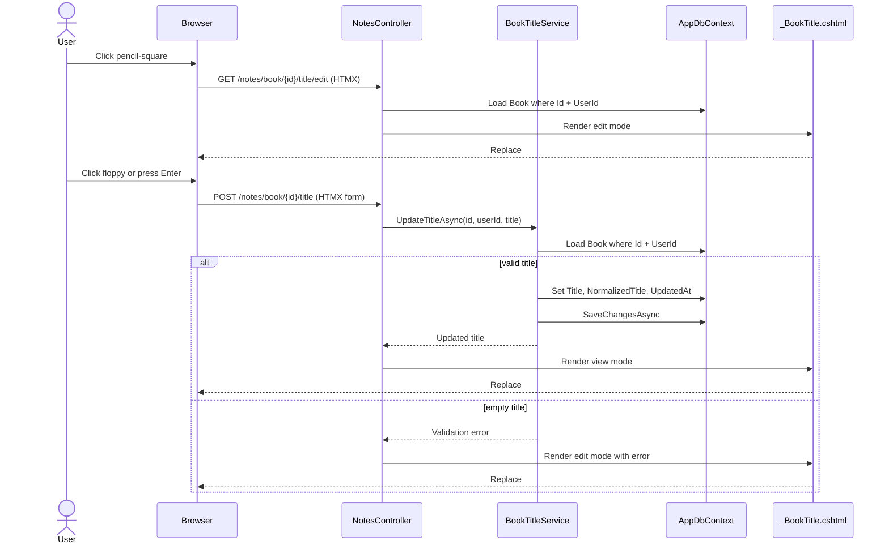

# Plan: Inline Book Title Editing

## Table of Contents

- [Summary](#summary)
- [Technical Approach](#technical-approach)
- [Component Breakdown](#component-breakdown)
- [Dependencies](#dependencies)
- [Flow](#flow)
- [Risk Assessment](#risk-assessment)

## Summary

Add a title-only HTMX partial to the existing Notes book detail screen so the title toggles between plain text plus a `pencil-square` icon and an input plus a `floppy` icon. Persist saves through a user-scoped MVC endpoint and a focused title update service that trims and normalizes the title.

## Technical Approach

### Razor and HTMX title region

`WebApp/Views/Notes/_BookDetails.cshtml` should stop rendering:

```razor
<p class="font-title text-3xl leading-tight">@Model.Title</p> // TODO implement the update title
```

Instead it should render a new title-region partial. The partial should have a stable wrapper id such as `book-title-@Model.Id` so HTMX can replace only that region. It can render in two modes:

- View mode: plain title text, existing title typography, Shoelace `pencil-square` icon button, and optional tooltip.
- Edit mode: `sl-input` containing the current title, Shoelace `floppy` save affordance, optional validation text, and an Enter-to-save trigger using HTMX/hyperscript.

This follows the existing Notes partial pattern in `WebApp/Views/Notes/_BookContext.cshtml`, where a stable `id` and `hx-target`/`hx-swap="outerHTML"` update one screen fragment without refreshing the surrounding book details.

### Controller endpoints

Extend `WebApp/Controllers/NotesController.cs` with small user-scoped endpoints:

- `GET /notes/book/{id:guid}/title/edit` - loads the book by `Id` and `UserId`, returns the title partial in edit mode.
- `POST /notes/book/{id:guid}/title` - validates and persists the title, then returns the title partial in view mode on success or edit mode with an error on failure.

The controller should continue using `ClaimTypes.NameIdentifier` as in `Library`, `Book`, and `GenerateContext`. It should return `Unauthorized` when the user id is missing and `NotFound` when the book does not belong to the user.

### Title update service

Introduce a narrow service for title edits, for example `IBookTitleService` / `BookTitleService` in `WebApp/Services/BookTitleService.cs`. This keeps title mutation, trimming, normalization, and timestamp updates outside the controller. The service owns the EF Core write:

- load `Book` with `Id` and `UserId`
- reject empty title before mutation
- set `Title` to the trimmed value
- set `NormalizedTitle` using the same normalization rule used by the import/search paths: lowercase invariant and keep only letters/digits
- set `UpdatedAt = DateTime.UtcNow`
- call `SaveChangesAsync`

This service should not regenerate embeddings or call Ollama. Embedding regeneration is out of scope for the inline edit slice and can be handled by a later spec if semantic lookup needs retuning after manual title edits.

### View model

Add a focused view model, for example `BookTitleEditViewModel`, under `WebApp/Models/` with:

- `Guid Id`
- `string Title`
- `bool IsEditing`
- `string? ErrorMessage`

`BookDetailsViewModel` can stay unchanged if the new partial is initialized from its existing `Id` and `Title`. If the implementation prefers a shared partial model, it can map `BookDetailsViewModel` into `BookTitleEditViewModel` in the Razor call.

### SOLID alignment

| Principle | How it applies |
| --- | --- |
| SRP | `NotesController` handles request flow and partial responses; `BookTitleService` handles persistence and normalization; Razor partials render state. |
| OCP | Existing book detail and import flows are extended by adding endpoints and a partial without changing their public behavior. |
| LSP | `IBookTitleService` can be faked in controller tests. |
| ISP | `IBookTitleService` exposes only title-edit behavior, not import, context, note, or search responsibilities. |
| DIP | The controller depends on an interface instead of a concrete EF mutation implementation. |

## Component Breakdown

**Existing files to modify:**

- `WebApp/Views/Notes/_BookDetails.cshtml` - replace the TODO title markup with a render of the new title-region partial.
- `WebApp/Controllers/NotesController.cs` - inject `IBookTitleService`; add title edit and save actions; keep user lookup and partial result handling consistent with existing Notes actions.
- `WebApp/Program.cs` - register `IBookTitleService` with `BookTitleService`.
- `WebApp.Tests/Controllers/NotesControllerTests.cs` - add controller coverage for title edit/save partial behavior, unauthorized access, not-found behavior, and validation failures.

**New files to create:**

- `WebApp/Views/Notes/_BookTitle.cshtml` - renders both view and edit title states with Shoelace icons and HTMX/hyperscript attributes.
- `WebApp/Models/BookTitleEditViewModel.cs` - title-region partial model.
- `WebApp/Services/BookTitleService.cs` - `IBookTitleService`, result type if needed, and EF Core title update implementation.
- `WebApp.Tests/Services/BookTitleServiceTests.cs` - focused tests for trimming, empty validation, normalized title updates, `UpdatedAt`, user scoping, and not-found behavior.

## Dependencies

- ASP.NET Core MVC and Razor partials already used by the app.
- HTMX and hyperscript already expected by the UI constraints; no new JavaScript package should be added.
- Shoelace components already used in `_BookContext.cshtml`, `UserProfile/Upsert.cshtml`, and shared UI.
- PostgreSQL/EF Core through existing `AppDbContext`.

## Flow



## Risk Assessment

| Risk | Evidence | Mitigation |
| --- | --- | --- |
| Title edit bypasses user isolation | Existing Notes actions always filter by `UserId`; book data is user-owned | Both controller load and service update must use `Id` + `UserId`; add tests for other-user books |
| Empty titles break library/search display | `Book.Title` is required and displayed in multiple views | Reject null/empty/whitespace values before mutation and keep edit mode visible with an error |
| Normalized title becomes inconsistent with import/search behavior | `KindleClippingsImportService` and search services rely on normalized title | Centralize the normalization expression in `BookTitleService` and cover it with tests |
| Title-only swap leaves cover alt/fallback text stale | Requirement intentionally updates only the title region | Document this as expected behavior; full detail render updates cover text on next navigation |
| Enter-to-save requires JavaScript | User explicitly forbids JavaScript | Use `hx-trigger` with keyboard events and/or hyperscript on the form/input; do not edit `site.js` |
| Semantic embedding remains based on old title | Existing `BookEmbedding` is generated at import time from title and author | Keep embedding regeneration out of scope and document the limitation for a later retrieval-quality spec |
