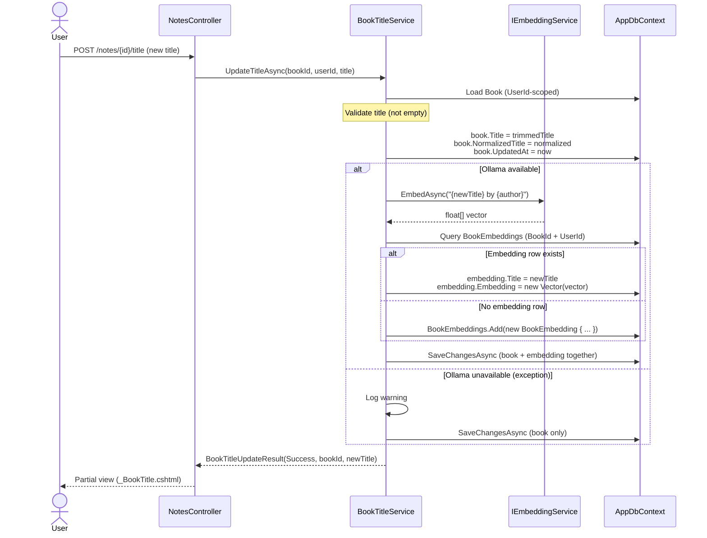

# Plan: Book Title Embedding Sync

## Table of Contents

- [Summary](#summary)
- [Technical Approach](#technical-approach)
- [Component Breakdown](#component-breakdown)
- [Dependencies](#dependencies)
- [Flow](#flow)
- [Risk Assessment](#risk-assessment)

## Summary

`BookTitleService` is extended to inject `IEmbeddingService` and regenerate the `BookEmbedding` row whenever a title is renamed. The change is entirely within `BookTitleService.UpdateTitleAsync` and its test file — no new classes, no new interfaces, no migrations, and no callers change.

## Technical Approach

### Change to `BookTitleService`

Add `IEmbeddingService` and `ILogger<BookTitleService>` to the primary constructor. After title validation passes and before `SaveChangesAsync`, attempt to regenerate the embedding:

```text
1. Generate new vector: IEmbeddingService.EmbedAsync("{trimmedTitle} by {book.Author}", ct)
2. Query AppDbContext.BookEmbeddings for existing row (BookId + UserId)
3a. If found  → update embedding.Title and embedding.Embedding
3b. If not found → db.BookEmbeddings.Add(new BookEmbedding { ... })
4. SaveChangesAsync (includes both book and embedding changes)
```

If step 1 throws, catch the exception, log a warning, skip steps 2–4 for the embedding, and call `SaveChangesAsync` for the book-only changes (title still saved).

This follows the same try/catch + warn + degrade pattern used in `BookLookupService.TryFindByEmbeddingAsync` and `OpenLibraryService`.

### Test changes to `BookTitleServiceTests`

The existing `TestDbContext` ignores `BookEmbedding` with `builder.Ignore<BookEmbedding>()`. This must be removed so in-memory EF can track embedding rows. The in-memory provider does not need pgvector support here — the `Vector` type is stored and retrieved as an opaque object in tests; no SQL cosine queries are executed. All existing tests receive a `FakeEmbeddingService` that returns a fixed float array, keeping them green with no other change.

### SOLID alignment

| Principle | How it applies |
|---|---|
| SRP | `BookTitleService` coordinates title + embedding update; `IEmbeddingService` generates vectors; `AppDbContext` persists. Responsibilities are unchanged — only the coordination scope widens. |
| OCP | No existing interface or public method signature changes; the extension is additive inside `UpdateTitleAsync`. |
| DIP | `BookTitleService` depends on `IEmbeddingService`; Ollama is never referenced directly. |
| ISP | `IEmbeddingService` is already a single-method interface (`EmbedAsync`) — no change. |

## Component Breakdown

**Existing files to modify:**

- `WebApp/Services/BookTitleService.cs` — add `IEmbeddingService` and `ILogger<BookTitleService>` to the primary constructor; add embedding upsert logic and exception guard in `UpdateTitleAsync`. The `IBookTitleService` interface is not modified.
- `WebApp.Tests/Services/BookTitleServiceTests.cs` — remove `builder.Ignore<BookEmbedding>()` from `TestDbContext`; add `FakeEmbeddingService`; pass it in all existing `new BookTitleService(db)` calls; add new test cases for embedding creation, embedding update, and Ollama-failure fallback.

**New files to create:**

None.

## Dependencies

- `IEmbeddingService` — already registered in `Program.cs`; no new registration needed.
- `Pgvector.Vector` — already referenced via `Pgvector.EntityFrameworkCore`.
- Running Ollama — needed at runtime for the real `EmbeddingService`; tests use a fake so no Docker dependency for the unit test suite.

## Flow



## Risk Assessment

| Risk | Evidence | Mitigation |
|---|---|---|
| `builder.Ignore<BookEmbedding>()` removal breaks existing tests | `TestDbContext` currently ignores `BookEmbedding` because `Vector` type requires pgvector EF registration | In-memory EF does not execute SQL and does not need pgvector; `Vector` can be tracked as a plain object. Verify by running `make test` after the change. |
| Ollama latency added to title-save request | Embedding generation is a synchronous Ollama round-trip (~200–800 ms) that now blocks the HTMX partial response | Acceptable for an infrequent, user-triggered action; async background embedding (e.g., `IBackgroundTaskQueue`) is out of scope for this fix. |
| Race condition: two simultaneous title edits for the same book | Unlikely in a single-user local app; no concurrency control exists today | Out of scope; the last write wins via EF's default behavior. |
| Books with no `BookEmbedding` row silently fixed on next title edit | Pre-embedding books have no row; the upsert path creates one | Desired behavior per FR3; no downside. |
