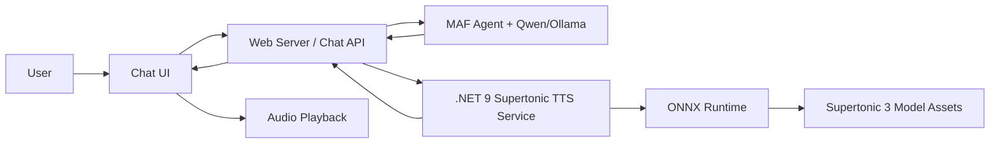

# Code Example: .NET 9 Supertonic Text-to-Speech Service

> This file is a code example reference only. It is not a tutorial, not the source of truth for scope, and not a step-by-step implementation plan. Use `Requirements.md`, `Plan.md`, and `Validation.md` as the authoritative spec for this project.

## 1. Project Overview

This document describes a recommended implementation for a dedicated **.NET 9 Text-to-Speech (TTS) service** using **Supertonic 3**. The service is intended to integrate with a web server or chat backend that already generates text responses using an LLM such as Qwen/Ollama.

The goal is to keep speech synthesis isolated from the chat agent logic. The web server or agent generates the final assistant response as text, then calls this TTS service to convert that text into playable audio.

The default voice strategy is:

| Language | Default Female Voice | Default Male Voice |
|---|---:|---:|
| English | `F3` | `M3` |
| Portuguese | `F3` | `M3` |

The same Supertonic preset voice can be used with different language codes. For example, `F3 + en` for English female speech and `F3 + pt` for Portuguese female speech.

## 2. Scope

This service is responsible for:

- Receiving text from the web server.
- Selecting the correct language and voice.
- Running Supertonic 3 locally through ONNX Runtime.
- Returning a WAV audio response or an audio file URL.
- Providing a clean HTTP interface for the rest of the application.

This service is not responsible for:

- Generating the assistant text response.
- Managing the chat conversation state.
- Calling the LLM directly.
- Deciding what the assistant should say.

A good separation is:

```text
LLM / Agent = decides what to say
TTS Service = converts final text into audio
```

## 3. High-Level Architecture



## 4. Recommended Repository Structure

```text
services/
  tts-service/
    TtsService.Api/
      Controllers/
        TtsController.cs
      Options/
        SupertonicOptions.cs
        TtsDefaultsOptions.cs
      Services/
        ITtsService.cs
        SupertonicTtsService.cs
        VoiceResolver.cs
      Models/
        TtsRequest.cs
        TtsResponse.cs
      Program.cs
      appsettings.json
    assets/
      supertonic-3/
        ... Supertonic ONNX model files and preset voice assets ...
```

## 5. Prerequisites

### 5.1 Install .NET 9

The Supertonic C# example targets **.NET 9** and allows major-version roll-forward. For this service, use .NET 9 as the baseline.

```bash
dotnet --version
```

Expected result:

```text
9.x.x
```

### 5.2 Download Supertonic 3 Assets

Clone the Supertonic model assets into the service assets directory.

```bash
mkdir -p services/tts-service/assets
cd services/tts-service/assets

git lfs install
git clone https://huggingface.co/Supertone/supertonic-3 supertonic-3
```

The final path should look similar to:

```text
services/tts-service/assets/supertonic-3
```

### 5.3 Add ONNX Runtime

Add ONNX Runtime to the .NET project:

```bash
cd services/tts-service/TtsService.Api

dotnet add package Microsoft.ML.OnnxRuntime
```

If you later deploy with GPU acceleration, use the correct ONNX Runtime GPU package and container image for your target environment. For the first version, CPU inference is simpler and should be enough for local study and MVP usage.

## 6. Create the .NET 9 Web API Service

```bash
mkdir -p services/tts-service
cd services/tts-service

dotnet new webapi -n TtsService.Api -f net9.0
cd TtsService.Api
```

Recommended packages:

```bash
dotnet add package Microsoft.ML.OnnxRuntime
dotnet add package Microsoft.Extensions.Options.ConfigurationExtensions
```

## 7. Configuration

Use `appsettings.json` to keep model paths and default voice settings outside the code.

```json
{
  "Supertonic": {
    "AssetsPath": "../assets/supertonic-3",
    "SampleRate": 44100,
    "DefaultTotalSteps": 8,
    "DefaultSpeed": 1.05
  },
  "TtsDefaults": {
    "Languages": {
      "en": {
        "Female": "F3",
        "Male": "M3"
      },
      "pt": {
        "Female": "F3",
        "Male": "M3"
      }
    }
  }
}
```

### Configuration Notes

- `AssetsPath` points to the local Supertonic 3 model folder.
- `DefaultTotalSteps` controls quality/performance tradeoff.
  - Lower values are faster.
  - Higher values may improve quality but cost more latency.
- `DefaultSpeed` controls speech speed.
- `F3` and `M3` are used as the default female/male voices for both English and Portuguese.

## 8. Request and Response Models

### `TtsRequest.cs`

```csharp
namespace TtsService.Api.Models;

public sealed class TtsRequest
{
    public required string Text { get; init; }

    // Supported values for the MVP: "en" and "pt".
    public string Language { get; init; } = "en";

    // Supported values for the MVP: "female" and "male".
    public string VoiceGender { get; init; } = "female";

    // Optional explicit override: "F3", "M3", etc.
    public string? VoiceName { get; init; }

    public float? Speed { get; init; }

    public int? TotalSteps { get; init; }
}
```

### `TtsResponse.cs`

Use this response model if your service stores generated files and returns a URL.

```csharp
namespace TtsService.Api.Models;

public sealed class TtsResponse
{
    public required string AudioUrl { get; init; }
    public required string Language { get; init; }
    public required string VoiceName { get; init; }
    public required double DurationSeconds { get; init; }
}
```

For a simpler MVP, the API can return `audio/wav` directly instead of returning JSON.

## 9. Options Classes

### `SupertonicOptions.cs`

```csharp
namespace TtsService.Api.Options;

public sealed class SupertonicOptions
{
    public required string AssetsPath { get; init; }
    public int SampleRate { get; init; } = 44100;
    public int DefaultTotalSteps { get; init; } = 8;
    public float DefaultSpeed { get; init; } = 1.05f;
}
```

### `TtsDefaultsOptions.cs`

```csharp
namespace TtsService.Api.Options;

public sealed class TtsDefaultsOptions
{
    public Dictionary<string, VoiceDefaults> Languages { get; init; } = new();
}

public sealed class VoiceDefaults
{
    public string Female { get; init; } = "F3";
    public string Male { get; init; } = "M3";
}
```

## 10. Voice Resolution

The voice resolver maps user-friendly options such as `female` and `male` into Supertonic preset voices.

### `VoiceResolver.cs`

```csharp
using Microsoft.Extensions.Options;
using TtsService.Api.Options;

namespace TtsService.Api.Services;

public sealed class VoiceResolver
{
    private readonly TtsDefaultsOptions _defaults;

    public VoiceResolver(IOptions<TtsDefaultsOptions> defaults)
    {
        _defaults = defaults.Value;
    }

    public string Resolve(string language, string voiceGender, string? explicitVoiceName)
    {
        if (!string.IsNullOrWhiteSpace(explicitVoiceName))
        {
            return explicitVoiceName.Trim().ToUpperInvariant();
        }

        var normalizedLanguage = NormalizeLanguage(language);
        var normalizedGender = voiceGender.Trim().ToLowerInvariant();

        if (!_defaults.Languages.TryGetValue(normalizedLanguage, out var voiceDefaults))
        {
            voiceDefaults = _defaults.Languages["en"];
        }

        return normalizedGender switch
        {
            "male" => voiceDefaults.Male,
            "female" => voiceDefaults.Female,
            _ => voiceDefaults.Female
        };
    }

    public static string NormalizeLanguage(string language)
    {
        var value = language.Trim().ToLowerInvariant();

        return value switch
        {
            "pt-br" => "pt",
            "pt_br" => "pt",
            "portuguese" => "pt",
            "en-us" => "en",
            "en-gb" => "en",
            "english" => "en",
            _ => value
        };
    }
}
```

This makes the default behavior explicit:

```csharp
// English female
Resolve("en", "female", null); // F3

// English male
Resolve("en", "male", null);   // M3

// Portuguese female
Resolve("pt", "female", null); // F3

// Portuguese male
Resolve("pt", "male", null);   // M3
```

## 11. TTS Service Interface

### `ITtsService.cs`

```csharp
using TtsService.Api.Models;

namespace TtsService.Api.Services;

public interface ITtsService
{
    Task<TtsAudioResult> SynthesizeAsync(
        TtsRequest request,
        CancellationToken cancellationToken);
}

public sealed class TtsAudioResult
{
    public required byte[] WavBytes { get; init; }
    public required string Language { get; init; }
    public required string VoiceName { get; init; }
    public required double DurationSeconds { get; init; }
}
```

## 12. Supertonic Service Implementation

The exact Supertonic C# helper types depend on the official Supertonic `csharp/` example. The important part is to keep those details inside `SupertonicTtsService`, so the rest of your application only depends on `ITtsService`.

### `SupertonicTtsService.cs`

```csharp
using Microsoft.Extensions.Options;
using TtsService.Api.Models;
using TtsService.Api.Options;

namespace TtsService.Api.Services;

public sealed class SupertonicTtsService : ITtsService
{
    private readonly SupertonicOptions _options;
    private readonly VoiceResolver _voiceResolver;

    public SupertonicTtsService(
        IOptions<SupertonicOptions> options,
        VoiceResolver voiceResolver)
    {
        _options = options.Value;
        _voiceResolver = voiceResolver;

        // Initialize the Supertonic / ONNX Runtime objects here.
        // Keep the model loaded for the lifetime of the service.
        // Avoid loading the model on every request.
    }

    public async Task<TtsAudioResult> SynthesizeAsync(
        TtsRequest request,
        CancellationToken cancellationToken)
    {
        if (string.IsNullOrWhiteSpace(request.Text))
        {
            throw new ArgumentException("Text is required.", nameof(request));
        }

        var language = VoiceResolver.NormalizeLanguage(request.Language);
        var voiceName = _voiceResolver.Resolve(
            language,
            request.VoiceGender,
            request.VoiceName);

        var speed = request.Speed ?? _options.DefaultSpeed;
        var totalSteps = request.TotalSteps ?? _options.DefaultTotalSteps;

        // Replace this block with the concrete calls from the official
        // Supertonic csharp/ example.
        //
        // Conceptually, the call should look like:
        //
        // var voiceStyle = _supertonic.GetVoiceStyle(voiceName);
        // var result = _supertonic.Synthesize(
        //     text: request.Text,
        //     lang: language,
        //     voiceStyle: voiceStyle,
        //     totalSteps: totalSteps,
        //     speed: speed);
        //
        // byte[] wavBytes = WavEncoder.Encode(
        //     samples: result.Samples,
        //     sampleRate: _options.SampleRate);
        //
        // return new TtsAudioResult
        // {
        //     WavBytes = wavBytes,
        //     Language = language,
        //     VoiceName = voiceName,
        //     DurationSeconds = result.DurationSeconds
        // };

        await Task.CompletedTask;

        throw new NotImplementedException(
            "Wire this adapter to the official Supertonic C# ONNX example.");
    }
}
```

### Why use an adapter?

The adapter keeps your web server independent from the Supertonic implementation. If later you move from Supertonic to another TTS engine, only this class needs to change.

```text
Web Server -> HTTP contract -> TTS Service -> ITtsService -> Supertonic Adapter
```

## 13. API Controller

### `TtsController.cs`

```csharp
using Microsoft.AspNetCore.Mvc;
using TtsService.Api.Models;
using TtsService.Api.Services;

namespace TtsService.Api.Controllers;

[ApiController]
[Route("tts")]
public sealed class TtsController : ControllerBase
{
    private readonly ITtsService _ttsService;

    public TtsController(ITtsService ttsService)
    {
        _ttsService = ttsService;
    }

    [HttpPost("synthesize")]
    [Produces("audio/wav")]
    public async Task<IActionResult> Synthesize(
        [FromBody] TtsRequest request,
        CancellationToken cancellationToken)
    {
        var result = await _ttsService.SynthesizeAsync(request, cancellationToken);

        Response.Headers["X-TTS-Language"] = result.Language;
        Response.Headers["X-TTS-Voice"] = result.VoiceName;
        Response.Headers["X-TTS-Duration-Seconds"] = result.DurationSeconds.ToString("0.000");

        return File(result.WavBytes, "audio/wav", "speech.wav");
    }
}
```

## 14. Program Configuration

### `Program.cs`

```csharp
using TtsService.Api.Options;
using TtsService.Api.Services;

var builder = WebApplication.CreateBuilder(args);

builder.Services.AddControllers();
builder.Services.AddEndpointsApiExplorer();
builder.Services.AddSwaggerGen();

builder.Services.Configure<SupertonicOptions>(
    builder.Configuration.GetSection("Supertonic"));

builder.Services.Configure<TtsDefaultsOptions>(
    builder.Configuration.GetSection("TtsDefaults"));

builder.Services.AddSingleton<VoiceResolver>();
builder.Services.AddSingleton<ITtsService, SupertonicTtsService>();

var app = builder.Build();

app.UseSwagger();
app.UseSwaggerUI();

app.MapControllers();

app.Run();
```

Use `Singleton` for `SupertonicTtsService` because the model should be loaded once and reused across requests. Loading ONNX model assets for every HTTP request would create unnecessary latency and memory pressure.

## 15. Example Requests

### English Female Voice

```bash
curl -X POST http://localhost:5080/tts/synthesize \
  -H "Content-Type: application/json" \
  --output english-female.wav \
  -d '{
    "text": "Hello, I can read this assistant response aloud.",
    "language": "en",
    "voiceGender": "female"
  }'
```

This resolves to:

```text
language: en
voice: F3
```

### English Male Voice

```bash
curl -X POST http://localhost:5080/tts/synthesize \
  -H "Content-Type: application/json" \
  --output english-male.wav \
  -d '{
    "text": "This is the default male English voice.",
    "language": "en",
    "voiceGender": "male"
  }'
```

This resolves to:

```text
language: en
voice: M3
```

### Portuguese Female Voice

```bash
curl -X POST http://localhost:5080/tts/synthesize \
  -H "Content-Type: application/json" \
  --output portuguese-female.wav \
  -d '{
    "text": "Olá, posso ler esta resposta do assistente em voz alta.",
    "language": "pt",
    "voiceGender": "female"
  }'
```

This resolves to:

```text
language: pt
voice: F3
```

### Portuguese Male Voice

```bash
curl -X POST http://localhost:5080/tts/synthesize \
  -H "Content-Type: application/json" \
  --output portuguese-male.wav \
  -d '{
    "text": "Esta é a voz masculina padrão em português.",
    "language": "pt",
    "voiceGender": "male"
  }'
```

This resolves to:

```text
language: pt
voice: M3
```

## 16. Consuming the Service from a Web Server

The web server should call the TTS service after the assistant text has been generated.

Recommended flow:

```text
1. User sends message.
2. Web server sends message to the MAF agent.
3. MAF agent calls Qwen/Ollama and returns text.
4. Web server sends final text to the TTS service.
5. TTS service returns WAV audio.
6. Web server returns both text and audio reference to the frontend.
```

### Web Server HTTP Client Example

```csharp
public sealed class TtsClient
{
    private readonly HttpClient _httpClient;

    public TtsClient(HttpClient httpClient)
    {
        _httpClient = httpClient;
    }

    public async Task<byte[]> GenerateSpeechAsync(
        string text,
        string language,
        string voiceGender,
        CancellationToken cancellationToken)
    {
        var payload = new
        {
            text,
            language,
            voiceGender
        };

        using var response = await _httpClient.PostAsJsonAsync(
            "/tts/synthesize",
            payload,
            cancellationToken);

        response.EnsureSuccessStatusCode();

        return await response.Content.ReadAsByteArrayAsync(cancellationToken);
    }
}
```

### Register the Client

```csharp
builder.Services.AddHttpClient<TtsClient>(client =>
{
    client.BaseAddress = new Uri("http://tts-service:5080");
});
```

In Docker Compose or Kubernetes, `tts-service` should be the internal service name.

## 17. Frontend Consumption Pattern

For the first version, return the assistant text and an audio URL or base endpoint from the web server.

Example response from your chat API:

```json
{
  "message": "Dune is a science fiction novel written by Frank Herbert...",
  "audioUrl": "/chat/audio/response-0186.wav"
}
```

Then the frontend can render:

```html
<div class="assistant-message">
  <p>Dune is a science fiction novel written by Frank Herbert...</p>
  <audio controls src="/chat/audio/response-0186.wav"></audio>
</div>
```

For better UX later, add:

- A speaker button beside each assistant message.
- A user setting for enabling/disabling TTS.
- Voice selection: female/male.
- Language selection: automatic, English, Portuguese.
- Optional caching of generated audio by message ID or text hash.

## 18. Caching Strategy

Speech generation can be cached because the same text, language, voice, speed, and steps always produce the same intended result.

A practical cache key:

```text
tts:{sha256(text + language + voiceName + speed + totalSteps)}
```

Possible cache locations:

- Local disk for a single-node MVP.
- Redis for short-lived cache metadata.
- Object storage for a production SaaS.

For local development, start simple:

```text
wwwroot/audio/generated/{hash}.wav
```

For production, avoid unlimited growth. Add either:

- TTL-based cleanup.
- Size-based FIFO cleanup.
- Per-user retention policy.

## 19. Deployment Notes

### Dockerfile Example

```dockerfile
FROM mcr.microsoft.com/dotnet/aspnet:9.0 AS runtime
WORKDIR /app

COPY ./publish ./
COPY ./assets/supertonic-3 ./assets/supertonic-3

ENV ASPNETCORE_URLS=http://+:5080
EXPOSE 5080

ENTRYPOINT ["dotnet", "TtsService.Api.dll"]
```

Build and publish:

```bash
dotnet publish TtsService.Api/TtsService.Api.csproj -c Release -o publish
```

### Docker Compose Example

```yaml
services:
  tts-service:
    build:
      context: ./services/tts-service
    ports:
      - "5080:5080"
    environment:
      ASPNETCORE_ENVIRONMENT: Development
```

### Kubernetes Notes

For AKS or another Kubernetes cluster:

- Deploy the TTS service as its own Deployment.
- Keep it internal-only with a `ClusterIP` Service.
- Let the web server call it through internal DNS.
- Mount model assets through the image, a persistent volume, or an init container.

Example internal URL:

```text
http://tts-service:5080/tts/synthesize
```

## 20. Performance Expectations

Supertonic 3 is designed for local, low-latency CPU inference. For chat responses, perceived latency is usually acceptable if the response is synthesized after the LLM finishes.

For a simple MVP:

```text
Qwen/Ollama response generation
    -> final text
    -> TTS generation
    -> WAV returned
```

For a better future experience, use sentence-level synthesis:

```text
Qwen/Ollama streams text
    -> web server buffers first sentence
    -> TTS service synthesizes sentence
    -> frontend starts playback earlier
```

Start with full-response synthesis first. Add streaming or sentence-level playback only after the basic service works reliably.

## 21. Error Handling Recommendations

The TTS service should return clear errors for invalid input.

Recommended validation:

- Reject empty text.
- Limit maximum text length per request.
- Allow only supported language codes for the MVP: `en`, `pt`.
- Default unknown voice gender to `female`, or reject it with `400 Bad Request`.
- Log synthesis duration, language, voice, text length, and errors.

Example validation limits:

```text
Maximum text length: 2,000 characters
Default language: en
Default gender: female
Default voice: F3
```

## 22. Logging Recommendations

Log one structured event per request:

```json
{
  "event": "tts.synthesis.completed",
  "language": "pt",
  "voice": "F3",
  "textLength": 124,
  "durationMs": 820,
  "audioDurationSeconds": 7.4
}
```

For your existing observability setup, also pass correlation IDs from the web server:

```http
X-Request-ID: <request-id>
X-User-ID: <user-id-if-available>
```

Do not log full user text in production unless you have an explicit privacy policy for it.

## 23. Security Recommendations

If the TTS service is only used by your web server, keep it private.

Recommended setup:

```text
Browser -> Web Server -> TTS Service
```

Avoid exposing the TTS service directly to the public internet unless you add:

- Authentication.
- Rate limiting.
- Maximum text size validation.
- Abuse monitoring.
- Request quotas.

For Kubernetes, prefer:

```text
Service type: ClusterIP
Ingress: none
```

## 24. License Reminder

Supertonic sample code is MIT licensed, while the Supertonic 3 model is distributed under an OpenRAIL-M license. For personal study and experimentation, this is usually practical. If this project becomes a commercial product, review the exact model license terms and restrictions before launch.

## 25. Recommended MVP Checklist

- [ ] Create `.NET 9` Web API project.
- [ ] Download Supertonic 3 assets.
- [ ] Add ONNX Runtime package.
- [ ] Implement `TtsRequest` and `TtsResponse` models.
- [ ] Add default voice config: `F3` female and `M3` male for `en` and `pt`.
- [ ] Implement `VoiceResolver`.
- [ ] Wrap the official Supertonic C# example inside `SupertonicTtsService`.
- [ ] Expose `POST /tts/synthesize`.
- [ ] Call the TTS service from the web server after the agent response is generated.
- [ ] Render an `<audio controls>` player in the chat UI.
- [ ] Add logging and request IDs.
- [ ] Add cache and cleanup strategy after the basic version works.

## 26. Final Recommendation

Use Supertonic as a dedicated internal service, not as part of the MAF agent itself.

The clean production-oriented boundary is:

```text
MAF Agent produces text.
TTS service produces audio.
Web server coordinates both.
```

This keeps the architecture simple, testable, and easy to evolve. If you later decide to replace Supertonic with another engine, the web server and agent contracts can remain unchanged.
