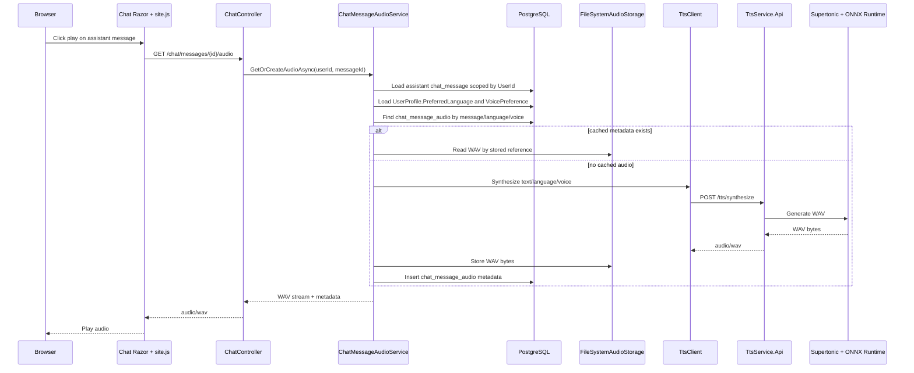

# Plan: Supertonic Text-to-Speech Service

## Table of Contents

- [Plan: Supertonic Text-to-Speech Service](#plan-supertonic-text-to-speech-service)
  - [Summary](#summary)
  - [Technical Approach](#technical-approach)
  - [Component Breakdown](#component-breakdown)
  - [Dependencies](#dependencies)
  - [Flow](#flow)
  - [Risk Assessment](#risk-assessment)

## Summary

Add a separate `.NET 9` TTS API under `services/tts-service/` and integrate it into the existing ASP.NET Core MVC chat UI through user-scoped WebApp services. The implementation follows the current pattern where controllers coordinate, focused services own behavior, EF Core stores metadata, and Docker/Make owns local runtime composition.

Use [CodeExample.md](CodeExample.md) in this spec folder as a non-authoritative code example for the Supertonic API shape, options, voice resolver, and service adapter. It is not a tutorial; `Requirements.md`, `Plan.md`, and `Validation.md` remain the source of truth.

## Technical Approach

Create `services/tts-service/TtsService.Api` as a small ASP.NET Core Web API that exposes `POST /tts/synthesize`, configures `SupertonicOptions` and `TtsDefaultsOptions`, resolves voices through a focused resolver, and hides ONNX Runtime/Supertonic calls behind `ITtsService`. The adapter will be wired to the official Supertonic C# example details during implementation; the rest of the project will treat it as an HTTP service that returns `audio/wav`. If the exact Supertonic C# calls are not available on the first pass, create a deterministic placeholder `ITtsService` implementation behind an explicit development-only configuration flag so WebApp integration, Docker wiring, and tests can proceed without pretending the real model adapter is complete.

Extend `docker-compose.yml` with a `tts` service built from `services/tts-service/TtsService.Api/Dockerfile`. Add an asset mount such as `./services/tts-service/assets/supertonic-3:/models/supertonic-3:ro` and configure `Supertonic__AssetsPath=/models/supertonic-3`. The Make targets in `Makefile` already use `docker-compose.yml` plus one OS-specific override, so adding the service to the base compose file makes `make docker-run`, `make docker-run-mac`, and `make docker-run-windows` start it automatically. Build/down targets continue to use the same compose file sets.

In `WebApp`, add a `ChatMessageAudio` model and `DbSet` in `WebApp/Data/AppDbContext.cs`. Configure `chat_message_audio` with a required FK to `chat_message`, cascade delete, `Language`, `Voice`, `StorageKey`, `ContentType`, `ByteLength`, optional `DurationSeconds`, `ContentHash`, `CreatedAt`, `UpdatedAt`, `UNIQUE(chat_message_id, language, voice)`, and lookup indexes. Recommended column constraints: `Language` max length `10`, `Voice` max length `20`, `StorageKey` max length `500`, `ContentType` max length `100`, `ContentHash` max length `64`, and `ByteLength` as a positive `long`. This keeps audio cache metadata in PostgreSQL while audio bytes live in filesystem-backed audio storage mounted as a Docker volume for development.

Add a persisted voice type preference to `WebApp/Models/UserProfile.cs`, such as `VoicePreference`, with supported values `female` and `male` and a default of `female`. Configure the column in `WebApp/Data/AppDbContext.cs` with max length `10`, non-null, and migration default value `female` so existing profiles remain valid. Normalize incoming form values to lowercase, accept only `female` or `male`, and fall back to `female` for missing or invalid values. Add an EF migration, bind it in `WebApp/Controllers/UserProfileController.cs`, include it in `BuildAgentProfileCompactJson`, and render it in `WebApp/Views/UserProfile/Upsert.cshtml` as a simple selector or compact radio/checkbox-style control. This mirrors the existing `PreferredLanguage` profile flow while keeping the first slice intentionally small.

Add focused WebApp interfaces: one client for the TTS API, one `IAudioStorage` abstraction for audio bytes, and one orchestration service that owns the cache lookup/generate/store flow. The first `IAudioStorage` implementation should be filesystem-backed and write to a configured directory mounted from a named Docker volume. `ChatController` should only expose a user-scoped endpoint such as `GET /chat/messages/{messageId}/audio`: it loads the authenticated user id, delegates to the audio service, and returns `audio/wav` or a clear failure result. The service must query `ChatMessages` by `{Id, UserId, Role = "assistant"}` so users cannot access another user's audio.

Language resolution should come from `UserProfile.PreferredLanguage`, matching the existing profile model in `WebApp/Models/UserProfile.cs`. Voice resolution should come from the new profile voice preference. The WebApp audio service should normalize language values such as `pt-br` to the Supertonic language code expected by the TTS API, then map `female` to `F3` and `male` to `M3`. The TTS API `VoiceResolver` should preserve the same mapping for supported languages, so the effective combinations are `pt` + `F3`, `pt` + `M3`, `en` + `F3`, and `en` + `M3`.

The Microsoft Agent Framework instructions built in `ChatController.BuildOrchestratorInstructions` should explicitly require answers in the user's preferred language regardless of the language of the source book, imported Kindle notes, Open Library synopsis, or generated book context. The existing `BuildProfileInstructions` path already includes `preferred_language`; this feature should make the instruction unambiguous with wording such as `Always answer in the reader's preferred_language, even when source material is in another language.` Include `voice_preference` in the compact profile JSON for cache consistency, but do not let voice preference influence Microsoft Agent Framework reasoning or response style. Text language and audio language should align before synthesis begins.

Update `WebApp/Views/Chat/Chat.cshtml` and `WebApp/Views/Chat/_BotMessage.cshtml` so assistant responses include an icon play control. Because the current `_BotMessage` model only contains rendered HTML, usage percent, and response time, implementation will likely need to extend `BotMessageViewModel` and the `ChatEntry` shape to carry the assistant `ChatMessage.Id`. Use a concrete DOM contract such as `button[data-audio-message-id]` with an accessible label. `WebApp/wwwroot/js/site.js` should disable the button while loading, show a spinner or loading icon, fetch the audio endpoint, play through one shared `Audio` instance, restore the play icon on completion, show an error state on failure, and revoke object URLs after playback. Preserve the existing HTMX after-swap scrolling and out-of-band context-ring behavior.

## Implementation Sequence

1. Add `UserProfile.VoicePreference`, EF configuration, migration, profile binding/UI, compact JSON update, and profile tests.
2. Add `ChatMessageAudio`, EF configuration, migration table/index constraints, and PostgreSQL integration tests.
3. Add `IAudioStorage` and `FileSystemAudioStorage` with unit tests for write/read/delete and path traversal protection.
4. Add `ITtsClient` and a fakeable WebApp `ChatMessageAudioService` using test doubles for TTS and storage.
5. Add the user-scoped chat audio endpoint and controller/service tests for missing, non-assistant, and cross-user messages.
6. Extend `ChatEntry` and `BotMessageViewModel` with assistant message ids, then render play controls in historical and HTMX response partials.
7. Add JavaScript click-to-play behavior using the stable `data-audio-message-id` contract.
8. Scaffold `services/tts-service/TtsService.Api` with voice resolver tests and a placeholder adapter only if real Supertonic wiring is not ready.
9. Wire Docker Compose, appsettings, volume mounts, and Make-compatible startup.
10. Replace the placeholder adapter with real Supertonic/ONNX integration and run the optional mounted-asset smoke test.

## Concurrency And Cache Algorithm

`ChatMessageAudioService` should follow this sequence for duplicate-click safety:

1. Normalize language and voice from the user profile.
2. Query `chat_message_audio` for `{chatMessageId, language, voice}`.
3. If metadata exists, read the WAV from `IAudioStorage` and return it.
4. If metadata is missing, call `ITtsClient` to synthesize the WAV.
5. Write audio to storage using a deterministic final key, or write to a temporary key and promote it after the database insert.
6. Attempt to insert `chat_message_audio`.
7. If the insert succeeds, return the newly stored audio.
8. If the insert fails with a unique-constraint violation, delete any orphan file written by this request, re-read the existing metadata, read that audio from storage, and return it.
9. If storage read fails for existing metadata, log a warning and regenerate only after deleting or replacing the stale metadata in a controlled path.

SOLID boundaries:

- `TtsController` in the TTS API owns HTTP shape only.
- `SupertonicTtsService` owns Supertonic/ONNX Runtime details.
- `VoiceResolver` owns language and voice normalization.
- WebApp `ChatMessageAudioService` owns chat message validation, cache lookup, generation, and metadata persistence.
- WebApp storage and TTS clients sit behind interfaces so service tests can use fakes.
- EF Core persistence remains in focused services and `AppDbContext` configuration, not in JavaScript or Razor views.

## Component Breakdown

**Existing files to modify:**

- `book-notes-ia.sln` - include the new TTS API project if solution-level restore/build should cover it.
- `docker-compose.yml` - add the `tts` service, Supertonic asset mount, a named audio storage volume mounted into `webapp`, and WebApp environment values for the internal TTS URL and audio storage path.
- `docker-compose.test.yml` - add test storage volume/path configuration only if integration tests exercise filesystem-backed audio storage.
- `Makefile` - update phony declarations or helper targets only if new asset/bootstrap commands are added; normal run/build/down targets should pick up TTS through the base compose file.
- `README.md` - document Supertonic asset download, Git LFS requirement, model mount path, and TTS playback workflow.
- `.gitignore` - ignore `services/tts-service/assets/supertonic-3/` and any local audio storage data outside Docker volumes.
- `WebApp/Program.cs` - register TTS client, audio storage, and chat message audio services.
- `WebApp/appsettings.json` - add TTS URL, default voice, and audio storage configuration.
- `WebApp/Models/UserProfile.cs` - add persisted voice type preference with a `female` default.
- `WebApp/Data/AppDbContext.cs` - add `DbSet<ChatMessageAudio>` and model configuration.
- `WebApp/Controllers/UserProfileController.cs` - bind and save voice preference and include it in compact profile JSON.
- `WebApp/Controllers/ChatController.cs` - preserve chat send behavior and add a user-scoped audio endpoint.
- `WebApp/Models/BotMessageViewModel.cs` - carry assistant message id for the newly generated response partial.
- `WebApp/Views/UserProfile/Upsert.cshtml` - render the male/female voice preference control near preferred language or tone.
- `WebApp/Views/Chat/Chat.cshtml` - render play controls for historical assistant messages.
- `WebApp/Views/Chat/_BotMessage.cshtml` - render play controls for the latest assistant message returned by HTMX.
- `WebApp/wwwroot/js/site.js` - implement click-to-play behavior and loading/error state.
- `WebApp.Tests/WebApp.Tests.csproj` - add any package references needed to test HTTP clients or storage fakes.

**New files to create:**

- `services/tts-service/TtsService.Api/TtsService.Api.csproj` - .NET 9 Web API project.
- `services/tts-service/TtsService.Api/Dockerfile` - SDK/runtime image for local development and Compose.
- `services/tts-service/TtsService.Api/Program.cs` - TTS API service registration and routing.
- `services/tts-service/TtsService.Api/Controllers/TtsController.cs` - `POST /tts/synthesize`.
- `services/tts-service/TtsService.Api/Models/TtsRequest.cs` - request contract.
- `services/tts-service/TtsService.Api/Models/TtsAudioResult.cs` - internal synthesis result.
- `services/tts-service/TtsService.Api/Options/SupertonicOptions.cs` - asset path and synthesis defaults.
- `services/tts-service/TtsService.Api/Options/TtsDefaultsOptions.cs` - language-to-voice defaults.
- `services/tts-service/TtsService.Api/Services/ITtsService.cs` - TTS API abstraction.
- `services/tts-service/TtsService.Api/Services/SupertonicTtsService.cs` - Supertonic/ONNX adapter.
- `services/tts-service/TtsService.Api/Services/VoiceResolver.cs` - language and voice mapping.
- `services/tts-service/TtsService.Api/Services/PlaceholderTtsService.cs` - optional explicit development fallback if the real Supertonic adapter is blocked.
- `WebApp/Models/ChatMessageAudio.cs` - EF Core metadata model.
- `WebApp/Services/IChatMessageAudioService.cs` - WebApp audio orchestration contract.
- `WebApp/Services/ChatMessageAudioService.cs` - cache lookup, synthesis, audio storage, metadata persistence.
- `WebApp/Services/ITtsClient.cs` - HTTP client abstraction for the TTS API.
- `WebApp/Services/TtsClient.cs` - `HttpClient` implementation.
- `WebApp/Services/IAudioStorage.cs` - audio byte storage abstraction.
- `WebApp/Services/FileSystemAudioStorage.cs` - development storage implementation backed by a configured filesystem path mounted as a Docker volume.
- `WebApp/Migrations/<timestamp>_AddChatMessageAudioAndVoicePreference.cs` - EF migration for the new audio table, indexes, and user profile voice preference column.
- `WebApp.Tests/Services/ChatMessageAudioServiceTests.cs` - unit tests for cache/generation/user-scope behavior.
- `WebApp.Tests/Controllers/UserProfileControllerTests.cs` or updated controller coverage - profile voice preference create/update behavior.
- `WebApp.Tests/Controllers/ChatAudioControllerTests.cs` or updated `ChatControllerTests.cs` - endpoint behavior.
- `WebApp.Tests/Services/TtsClientTests.cs` - HTTP contract behavior with fake handlers.
- `services/tts-service/TtsService.Tests/VoiceResolverTests.cs` or equivalent - TTS voice/language resolution tests.

## Dependencies

- Supertonic 3 model assets downloaded from Hugging Face with Git LFS into `services/tts-service/assets/supertonic-3/`.
- `Microsoft.ML.OnnxRuntime` in the TTS API project.
- A filesystem-backed development audio storage directory mounted into `webapp` as a Docker volume and accessed through `IAudioStorage`.
- PostgreSQL for `chat_message_audio` metadata and uniqueness constraints.
- The existing authenticated WebApp, Identity, and `chat_message` persistence.
- Docker Compose and the existing Makefile `DOCKER_HOST` detection.
- Decide during implementation whether `book-notes-ia.sln` owns the TTS API and tests. If it does, `make test` must restore/build the TTS projects without requiring model assets. If not, keep a separate solution under `services/tts-service/` and document the service-specific test command.

## Flow

## Risk Assessment

| Risk | Evidence | Mitigation |
| --- | --- | --- |
| Supertonic C# integration details differ from the code example. | `CodeExample.md` notes the exact helper types depend on the official Supertonic C# example. | Keep the adapter isolated in `SupertonicTtsService`; validate with a smoke test against mounted assets. |
| Large model assets bloat Git or Docker contexts. | Supertonic model assets are external Hugging Face/Git LFS artifacts. | Ignore `services/tts-service/assets/supertonic-3/`, mount read-only for development, and document production bake/sync options. |
| Duplicate play clicks generate duplicate audio. | UI click-to-play can be repeated while a request is in flight. | Enforce `UNIQUE(chat_message_id, language, voice)`, check cache first, and handle unique conflicts by re-reading metadata. |
| Audio endpoint leaks another user's chat response. | `chat_message` is user-owned and existing chat queries filter by `UserId`. | Query by `{Id, UserId, Role = "assistant"}` before lookup or generation; add controller/service tests. |
| Filesystem storage is not a production object store. | The first implementation intentionally avoids MinIO/S3 complexity for development. | Keep storage behind `IAudioStorage`, store portable references in `chat_message_audio`, and add S3-compatible storage later without changing controllers or Razor views. |
| UI changes disturb HTMX OOB swaps. | `_BotMessage.cshtml` currently returns both `agent-response` and `context-ring` OOB fragments. | Extend the existing partial carefully and test rendered HTML for both historical and newest messages. |
| Normal tests become dependent on large external assets. | Supertonic assets are downloaded through Git LFS and intentionally kept out of Git. | Unit and controller tests must use fakes or placeholder mode; mounted-asset Supertonic tests should be opt-in/manual unless assets are present. |
