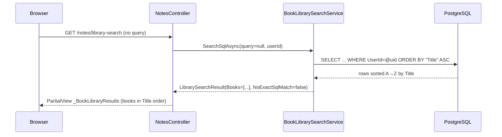

# Plan: Book Library Alphabetical Default Sort

## Table of Contents

- [Summary](#summary)
- [Technical Approach](#technical-approach)
- [Component Breakdown](#component-breakdown)
- [Dependencies](#dependencies)
- [Flow](#flow)
- [Risk Assessment](#risk-assessment)

## Summary

Change the single EF Core LINQ sort clause in the no-query path of `BookLibrarySearchService.SearchSqlAsync` from `OrderByDescending(b => b.UpdatedAt)` to `OrderBy(b => b.Title)`. No new files, no schema changes, no UI changes.

## Technical Approach

`BookLibrarySearchService` in `WebApp/Services/BookLibrarySearchService.cs` owns all library query logic. The no-query branch (lines 27–43) builds a LINQ query against `db.Books`, filters by `UserId`, projects to `BookCardViewModel`, and currently sorts by `UpdatedAt DESC`. Replacing `.OrderByDescending(b => b.UpdatedAt)` with `.OrderBy(b => b.Title)` is the entire change.

SOLID alignment:
- **Single Responsibility**: the sort strategy lives entirely inside `BookLibrarySearchService`; no controller or view is touched.
- **Open/Closed**: the interface contract `IBookLibrarySearchService.SearchSqlAsync` is unchanged; callers in `NotesController` (`/notes/library-search`) are unaffected.
- **Testability**: the existing in-memory EF Core tests in `BookLibrarySearchServiceTests` already seed books; updating the assertion from UpdatedAt ordering to Title ordering is sufficient.

The search paths (non-empty `trimmed` query) are unchanged.

## Component Breakdown

**Existing files to modify:**

- [WebApp/Services/BookLibrarySearchService.cs](../../WebApp/Services/BookLibrarySearchService.cs) — Change `.OrderByDescending(b => b.UpdatedAt)` to `.OrderBy(b => b.Title)` in the no-query branch (line 39).

**Test files to update:**

- [WebApp.Tests/Services/BookLibrarySearchServiceTests.cs](../../WebApp.Tests/Services/BookLibrarySearchServiceTests.cs) — Update or add assertions that verify Title A→Z order when query is null/empty.
- [WebApp.Tests/Integration/BookLibrarySearchPostgresTests.cs](../../WebApp.Tests/Integration/BookLibrarySearchPostgresTests.cs) — Update or add a no-query test case that asserts alphabetical Title ordering against a real PostgreSQL instance.

**New files to create:**

None required.

## Dependencies

- Running PostgreSQL instance (for integration tests only); the unit tests use EF Core in-memory provider.
- No new packages, migrations, env vars, or infrastructure required.

## Flow

## Risk Assessment

| Risk | Evidence | Mitigation |
| --- | --- | --- |
| PostgreSQL cannot satisfy `ORDER BY "Title"` without a full scan on large libraries | No index on `book."Title"` exists; typical personal Kindle libraries are hundreds of books, not millions | Acceptable for the expected library size; no index needed. |
| Existing tests assert UpdatedAt ordering and will fail after the change | `BookLibrarySearchServiceTests` and `BookLibrarySearchPostgresTests` contain no-query assertions | Update test assertions as part of this spec implementation. |
