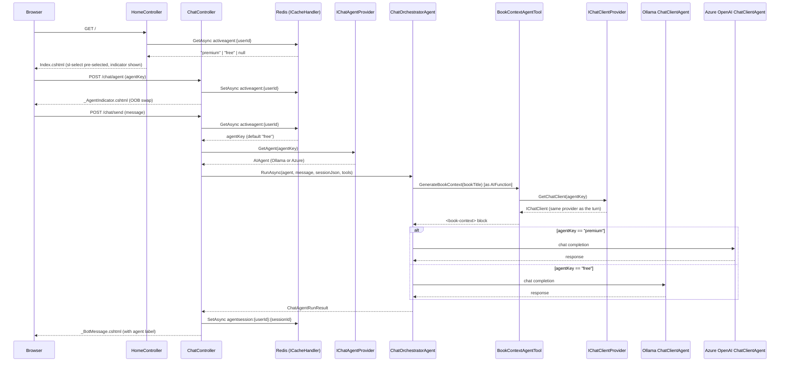

# Plan: Selectable AI Agent (Premium ChatGPT / Free Qwen 3.5)

## Table of Contents

- [Plan: Selectable AI Agent (Premium ChatGPT / Free Qwen 3.5)](#plan-selectable-ai-agent-premium-chatgpt--free-qwen-35)
  - [Summary](#summary)
  - [Technical Approach](#technical-approach)
  - [Component Breakdown](#component-breakdown)
  - [Dependencies](#dependencies)
  - [Flow](#flow)
  - [Risk Assessment](#risk-assessment)

## Summary

Register a second, Azure OpenAI–backed `ChatClientAgent` alongside the existing Ollama one using .NET keyed DI, expose both through two narrow provider interfaces, and thread the user's per-session string selection (`"premium"` / `"free"`) from a new `sl-select` on `Index.cshtml` through `ChatController`, `ChatOrchestratorAgent`, and `BookContextService` so the entire turn — main reply, tool calls, and tool-internal generation — runs on the chosen provider.

## Technical Approach

**Provider registration (Open/Closed).** `WebApp/Program.cs` currently builds one `IChatClient` singleton (Ollama, wrapped in `TokenCountingChatClient`) and one `AIAgent` singleton built from it. This plan adds a second `IChatClient` for Azure OpenAI and registers both under .NET keyed services (`AddKeyedSingleton<IChatClient>("free", ...)` / `AddKeyedSingleton<IChatClient>("premium", ...)`), each still wrapped in `TokenCountingChatClient` so token accounting (FR7) keeps working uniformly. Two keyed `AIAgent` singletons (`ChatClientAgent` instances) are built the same way, one per key. Adding a third provider later means adding one more keyed registration — no other class changes, satisfying Open/Closed.

**Two narrow interfaces, not a service locator.** `IChatAgentProvider.GetAgent(string agentKey)` and `IChatClientProvider.GetChatClient(string agentKey)` wrap `IServiceProvider.GetRequiredKeyedService<T>(agentKey)` internally. Consumers (`ChatController`, `BookContextService`) depend on these small interfaces, not on `IServiceProvider` directly, so they stay fakeable in unit tests (Liskov/Dependency Inversion, per `Specs/TechStak.md`'s SOLID guide). Per the resolved discovery answer, the key is a plain `string` ("premium"/"free") for this iteration, not a new enum/struct — that formalization is explicitly deferred (see Requirements' Out of Scope).

**Selection persistence follows the existing session-cache pattern.** `ChatController` already tracks `activesessionid:{userId}` in Redis via `ICacheHandler` with `SessionTtl` (7 days). This plan adds `activeagent:{userId}` using the identical read/write/default pattern — no new persistence mechanism, no `UserProfile` migration. A new `POST /chat/agent` action writes the key and returns a small OOB partial updating the visible indicator; it does not touch `#chat`, `activesessionid:{userId}`, or any `agentsession:*`/`agentcontext:*` keys, so switching agents never resets conversation state (FR6).

**Orchestrator becomes agent-agnostic.** `IChatOrchestratorAgent.RunAsync` currently closes over a single constructor-injected `AIAgent`. This plan changes the signature to accept the resolved `AIAgent` as a parameter (`RunAsync(AIAgent agent, string message, string? sessionJson, ...)`), removing the constructor dependency entirely. `ChatOrchestratorAgent` becomes a pure orchestration function: deserialize/create the session on whichever `AIAgent` it's given, run it, serialize the result. Because `ChatClientAgent` sessions in this codebase are plain conversational threads (no external provider-side thread store — Ollama has none, and this plan does not adopt Azure's stateful Assistants/threads API, just chat completions), the same serialized `agentsession:{userId}:{sessionId}` JSON deserializes correctly regardless of which keyed `AIAgent` processes it, which is what makes FR6 possible without special-casing.

**BookContextService becomes provider-aware for full parity.** Per the resolved discovery answer ("Full parity"), `BookContextAgentTool.Create` gains an `agentKey` parameter, threaded through `IBookContextService.GenerateAndSaveAsync(bookId, userId, agentKey, ct)` → `GenerateContextAsync(book, userId, agentKey, ct)`. The existing `IOllamaService`/`OllamaService` — currently a thin wrapper over one hardcoded `IChatClient` — is renamed to `IChatCompletionService`/`ChatCompletionService`, constructed with `IChatClientProvider` instead of a raw `IChatClient`, and its `CompleteAsync(string prompt, string agentKey, CancellationToken ct)` resolves the correct client per call. This keeps the "one-off completion" responsibility in its own focused service (Single Responsibility) rather than merging it into `BookContextService` or the orchestrator.

**Azure OpenAI client construction.** Following the Microsoft Agent Framework's documented pattern for building a `ChatClientAgent` from any `Microsoft.Extensions.AI`-compatible `IChatClient`, the Azure path constructs an `AzureOpenAIClient` (from the `Azure.AI.OpenAI` package) using `AZURE_OPENAI_ENDPOINT` + `AZURE_OPENAI_API_KEY`, calls `.GetChatClient(AZURE_LLM_DEPLOYMENT_NAME).AsIChatClient()`, and wraps it exactly like the Ollama client (`TokenCountingChatClient`, `.AsBuilder().ConfigureOptions(...)`) — minus the Ollama-only `think`/`num_ctx` additional properties, which don't apply to Azure OpenAI.

**UI follows the existing Shoelace/HTMX conventions.** `Index.cshtml` gets an `sl-select` styled and wired like the ones in `WebApp/Views/UserProfile/Upsert.cshtml`, posting via `hx-post="/chat/agent" hx-trigger="sl-change"` (Shoelace fires `sl-change`, not the native `change` event) to a small OOB-swapped indicator partial. `HomeController.Index` reads `activeagent:{userId}` the same way it already reads `ContextUsagePct`, so the selector and indicator are correct on first paint (FR11), not just after a change event.

**Per-message provider label.** `WebApp/Models/ChatMessage.cs` gets a new `AgentType` string column, set on the assistant row in `ChatController.Send`. `BotMessageViewModel` and `ChatEntry` gain an `AgentType`/`AgentLabel` field; `_BotMessage.cshtml` and `Chat.cshtml` render a small label in the same footer row that already holds the response-time text, reusing the existing style conventions (`text-xs text-white/45`).

## Component Breakdown

**Existing files to modify:**

- `WebApp/Program.cs` — add keyed `IChatClient`/`AIAgent` registrations for `"free"`/`"premium"`, register `IChatAgentProvider`, `IChatClientProvider`, and the renamed `IChatCompletionService`; bind Azure config from `AZURE_OPENAI_ENDPOINT` / `AZURE_LLM_DEPLOYMENT_NAME` / `AZURE_OPENAI_API_KEY`.
- `WebApp/Services/IChatOrchestratorAgent.cs` — change `RunAsync` to accept `AIAgent agent` as a parameter; `ChatOrchestratorAgent` drops its constructor-injected `AIAgent`.
- `WebApp/Services/IOllamaService.cs` / `WebApp/Services/OllamaService.cs` — rename to `IChatCompletionService`/`ChatCompletionService`; depend on `IChatClientProvider`; `CompleteAsync` gains an `agentKey` parameter.
- `WebApp/Services/IBookContextService.cs` / `WebApp/Services/BookContextService.cs` — `GenerateAndSaveAsync`/`GenerateContextAsync` gain an `agentKey` parameter, passed to `IChatCompletionService.CompleteAsync`.
- `WebApp/Services/BookContextAgentTool.cs` — `Create(string userId, string agentKey)`.
- `WebApp/Controllers/ChatController.cs` — inject `IChatAgentProvider`; read/default/write `activeagent:{userId}`; new `POST /chat/agent` (`SetAgent`) action; pass the resolved `AIAgent` and `agentKey` into `_agent.RunAsync(...)` and `_bookContextTool.Create(userId, agentKey)`; set `assistantMessage.AgentType`; map `AgentType` into `ChatEntry` in the `Chat` GET action.
- `WebApp/Controllers/HomeController.cs` — read `activeagent:{userId}` into `ViewData["ActiveAgent"]`, defaulting to `"free"`.
- `WebApp/Models/ChatMessage.cs` — add `public string? AgentType { get; set; }`.
- `WebApp/Models/BotMessageViewModel.cs` — add `AgentType`/`AgentLabel`.
- `WebApp/Views/Home/Index.cshtml` — new `sl-select` agent picker + active-agent indicator element.
- `WebApp/Views/Chat/Chat.cshtml` — render the per-message agent label for assistant entries.
- `WebApp/Views/Chat/_BotMessage.cshtml` — render the per-message agent label for the live turn.
- `WebApp/WebApp.csproj` — add `Azure.AI.OpenAI` package reference.
- `docker-compose.yml` — pass `AZURE_OPENAI_ENDPOINT`, `AZURE_LLM_DEPLOYMENT_NAME`, `AZURE_OPENAI_API_KEY` through to the `webapp` service environment (mirroring how `UNSPLASH_ACCESS_KEY` is passed today).
- `WebApp/appsettings.json` — add an `Azure:OpenAI` config section shape (non-secret placeholders) if the app reads structured config instead of raw env vars, consistent with the `Ollama:*` section convention.

**New files to create:**

- `WebApp/Services/IChatClientProvider.cs` + `ChatClientProvider.cs` — `IChatClient GetChatClient(string agentKey)`, resolves the keyed `IChatClient`.
- `WebApp/Services/IChatAgentProvider.cs` + `ChatAgentProvider.cs` — `AIAgent GetAgent(string agentKey)`, resolves the keyed `AIAgent`.
- `WebApp/Views/Chat/_AgentIndicator.cshtml` — small partial rendering "Currently using: Premium — ChatGPT" / "Free — Qwen 3.5", returned by `POST /chat/agent` as an OOB swap and rendered inline by `Index.cshtml` on first load.
- `WebApp/Migrations/<timestamp>_AddChatMessageAgentType.cs` — EF Core migration adding `ChatMessage.AgentType`.

## Dependencies

- `Azure.AI.OpenAI` NuGet package (new) — provides `AzureOpenAIClient` and the `.AsIChatClient()` extension consumed via `Microsoft.Extensions.AI`, the same abstraction (`IChatClient`) the Ollama path already uses.
- A reachable Azure OpenAI resource at `AZURE_OPENAI_ENDPOINT=https://epoch-openai.openai.azure.com/` with the `epoch-gpt-4.1` deployment (`AZURE_LLM_DEPLOYMENT_NAME`) and a valid `AZURE_OPENAI_API_KEY` — already documented in `.env.example`, required at runtime only when a user selects Premium.
- Existing Ollama, Redis, and PostgreSQL/pgvector stack — unchanged.

## Flow

## Risk Assessment

| Risk | Evidence | Mitigation |
| --- | --- | --- |
| Assuming `AgentSession` serialization is provider-agnostic across two different `ChatClientAgent` instances is a real architectural bet, not yet proven in this codebase. | `IChatOrchestratorAgent.RunAsync` calls `agent.DeserializeSessionAsync`/`agent.CreateSessionAsync` on whatever `AIAgent` instance it's given; today there is only ever one instance, so cross-agent deserialization is unexercised. | Add an integration test that starts a turn on Free, serializes the session, deserializes it on Premium (with a faked Azure `IChatClient`), and asserts prior message history round-trips before relying on this in production. |
| Renaming `IOllamaService`/`OllamaService` ripples into existing tests. | `grep` shows `BookContextServiceTests`, `BookContextAgentToolTests`, and `AgentToolsPostgresTests` reference the affected types. | Update these tests alongside the rename as part of the same implementation slice; covered explicitly in `Validation.md`. |
| Azure OpenAI calls in CI/tests would incur cost or flakiness if not faked. | Premium is a paid, network-dependent provider; `Specs/TechStak.md`'s Docker-first test strategy only expects Postgres/pgvector to be a real dependency in tests. | All unit tests fake `IChatAgentProvider`/`IChatClientProvider`; no test suite calls the real Azure endpoint. |
| Secret leakage via logging. | `ChatController.Send` already has a structured `_logger.LogInformation` call for turn stats. | Do not add `AZURE_OPENAI_API_KEY` or raw Azure request/response bodies to any log statement; code review should check this explicitly. |
| Shoelace's `sl-select` fires a custom `sl-change` event, not the native DOM `change` event HTMX defaults to. | No existing view in this codebase wires `hx-post` directly off an `sl-select`'s change — `Upsert.cshtml` only submits via a button. | Explicitly set `hx-trigger="sl-change"` on the new `sl-select`, and verify the OOB swap fires in a real browser during manual verification. |
