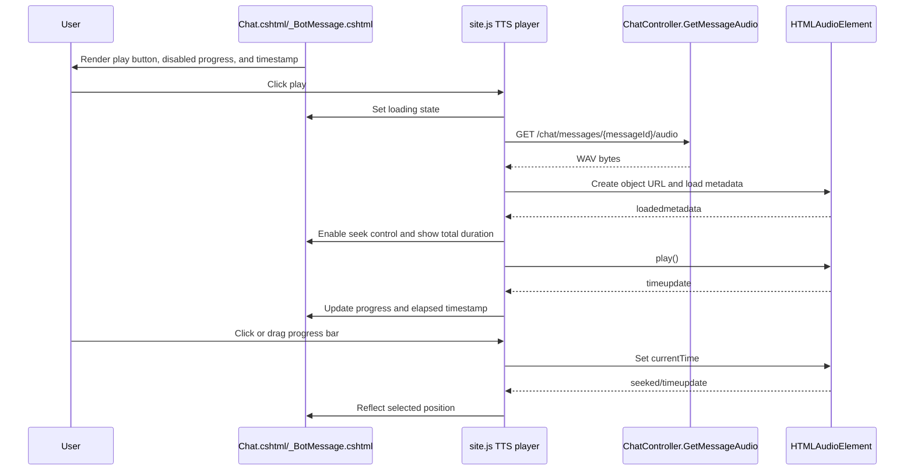

# Plan: TTS Audio Progress Seeking

## Table of Contents

- [Plan: TTS Audio Progress Seeking](#plan-tts-audio-progress-seeking)
  - [Table of Contents](#table-of-contents)
  - [Summary](#summary)
  - [Technical Approach](#technical-approach)
  - [Component Breakdown](#component-breakdown)
  - [Dependencies](#dependencies)
  - [Flow](#flow)
  - [Risk Assessment](#risk-assessment)

## Summary

Add a compact, reusable audio progress and seek control to assistant TTS widgets while preserving the existing `/chat/messages/{messageId}/audio` endpoint and one-audio-at-a-time playback behavior. The implementation follows the current Razor + `site.js` + Sass pattern and keeps TTS generation/storage responsibilities in existing services.

## Technical Approach

The current TTS control is rendered inline in both `WebApp/Views/Chat/Chat.cshtml` for existing messages and `WebApp/Views/Chat/_BotMessage.cshtml` for HTMX-inserted assistant responses. Both views should render the same player markup shape: the existing Shoelace play/pause `sl-icon-button`, a range-like seek control, elapsed/total timestamp text, loading state, and error state. If duplication becomes awkward during implementation, extract a small Razor partial such as a message audio player partial so both chat views share one markup source.

`WebApp/wwwroot/js/site.js` already owns the shared `Audio` instance, `currentWidget`, `currentObjectUrl`, loading/error handling, and play/pause toggling. Extend that client-side module with focused helper functions for finding player elements, formatting duration, setting disabled/loading/error/play states, updating progress from `timeupdate`, seeking from input/click/drag events, and remembering message positions in an in-memory `Map` keyed by `data-audio-message-id`. When a user switches messages, store the outgoing audio's `currentTime`; when returning to a message during the same page load, restore that time after metadata is loaded and before playback resumes.

Sass source should own the visual details rather than generated CSS. Add TTS player styles to an existing component Sass file if one is already imported by `WebApp/Styles/main.sass`, or create a focused component Sass file and import it from `main.sass`. The design should remain compact in the chat footer, using stable dimensions for the play button, range track, and timestamp text so the agent label and response-time text do not collide. The control should show immediately but disabled while audio is being generated or metadata is unavailable.

This remains SOLID by preserving server boundaries: `ChatController.GetMessageAudio` still authorizes and returns audio bytes, `IChatMessageAudioService` still owns cache/generation lookup, and the browser owns ephemeral playback position. The reusable boundary is client-side and widget-oriented; no EF Core, Microsoft Agent Framework, Redis, Ollama, or TTS service changes are expected.

## Component Breakdown

**Existing files to modify:**

- `WebApp/Views/Chat/Chat.cshtml` - add the progress, timestamp, and disabled/loading player markup for historical assistant messages.
- `WebApp/Views/Chat/_BotMessage.cshtml` - add the same player markup for newly returned assistant messages.
- `WebApp/wwwroot/js/site.js` - extend the TTS playback module with progress updates, seeking, timestamp formatting, and in-memory per-message position memory.
- `WebApp/Styles/main.sass` - import the TTS player Sass if a new component file is created.
- `WebApp/Styles/Components/*.sass` - add focused audio player styles in the existing Sass source tree.

**New files to create:**

- `WebApp/Views/Chat/_TtsAudioPlayer.cshtml` - optional partial if implementation chooses to remove duplicated Razor markup between `Chat.cshtml` and `_BotMessage.cshtml`.
- `WebApp/Styles/Components/tts_audio_player.sass` - optional focused component stylesheet for the player.

## Dependencies

- Existing authenticated chat messages must include `MessageId` so the widget can call `/chat/messages/{messageId}/audio`.
- The existing `tts` service must be reachable when audio is not already cached by `ChatMessageAudioService`.
- Browser support for `HTMLAudioElement`, object URLs, and range inputs is required.
- Docker-first validation uses the Make targets documented in `AGENTS.md`; no new runtime package or infrastructure dependency is planned.

## Flow

## Risk Assessment

| Risk | Evidence | Mitigation |
| --- | --- | --- |
| Duplicated TTS markup diverges between initial chat render and HTMX response render. | `Chat.cshtml` and `_BotMessage.cshtml` currently contain similar widget markup. | Prefer extracting `_TtsAudioPlayer.cshtml` if implementation needs more than a small markup addition. |
| Footer layout becomes cramped on narrow screens. | The current footer also shows agent label and response time. | Use compact fixed-width timestamp text, flexible progress width, wrapping-safe layout, and responsive Sass checks. |
| Seeking before metadata loads sets invalid times. | Duration is unknown until the browser fires `loadedmetadata`. | Keep the seek control disabled until duration is finite and greater than zero. |
| Switching messages loses useful position context. | Current `cleanupCurrentAudio()` discards the active audio object. | Store `currentTime` in a per-message `Map` before cleanup and restore after metadata loads. |
| Object URLs or event handlers leak. | Existing code already creates and revokes object URLs. | Continue revoking object URLs during cleanup and attach listeners only to the active `Audio` instance. |
