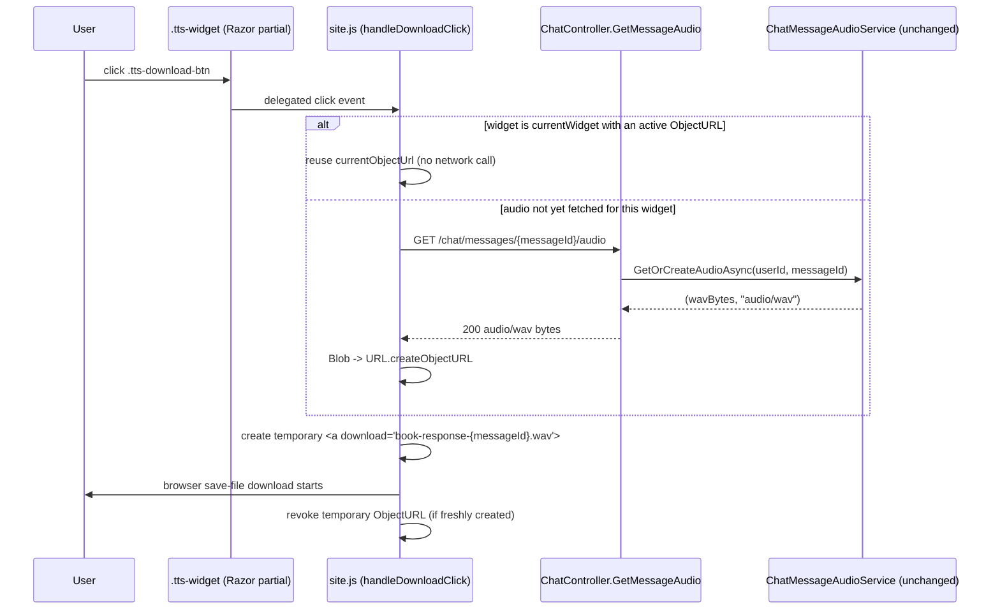

# Plan: TTS Audio Download

## Table of Contents

- [Plan: TTS Audio Download](#plan-tts-audio-download)
  - [Table of Contents](#table-of-contents)
  - [Summary](#summary)
  - [Technical Approach](#technical-approach)
  - [Component Breakdown](#component-breakdown)
  - [Dependencies](#dependencies)
  - [Flow](#flow)
  - [Risk Assessment](#risk-assessment)

## Summary

Add a "Download audio" icon button to the existing `.tts-widget` (`WebApp/Views/Chat/_TtsAudioPlayer.cshtml`) and a small client-side handler in `WebApp/wwwroot/js/site.js` that fetches the same WAV bytes already served by `GET /chat/messages/{messageId}/audio` and saves them via a temporary `<a download>` element — no server, database, or TTS pipeline changes.

## Technical Approach

This is a pure frontend addition layered onto the module that already owns TTS playback in `site.js` (the IIFE starting around `site.js:260` that tracks `currentAudio`, `currentObjectUrl`, `currentWidget`, and `messagePositions`). It follows the same pattern already used for play: read `data-audio-message-id` off the widget, `fetch` the existing endpoint, turn the response into a `Blob`/`ObjectURL`, and act on it — the only new behavior is triggering a save-as download instead of (or alongside, if already loaded) assigning the URL to an `Audio` element.

SOLID / responsibility boundaries:
- No new controller action, service, or EF Core model — `ChatController.GetMessageAudio`, `IChatMessageAudioService`, `IAudioStorage`, and `ChatMessageAudioService`'s WAV cache (`ChatMessageAudio` keyed by `{ChatMessageId, Language, Voice}`) are untouched, per FR8. The server's single responsibility (generate/cache/serve WAV bytes for a message) does not change; "download" is purely how the browser disposes of bytes it already has a documented way to fetch.
- The download handler is a narrow, single-purpose function (`handleDownloadClick`) parallel to the existing `handlePlayClick`, not a generic "audio action" dispatcher — keeps each handler doing one thing, consistent with the existing module's style.
- State display for the download button is scoped to the button itself (new small icon-swap state), not merged into `setAudioState`, which governs play/pause/loading/error for the whole widget. This avoids the download control silently coupling widget-wide state semantics to a concern (download loading/error) that is independent of playback.

Reuse of existing patterns:
- Reuses the existing `.tts-widget` / `data-audio-message-id` wiring so no new DOM query surface is introduced beyond one new button and its state elements.
- Reuses the existing event-delegation style: `document.body.addEventListener("click", ...)` already listens for `.tts-play-btn`; a second delegated listener (or an extension of the same one) handles `.tts-download-btn` the same way, so it keeps working after HTMX swaps `_BotMessage.cshtml` partials in without any rebinding step — consistent with how `.tts-play-btn` already survives OOB swaps today.
- Reuses `fetch("/chat/messages/${messageId}/audio")` verbatim — no new endpoint, no new query string, no new headers.

Why no new dependency: converting to a true MP3 would require either shelling out to `ffmpeg` (new Dockerfile step, new external process dependency in `ChatMessageAudioService` or a new service) or a native LAME encoder NuGet package. The user explicitly decided against both during spec discovery, since the frontend already receives the full audio payload as a `Blob` for playback — there is nothing left to add server-side to let the browser save those same bytes to disk.

## Component Breakdown

**Existing files to modify:**

- `WebApp/Views/Chat/_TtsAudioPlayer.cshtml` — add a second `sl-icon-button` (`.tts-download-btn`, icon `download`) next to the existing `.tts-play-btn`, plus a small element to host the download-only loading/error icon swap (e.g. toggling the button's `name`/`label` attributes directly, no extra markup needed).
- `WebApp/wwwroot/js/site.js` — add `handleDownloadClick(widget)`, a `setDownloadButtonState(widget, state)` helper scoped to the new button, and a delegated `click` listener for `.tts-download-btn` alongside the existing `.tts-play-btn` listener (`site.js:485-490`). Reuses `currentWidget`/`currentObjectUrl` from the existing closure to satisfy the "reuse already-fetched audio" requirement (FR3) without adding new module-level state.

**New files to create:**

- None required.

## Dependencies

- No new runtime, npm, or NuGet dependency.
- No Docker image or `docker-compose*.yml` change.
- No database migration.
- Relies on browser support for `URL.createObjectURL` and the `<a download>` attribute, both already assumed by the existing playback code in the same file.

## Flow

## Risk Assessment

| Risk | Evidence | Mitigation |
| --- | --- | --- |
| Downloaded file is `.wav`, not the `.mp3` implied by the original task title | User explicitly chose "skip conversion" during discovery; TTS pipeline (`services/TtsService.Api`) only ever produces WAV (`WavEncoder`, `Produces("audio/wav")`) | Call this out plainly in `Requirements.md` Open Questions and in the PR/description so reviewers aren't surprised the button is labeled "Download audio" with a `.wav` output. |
| Reusing `currentObjectUrl` for download while playback later revokes it via `cleanupCurrentAudio()` (`site.js:275-284`) could hand back a dangling URL if a race occurs | `cleanupCurrentAudio` runs on widget switch and on `ended`/`error` handlers | Perform the anchor `click()` synchronously right after obtaining the URL, before any `await` that could yield to another handler; only revoke URLs this feature itself created, never the shared `currentObjectUrl` owned by the playback code. |
| Delegated click listener collision with `.tts-play-btn` if a user clicks near the boundary of adjacent icon buttons | Both buttons live in the same `.tts-widget` flex row (`_TtsAudioPlayer.cshtml`) | Use `event.target.closest(".tts-download-btn")` exactly like the existing play handler's `closest(".tts-play-btn")` pattern so each button's handler only fires for its own class. |
| Browser download blocked/ignored if triggered from an `async` function after a `await fetch(...)` in some strict popup-blocker configurations | Some browsers restrict programmatic downloads not triggered synchronously from a user gesture | Existing play-button `fetch` flow already awaits inside the click handler without issue in this app's supported browsers; if this surfaces in manual testing, fall back to opening the resulting blob URL in a new tab as a secondary path. |
