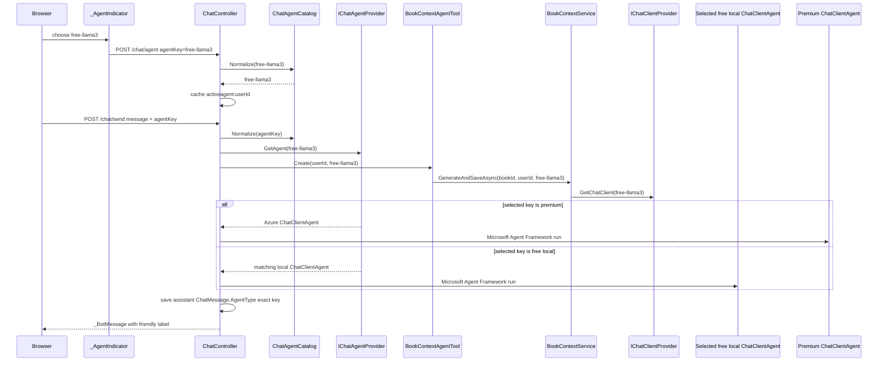

# Plan: Multiple Free Ollama Agents

## Table of Contents

- [Plan: Multiple Free Ollama Agents](#plan-multiple-free-ollama-agents)
  - [Summary](#summary)
  - [Technical Approach](#technical-approach)
  - [Component Breakdown](#component-breakdown)
  - [Dependencies](#dependencies)
  - [Flow](#flow)
  - [Risk Assessment](#risk-assessment)

## Summary

Extend the current Premium/Free provider architecture into a small agent catalog with four free local model choices: Qwen, Llama 3.2, Phi-4 Mini, and Granite 4 — all confirmed tool-calling capable on Ollama, since DeepSeek R1 and Gemma 3 (the original two picks) turned out not to support tools at any size. The implementation keeps the existing Microsoft Agent Framework keyed-agent pattern, but replaces hardcoded `"free"` assumptions with centralized metadata and compatibility normalization.

## Technical Approach

**Central agent catalog.** Add a focused catalog type under `WebApp/Services`, for example `ChatAgentCatalog`, with immutable entries for `premium`, `free-qwen`, `free-llama3`, `free-phi4`, and `free-granite4`. Each entry should include the stable key, display label, short UI subtitle, provider category (`Premium` or `FreeLocal`), optional Ollama model name, icon/color hint if useful, and a default flag. The catalog owns normalization so legacy `"free"` maps to `free-qwen`, unknown keys map to `free-qwen`, and the rest of the app stops duplicating key rules.

**Provider registration.** `WebApp/Program.cs` currently registers keyed `IChatClient` and `AIAgent` services for `"free"` and `"premium"`. Replace the single free registration with one registration per free catalog entry. Each local registration constructs `OllamaApiClient(httpClient, entry.ModelName)` and wraps it in `TokenCountingChatClient` with the same options now used by Qwen: `Temperature = 0`, `think = false`, and `num_ctx = Ollama:NumCtx`. Keep the Azure registration keyed as `premium`. This follows Open/Closed better than adding repeated handwritten blocks for each new local model.

**Controller and label mapping.** `ChatController.NormalizeAgentKey` and `GetAgentLabel` currently only know `"premium"` and `"free"`. Rework them to delegate to the catalog or to shared static catalog data. `HomeController` should default `ViewData["ActiveAgent"]` to `free-qwen`. `ChatController.Send` should continue caching `activeagent:{userId}`, resolving the selected `AIAgent`, creating the Microsoft Agent Framework tool list, saving `ChatMessage.AgentType`, and returning `_BotMessage`, but with the exact normalized key.

**Book context parity.** The current provider-aware path already threads `agentKey` into `BookContextAgentTool.Create(userId, agentKey)` and `BookContextService.GenerateAndSaveAsync(bookId, userId, agentKey, ct)`. Keep that behavior so if a reader chooses Llama 3.2, Phi-4 Mini, or Granite 4, both the main chat turn and generated literary context use that model's `IChatClient`.

**Razor and JavaScript selector.** `_AgentIndicator.cshtml` currently renders two hardcoded Shoelace menu items and visible text "Local Ollama". Change it to render entries from the catalog/list model, or use the catalog helpers directly if the view remains string-backed. Visible UI should say "Free - Qwen 3.5", "Free - Llama 3.2", "Free - Phi-4 Mini", and "Free - Granite 4"; subtitles should say local/private/free without displaying "Ollama". `WebApp/wwwroot/js/site.js` should mirror the supported key list and labels in one small map so menu clicks, hidden form input sync, trigger text, and checked state support all options.

**History labels.** `WebApp/Models/BotMessageViewModel.cs`, `ChatEntry.AgentLabel`, `WebApp/Views/Chat/_BotMessage.cshtml`, and `WebApp/Views/Chat/Chat.cshtml` should render friendly labels for new keys. Legacy `free` history should display as Qwen/Free instead of blank.

**Docker startup.** Update the `ollama` service command in `docker-compose.yml` to pull `qwen3.5:4b`, `llama3.2:3b`, `phi4-mini:3.8b`, `granite4:3b`, and `mxbai-embed-large`. Leave OS-specific compose overrides unchanged unless they duplicate model pulling.

## Component Breakdown

**Existing files to modify:**

- `WebApp/Program.cs` - register keyed chat clients and Microsoft Agent Framework `ChatClientAgent` instances for `free-qwen`, `free-llama3`, `free-phi4`, and `free-granite4`; keep Azure `premium`; reuse common Ollama registration logic.
- `WebApp/Controllers/ChatController.cs` - normalize/cache/persist supported keys through the catalog; preserve `activeagent:{userId}` behavior and exact `ChatMessage.AgentType` storage.
- `WebApp/Controllers/HomeController.cs` - default and cached active-agent view data should normalize to `free-qwen`.
- `WebApp/Models/BotMessageViewModel.cs` - map new and legacy agent keys to friendly labels.
- `WebApp/Views/Chat/_AgentIndicator.cshtml` - render Premium plus three separate free local menu choices without visible "Ollama" wording.
- `WebApp/Views/Chat/_BotMessage.cshtml` and `WebApp/Views/Chat/Chat.cshtml` - ensure labels for new keys display correctly in live responses and history.
- `WebApp/Views/Home/Index.cshtml` - hidden `agentKey` input default should use `free-qwen` through existing normalization.
- `WebApp/wwwroot/js/site.js` - support the new key set for trigger label, checked menu state, hidden input sync, and form submission.
- `docker-compose.yml` - pull all free chat models plus the embedding model during `ollama` startup.
- `README.md` - update model list and local AI configuration notes.
- `Specs/Roadmap.md` and `Specs/TechStak.md` - update current-state/model inventory after implementation if the feature is completed.
- `WebApp.Tests/Controllers/ChatControllerTests.cs`, `HomeControllerTests.cs`, `WebApp.Tests/Services/ChatAgentProviderTests.cs`, `ChatClientProviderTests.cs`, `ChatCompletionServiceTests.cs`, `BookContextServiceTests.cs`, `BookContextAgentToolTests.cs`, and `WebApp.Tests/Integration/AgentToolsPostgresTests.cs` - update assumptions from `"free"` to `free-qwen` and add coverage for the new keys.

**New files to create:**

- `WebApp/Services/ChatAgentCatalog.cs` - central supported-agent metadata, default key, legacy key normalization, labels, and free local model entries.
- `WebApp.Tests/Services/ChatAgentCatalogTests.cs` - catalog normalization, label, model metadata, and future-extension guard tests.

## Dependencies

- Existing Ollama container from `docker-compose.yml`.
- Local model names: `qwen3.5:4b`, `llama3.2:3b`, `phi4-mini:3.8b`, `granite4:3b`, and embedding model `mxbai-embed-large`. All four must support native Ollama tool calling.
- Existing Azure OpenAI configuration remains required only for `premium`: `AZURE_OPENAI_ENDPOINT`, `AZURE_LLM_DEPLOYMENT_NAME`, and `AZURE_OPENAI_API_KEY`.
- Existing Redis cache for `activeagent:{userId}`, Microsoft Agent Framework session JSON, and context metrics.
- Existing PostgreSQL `ChatMessage.AgentType` nullable column.

## Flow

## Risk Assessment

| Risk | Evidence | Mitigation |
| --- | --- | --- |
| Key drift between C#, Razor, JavaScript, and persisted history could break routing or labels. | `NormalizeAgentKey`, `GetAgentLabel`, `BotMessageViewModel.AgentLabel`, `_AgentIndicator.cshtml`, and `site.js` currently duplicate `"premium"`/`"free"` logic. | Centralize server-side metadata in `ChatAgentCatalog`; keep JavaScript's small display map aligned with tests/manual checks; preserve legacy `"free"` normalization. |
| Startup pulls become slower and heavier. | `docker-compose.yml` currently pulls only `qwen3.5:4b` and `mxbai-embed-large`; adding three models increases first-run download time and storage. | Document the heavier first startup in `README.md`; keep pulls in the existing `ollama` command so the workflow remains automatic. |
| A chosen free model may not actually support Ollama tool calling, breaking every chat turn since `GenerateBookContext`/notes tools are mandatory. | Realized during manual verification: `deepseek-r1` and `gemma3` (the original picks) have no `tools` capability at any size in Ollama's library, causing `does not support tools` errors on every send. | Verify each candidate model's `tools` capability against `ollama.com/library` before adding it to the catalog, not just by name/vendor reputation; swapped to `llama3.2:3b`, `phi4-mini:3.8b`, and `granite4:3b`, all confirmed tool-capable. |
| Existing tests assume `free` exactly. | `rg` shows many tests and fakes use `"free"` as the default key. | Update tests to expect `free-qwen` while adding explicit legacy `"free"` normalization tests. |
| Adding future models could still require many edits if registration stays handwritten. | `Program.cs` currently has separate keyed registration blocks. | Use catalog-driven helper methods/loops for free local registrations so adding another free model is localized to catalog/configuration plus Docker pull docs. |
