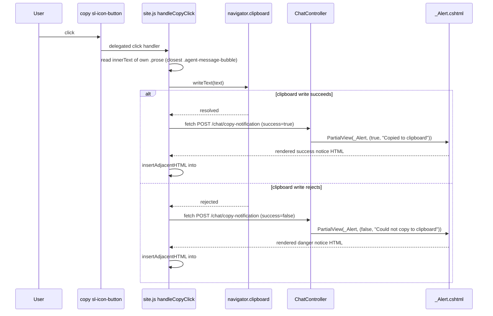

# Plan: Copy Agent Response to Clipboard

## Table of Contents

- [Summary](#summary)
- [Technical Approach](#technical-approach)
- [Component Breakdown](#component-breakdown)
- [Dependencies](#dependencies)
- [Flow](#flow)
- [Risk Assessment](#risk-assessment)

## Summary

Add a `copy` `sl-icon-button` + `sl-tooltip` to the footer row of every rendered assistant message. A single delegated click listener in `WebApp/wwwroot/js/site.js` reads that message's own `.prose` text, writes it to the clipboard, then calls a standard `ChatController` action with plain `fetch()` and inserts the returned `_Alert.cshtml` HTML into `#alert` — no HTMX attributes or Hyperscript are added for this feature.

## Technical Approach

**Scoping the copy target.** Both message-rendering views wrap each assistant bubble in an outer `<div class="flex flex-col max-w-[75%]">` containing an inner `.prose` element. Tailwind's bracketed `max-w-[75%]` class is not a stable selector to hang new behavior on, so both views add one additional plain class, `agent-message-bubble`, to that same outer `div` (purely additive — no existing class is removed or renamed). The click handler resolves the button's own message text with `button.closest(".agent-message-bubble").querySelector(".prose")`, so a click always reads the `.prose` node inside its own ancestor bubble, never a sibling message's text, regardless of how many assistant messages are on the page.

**Plain JS click handler, following the site's own existing conventions.** `site.js` already has two precedents for exactly this shape of work: `handlePlayClick`/`handleDownloadClick` (delegated `document.body.addEventListener("click", ...)` handlers scoped with `event.target.closest(...)`) and `persistAgentSelection` (an async function that does `fetch()`, awaits `response.text()`, and manually swaps the returned HTML into the DOM). The copy feature reuses both patterns directly instead of introducing HTMX or Hyperscript:

```js
function getMessageBubble(btn) {
    return btn.closest(".agent-message-bubble");
}

async function handleCopyClick(btn) {
    const bubble = getMessageBubble(btn);
    const prose = bubble?.querySelector(".prose");
    if (!prose) return;

    let success = true;
    try {
        await navigator.clipboard.writeText(prose.innerText);
    } catch {
        success = false;
    }

    try {
        const response = await fetch("/chat/copy-notification", {
            method: "POST",
            headers: { "Content-Type": "application/x-www-form-urlencoded" },
            body: new URLSearchParams({ success: String(success) })
        });

        if (!response.ok) return;

        const html = await response.text();
        document.getElementById("alert")?.insertAdjacentHTML("beforeend", html);
    } catch (error) {
        console.error("Copy notification failed", error);
    }
}

document.body.addEventListener("click", (event) => {
    const btn = event.target.closest(".copy-response-btn");
    if (!btn) return;
    void handleCopyClick(btn);
});
```

This is the same `addEventListener` + `closest` + `fetch` + manual DOM-insertion shape already present three times in this file, so the copy feature reads as one more instance of an established pattern rather than a new one.

**One single-purpose controller action, standard MVC shape.** `ChatController` (`[Authorize]` already applied at the class level) gets `[HttpPost("/chat/copy-notification")] public IActionResult CopyNotification([FromForm] bool success)`. It maps the boolean to the existing success or danger alert and touches no service, cache, or `AppDbContext` — this is the same "controller action returns a `PartialViewResult`" shape already used for `/chat/agent`, `/chat/reset`, and `UserProfileController.Upsert`.

**`_Alert.cshtml` shows itself declaratively instead of via Hyperscript.** Because the alert HTML is now inserted with plain `insertAdjacentHTML` — bypassing HTMX's swap pipeline entirely, which is what normally calls `htmx.process()` and activates Hyperscript's `on load` handler on newly inserted nodes — `_Alert.cshtml`'s `_="on load call me.show()"` would never fire for alerts triggered by this feature. The partial is updated to render `<sl-alert variant="..." closable open>` instead, using Shoelace's declarative `open` attribute so the component shows itself the moment it is parsed into the DOM, with no script pass required. This is a one-attribute change and keeps working unchanged for every other existing HTMX-driven call site (`/chat/reset`, `UserProfile/Upsert`), since `open` is equivalent to what `me.show()` already did.

**Frontend conventions followed.** The new `sl-icon-button` matches the sizing/opacity/color-token pattern already used by the TTS play (`play-circle`) and download (`download`) buttons in `WebApp/Views/Chat/_TtsAudioPlayer.cshtml` (`text-white/40`, inline `--sl-color-primary-600`/`--sl-color-primary-700` overrides, `font-size` in the 16–18px range) so the new control reads as part of the same footer-row family instead of a visually distinct addition. No Sass changes are needed since no new custom classes require styling beyond what Tailwind utility classes and Shoelace's own parts already provide.

## Component Breakdown

**Existing files to modify:**

- `WebApp/Views/Chat/_BotMessage.cshtml` — add `agent-message-bubble` class to the outer message `div`; add the copy `sl-tooltip` + `sl-icon-button` (`copy-response-btn`) to the footer row next to `_TtsAudioPlayer.cshtml`. No `hx-*`/`_` attributes on the new button.
- `WebApp/Views/Chat/Chat.cshtml` — same two changes, applied inside the assistant branch (`entry.Role != "user"`) of the `@foreach` loop, so every historical message gets the same control.
- `WebApp/Controllers/ChatController.cs` — add `CopyNotification([FromForm] bool success)` at `/chat/copy-notification`, placed near `Reset()`.
- `WebApp/wwwroot/js/site.js` — add `getMessageBubble`, `handleCopyClick`, and the `.copy-response-btn` delegated click listener, alongside the existing `.tts-play-btn`/`.tts-download-btn` listeners.
- `WebApp/Views/Shared/Components/_Alert.cshtml` — replace `_="on load call me.show()"` with the declarative `open` attribute.
- `WebApp.Tests/Controllers/ChatControllerTests.cs` — add tests for both `CopyNotification(true)` and `CopyNotification(false)`.

**New files to create:**

- None required — no new views, services, models, or Sass components are needed.

## Dependencies

- Shoelace `sl-icon-button`, `sl-tooltip`, and the `copy` icon from the icon set already used for `play-circle`/`download`/`exclamation-circle` (no new CDN resource).
- Browser `navigator.clipboard.writeText()` API — requires a secure context (HTTPS or `localhost`); this is already how the app is served locally per `docker-compose.yml` (`http://localhost:8080`), so no new infrastructure dependency.
- HTMX remains loaded for the rest of the app's existing features; this spec does not add a new HTMX or Hyperscript dependency for the copy feature itself.

## Flow



## Risk Assessment

| Risk | Evidence | Mitigation |
| --- | --- | --- |
| `.prose` scoping regresses if the outer bubble markup changes in a future spec (e.g. Phase 15/20/21 TTS work already touches this exact footer row) | `_BotMessage.cshtml` and `Chat.cshtml` both hard-code the bubble/footer structure; a future edit could rename or restructure `.agent-message-bubble` without updating `getMessageBubble` in `site.js` | Keep the `agent-message-bubble` class name and the `closest`/`querySelector` pair documented together in this Plan so future footer-row edits (TTS or otherwise) know to preserve or update both in the same change |
| `navigator.clipboard` is unavailable in non-secure contexts or older browsers, causing every copy to silently fail | `writeText()` requires a secure context; the app is served over plain HTTP in some non-`localhost` deployments per `docker-compose.yml` overrides | The `try`/`catch` in `handleCopyClick` always resolves `success` to `false` on any rejection or thrown error (including a missing `navigator.clipboard`), so `CopyNotification(false)` always renders the danger alert rather than failing silently |
| Switching `_Alert.cshtml` from `me.show()` to the declarative `open` attribute could change behavior for existing HTMX-driven call sites (`/chat/reset`, `UserProfile/Upsert`) | `_Alert.cshtml` is shared by every alert in the app; Phase 18's restyle spec explicitly preserved `me.show()` semantics | `open` is a direct declarative equivalent of what `me.show()` already set programmatically for an inline (non-toasted) `sl-alert`; manual verification in this spec's Validation.md re-checks the reset and profile-save alerts still appear correctly after the change |
| Duplicate/rapid clicks could append multiple stacked notices into `#alert` | `insertAdjacentHTML("beforeend", ...)` appends rather than replaces, matching the existing `hx-swap="beforeend"` convention, and Phase 18's spec explicitly left notice stacking out of scope | Accept the existing app-wide behavior; no new mitigation needed since this matches every other `_Alert` call site already shipped |
