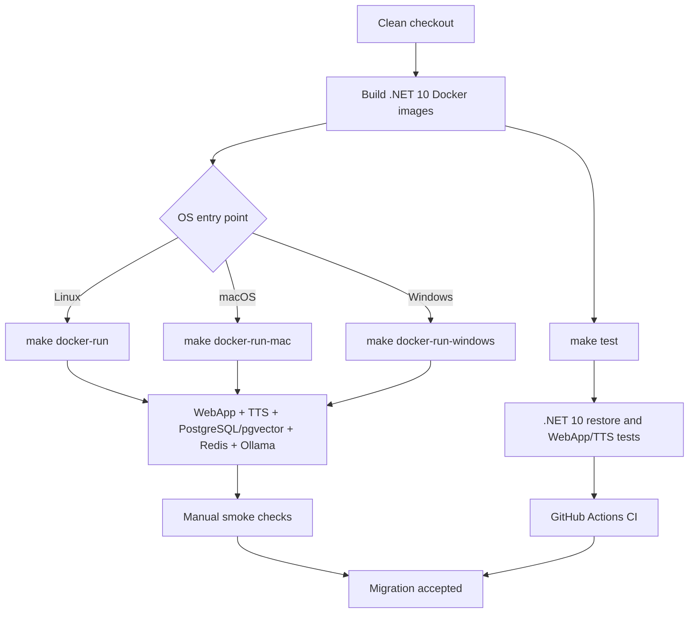

# Plan: Migrate the local MVP to .NET 10

## Table of Contents

- [Summary](#summary)
- [Technical Approach](#technical-approach)
- [Component Breakdown](#component-breakdown)
- [Dependencies](#dependencies)
- [Flow](#flow)
- [Risk Assessment](#risk-assessment)

## Summary

Retarget all .NET projects and Docker/CI execution to .NET 10, update the Microsoft dependency family and development tools, then validate the complete Docker-first local workflow. The migration keeps the existing ASP.NET Core MVC, Microsoft Agent Framework, Ollama, PostgreSQL/pgvector, Redis, and TTS boundaries intact.

## Technical Approach

1. Inventory direct package versions in the four project files and select compatible .NET 10 releases. Keep non-Microsoft packages unchanged unless restore/build or compatibility checks require an update. Replace `9.0.*` with an explicit Redis package version.
2. Change every project TFM to `net10.0`.
3. Update `WebApp/Dockerfile`, `services/TtsService.Api/Dockerfile`, and `docker-compose.test.yml` to .NET 10 SDK/runtime images. Update the Docker-installed EF and ASP.NET code generator tools to `10.*`.
4. Keep `docker-compose.yml` and its Linux, macOS, and Windows overrides structurally unchanged except for required .NET image or build compatibility changes. Preserve the existing `make docker-run`, `make docker-run-mac`, `make docker-run-windows`, and `make test` entry points.
5. Update `.github/workflows/ci.yml` to set up .NET 10 while retaining PostgreSQL/pgvector, both test projects, caching, and result artifacts.
6. Build and test through Docker. Inspect EF migrations and run the application against PostgreSQL to detect provider/model incompatibilities, but do not create a migration unless the upgraded model actually requires one.
7. Review .NET 10 and ASP.NET Core 10 breaking changes against the existing code. In particular, check package references, container base-image behavior, Identity redirects, generated tooling, configuration, and any APIs marked obsolete.
8. Update `Specs/TechStak.md`, relevant Docker guidance in `AGENTS.md`, and `Specs/Roadmap.md` after validation.

The change remains within existing service boundaries: application behavior stays in its current MVC/services and Microsoft Agent Framework adapters; infrastructure changes remain in Docker, Make, and CI configuration. No new abstraction or runtime dependency is needed.

## Component Breakdown

**Existing files to modify:**

- `WebApp/WebApp.csproj` — target `net10.0` and update compatible Microsoft/EF/Npgsql/Redis/code-generation references.
- `WebApp.Tests/WebApp.Tests.csproj` — target `net10.0` and update EF/Npgsql/test references.
- `services/TtsService.Api/TtsService.Api.csproj` — target `net10.0` and update Microsoft configuration references if required.
- `services/TtsService.Tests/TtsService.Tests.csproj` — target `net10.0` and update test dependencies if required.
- `WebApp/Dockerfile` — use .NET 10 SDK and .NET 10 global tools.
- `services/TtsService.Api/Dockerfile` — use .NET 10 SDK and ASP.NET runtime images.
- `docker-compose.test.yml` — use the .NET 10 SDK test image.
- `docker-compose.yml` — preserve the base local stack and update any .NET-specific build/runtime settings if required.
- `docker-compose.linux.yml` — verify Linux override compatibility.
- `docker-compose.mac.yml` — verify macOS/arm64 override compatibility.
- `docker-compose.windows.yml` — verify Windows/NVIDIA override compatibility.
- `.github/workflows/ci.yml` — use .NET 10 setup and retain integration test coverage/artifacts.
- `Makefile` — update commands only if needed to keep Docker-first targets working.
- `Specs/TechStak.md` — document .NET 10 and updated package/image/tool versions.
- `AGENTS.md` — update .NET/Docker/test guidance from 9.0 to 10.0 where applicable.
- `Specs/Roadmap.md` — add the completed migration as a P0 phase/item.

**New files to create:**

- None required.

## Dependencies

- Docker or Podman runtime accessible through the existing `make docker-env` detection.
- Docker Compose with PostgreSQL/pgvector, Redis, Ollama, and TTS services.
- .NET 10 SDK and package feeds available inside Docker images.
- Existing Ollama models and Supertonic assets; no host installation or model migration is required.
- GitHub Actions hosted Linux runner for automated CI.

## Flow

## Risk Assessment

| Risk | Evidence | Mitigation |
| --- | --- | --- |
| EF Core/Npgsql incompatibility | Current app uses EF Core 9, Npgsql 9.0.4, pgvector, and existing migrations | Update provider family together, inspect migrations, run PostgreSQL integration tests, and avoid schema changes unless required |
| Docker base-image behavior changes | .NET 10 images use Ubuntu by default | Build and run WebApp/TTS images; verify ONNX Runtime, filesystem audio, model mounts, and shell/tool commands |
| Cross-platform Compose regression | Ollama overrides differ for Linux, macOS arm64, and Windows NVIDIA | Validate Compose configuration for every override and run the supported Make targets where the local platform is available |
| AI package API drift | The app uses Microsoft.Extensions.AI and Microsoft Agent Framework packages | Keep agent/service boundaries unchanged, compile all projects, and run chat/tool tests |
| CI drift from local Docker workflow | CI runs PostgreSQL but not the complete Ollama/TTS stack | Keep existing test coverage, add static Compose checks, and preserve local manual smoke checks |
| Floating dependency resolution | Redis currently uses `9.0.*` | Pin an explicit compatible version and record it in the technology inventory |
