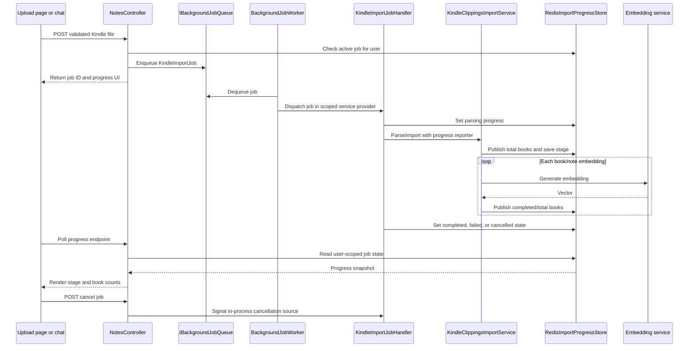

# Plan: Reusable Redis-Backed Background Jobs for Kindle Import

## Table of Contents

- [Summary](#summary)
- [Technical Approach](#technical-approach)
- [Component Breakdown](#component-breakdown)
- [Dependencies](#dependencies)
- [Flow](#flow)
- [Risk Assessment](#risk-assessment)

## Summary

Move Kindle import execution from the synchronous MVC request into a reusable in-process background job pipeline. The pipeline uses an in-memory `Channel` queue and hosted worker for execution, while reusing the existing `ICacheHandler`/Redis configuration to store user-scoped progress that both the upload page and chat UI can poll.

## Technical Approach

`NotesController` remains responsible for authentication, file validation, and HTTP responses. It copies the validated upload into a bounded job payload, checks the user's active-job key, and enqueues a `KindleImportJob`. The controller returns a job ID and the appropriate initial partial/view model rather than waiting for embeddings.

The generic job layer should use small interfaces:

- `IBackgroundJobQueue` owns enqueue/dequeue behavior.
- `IJobHandler` or a typed handler contract owns processor dispatch.
- `BackgroundJobWorker` is an ASP.NET Core `BackgroundService` that consumes envelopes, creates a dependency-injection scope, resolves the handler, and records terminal failures.
- `IImportProgressStore` owns progress serialization, Redis keys, TTLs, active-job lookup, and terminal cleanup rules.
- A cancellation registry/service owns in-process `CancellationTokenSource` instances because Redis can persist status but cannot cancel a running .NET operation by itself.

`KindleImportJobHandler` owns Kindle-specific orchestration. It resolves the existing scoped `IKindleClippingsImportService`, passes a progress reporter/job context into the import workflow, publishes stages and book-level progress, handles cooperative cancellation, and clears the user's active-job marker in a `finally` block. The existing EF Core retry strategy and transaction remain inside the Kindle import service; the queue layer must not own database transactions. Cancellation must propagate through the import transaction and prevent the final commit, rolling back all books, notes, and embeddings created or updated by the job.

Progress should be represented by a serializable model such as `ImportProgress` with a status enum, stage enum, completed/total books, optional current book, optional `KindleImportSummary`, optional `sessionId`, and error/cancellation text. Redis keys should include `userId`, optional `sessionId`, and `jobId`. The total book count becomes known after parsing; the handler should publish an initial indeterminate state before that point and a determinate book-count state during embedding. Note-level embedding can update stage text or note counters without pretending that each embedding has equal duration. Progress records should be retained for one day, while active-job markers are removed as soon as the job is terminal.

The progress endpoint must require authentication and verify both the job's stored `UserId` and the current claims user. The cancellation endpoint must perform the same check, signal the in-process cancellation source, and return the updated state. A missing job after TTL expiry should return a clear not-found/expired result rather than exposing another user's state.

The upload page and chat upload flow should share progress-state JavaScript and a small progress partial/view model where practical. The page keeps its existing upload layout. Chat inserts an agent-style progress bubble and disables the message form, attachment control, and relevant mode controls through a single client-side import-active state. Both flows poll the same endpoint and handle terminal states consistently. The implementation should use existing Razor, Shoelace, HTMX-style partial updates, and `site.js` patterns; no new frontend library is required.

SOLID boundaries are preserved because generic job infrastructure does not parse Kindle files, controllers do not run embeddings, Redis serialization is isolated behind an interface, and processors are replaceable handlers. Unit tests can use fake queue/progress/cancellation implementations; Redis-backed integration behavior can be covered through the existing Compose test environment where the project already provisions Redis.

## Component Breakdown

**Existing files to modify:**

- `WebApp/Controllers/NotesController.cs` — enqueue page and chat import jobs, expose authenticated progress/cancel actions, and return initial/final partial responses.
- `WebApp/Services/KindleClippingsImportService.cs` — preserve the current import transaction/retry behavior while adding a progress reporting seam for parsing, book processing, and embedding stages.
- `WebApp/Program.cs` — register the generic queue, hosted worker, job handlers, progress store, and cancellation service.
- `WebApp/Views/Home/_UploadNotes.cshtml` — add the page progress component, loading/error/complete states, and cancel control.
- `WebApp/Views/Home/Index.cshtml` — add stable selectors/hooks for disabling chat controls during an active import if required by the existing markup.
- `WebApp/Views/Chat/_BotMessage.cshtml` — support an agent-style import progress bubble or the shared progress partial.
- `WebApp/wwwroot/js/site.js` — start polling for page/chat jobs, render stage/book progress, call cancellation, and disable/re-enable chat controls.
- `WebApp.Tests/Controllers/NotesControllerTests.cs` — test enqueue responses, ownership checks, active-job conflicts, progress reads, and cancellation requests.
- `WebApp.Tests/Services/KindleClippingsImportServiceTests.cs` — test progress callbacks and cancellation without regressing deduplication, rollback, or embedding behavior.
- `WebApp.Tests/GlobalUsings.cs` or the relevant test fixtures — add only the test support needed for fake queue/progress services.

**New files to create:**

- `WebApp/Jobs/IBackgroundJobQueue.cs` — generic queue contract.
- `WebApp/Jobs/BackgroundJobQueue.cs` — bounded in-process `Channel` implementation.
- `WebApp/Jobs/BackgroundJobWorker.cs` — reusable hosted worker and handler dispatch lifecycle.
- `WebApp/Jobs/BackgroundJobEnvelope.cs` — job type/payload envelope used by the queue.
- `WebApp/Jobs/IJobHandler.cs` — processor handler contract.
- `WebApp/Jobs/KindleImportJob.cs` — upload bytes, filename, user ID, and job ID payload.
- `WebApp/Jobs/KindleImportJobHandler.cs` — Kindle-specific execution, progress publication, cancellation, and active-job cleanup.
- `WebApp/Jobs/IJobCancellationService.cs` and `WebApp/Jobs/JobCancellationService.cs` — in-process cancellation source registry.
- `WebApp/Services/IImportProgressStore.cs` and `WebApp/Services/RedisImportProgressStore.cs` — Redis-backed progress and active-job state.
- `WebApp/Models/ImportProgress.cs` — serialized progress contract and status/stage values.
- `WebApp/Views/Shared/_ImportProgress.cshtml` — shared Shoelace progress markup where the existing view composition allows it.
- `WebApp.Tests/Jobs/BackgroundJobWorkerTests.cs` — generic dispatch, failure, and cancellation tests.
- `WebApp.Tests/Services/RedisImportProgressStoreTests.cs` — serialization/key/TTL tests, using the repository's available Redis test pattern or a focused fake where appropriate.

## Dependencies

- Existing `redis:7-alpine` service and `ConnectionStrings__Redis` configuration in `docker-compose.yml`.
- Existing `ICacheHandler` backed by `IDistributedCache`; no new Redis client package is required.
- ASP.NET Core `BackgroundService` and `System.Threading.Channels` from the framework.
- Existing PostgreSQL/pgvector, Ollama, and embedding services used by `KindleClippingsImportService`.
- Existing Make/Docker workflows for building and testing; no host-installed .NET tooling.

## Flow

## Risk Assessment

| Risk | Evidence | Mitigation |
| --- | --- | --- |
| Upload bytes are unavailable after the request ends | Current controllers pass an open `IFormFile` stream directly to `ImportAsync` | Copy the bounded validated file into the job payload before enqueueing and release the request stream. |
| Redis progress is visible after a process restart while the in-memory job no longer exists | Redis is persistent in Compose; the queue is intentionally ephemeral | Store a terminal/expired marker or detect missing active execution and document restart behavior; never claim that queued jobs resume. |
| Two requests enqueue imports for the same user concurrently | Page and chat are separate upload paths | Use an atomic Redis active-job claim with the job ID and reject the loser; release it in a handler `finally` block. |
| Cancellation leaves database state different from the final UI | Existing import has EF transaction and embedding calls | Preserve the transaction boundary around the complete import, propagate cancellation, do not commit after cancellation, and test that books, notes, and embeddings are all rolled back. |
| A generic worker becomes Kindle-specific | The current import service already owns substantial workflow behavior | Dispatch through typed handlers and keep Kindle parsing/embedding logic in `KindleImportJobHandler`/`KindleClippingsImportService`. |
| Browser polling continues after terminal state or page navigation | Progress is client-side and asynchronous | Stop polling on all terminal states, clear timers, and make UI state restoration idempotent. |
