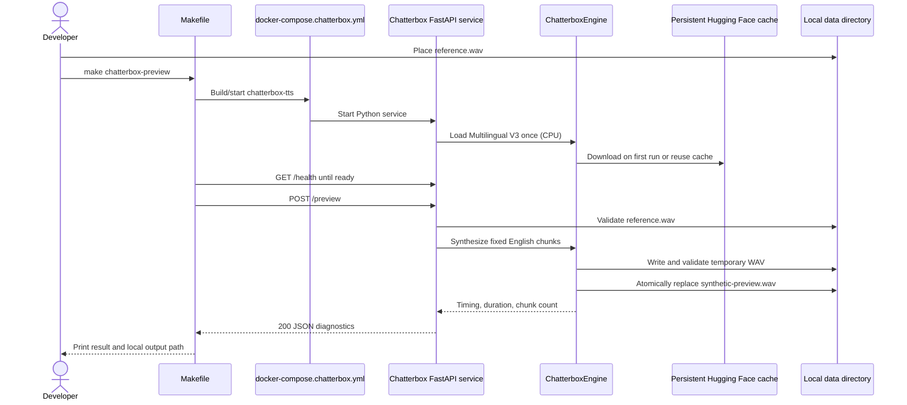

# Plan: Chatterbox Custom Voice Proof of Concept

## Table of Contents

- [Plan: Chatterbox Custom Voice Proof of Concept](#plan-chatterbox-custom-voice-proof-of-concept)
  - [Summary](#summary)
  - [Technical Approach](#technical-approach)
  - [Component Breakdown](#component-breakdown)
  - [Dependencies](#dependencies)
  - [Microsoft Learn Evidence](#microsoft-learn-evidence)
  - [Hardware Discovery](#hardware-discovery)
  - [Flow](#flow)
  - [Risk Assessment](#risk-assessment)

## Summary

Add an isolated, CPU-first Chatterbox Multilingual V3 HTTP service and a dedicated Compose/Make workflow that turns the supplied local `reference.wav` into `synthetic-preview.wav` using a fixed English passage. The POC deliberately leaves the existing ASP.NET Core Supertonic service and all web application behavior unchanged.

## Technical Approach

**Isolation from the application.** Add a separate `docker-compose.chatterbox.yml` rather than adding Chatterbox to the normal application stack. This keeps `make docker-run` behavior and the existing `tts` service in `docker-compose.yml` unchanged, avoids paying Chatterbox's startup and memory cost during unrelated development, and gives the POC focused lifecycle commands.

**Python service boundary.** Build a Python 3.11 HTTP service under `services/ChatterboxTtsService/`. FastAPI owns only HTTP request/response mapping and delegates synthesis to a narrow engine abstraction. A concrete Chatterbox engine loads `ChatterboxMultilingualTTS.from_pretrained(device="cpu", t3_model="v3")` once during process startup and implements fixed-reference preview synthesis. Tests replace this engine with a fake, preserving dependency inversion and preventing heavyweight model downloads in automated checks.

**Fixed local artifacts.** During implementation, move the currently untracked root `reference.wav` into `services/ChatterboxTtsService/data/reference.wav`. Bind-mount that ignored data directory read/write at `/data`. Store the exact user-approved passage as a tracked UTF-8 configuration text file rather than embedding a long multiline value in Compose or Make. Write the result to a temporary file inside `/data`, validate it as a non-empty WAV, and atomically replace `/data/synthetic-preview.wav` only after success.

**Long-text handling.** The approved passage is substantially longer than a short demo sentence. A focused chunker will preserve paragraph and sentence order while producing bounded inference chunks. The engine will synthesize each chunk with the same reference and `language_id="en"`, join waveform tensors with a short configured silence, and save one final WAV. Chunking belongs to the inference service, not the Makefile or API layer.

**Model acquisition and offline reuse.** Pin the official Chatterbox source to commit `5de7a54aa4e5e2baadb0182dde554908b48b85c2` (whose metadata reports `0.1.7`) and configure a bind-mounted, ignored Hugging Face cache under `services/ChatterboxTtsService/models/`. The published PyPI `0.1.7` wheel was found during implementation to lack the V3 `t3_model` loading API present in official source, so the source commit is required. The first preview may access Hugging Face; subsequent restarts must resolve from that cache. The model repository is independently pinned to Hugging Face snapshot `5bb1f6ee58e50c3b8d408bc82a6d3740c2db6e18`.

**Developer workflow.** Add Make targets backed only by `docker-compose.chatterbox.yml`. `make chatterbox-preview` builds/starts the service, waits for its health/readiness endpoint, posts to `/preview`, and prints the host output path. Separate targets expose logs, fake-engine tests, and teardown. They must not call the existing `docker-down*` commands because those remove the main stack's volumes.

**Diagnostics as the POC outcome.** The preview response and logs will include CPU device selection, chunk count, elapsed synthesis time, and output duration. Manual validation will record container memory alongside the machine facts below. These observations decide whether a later product-integration spec is worthwhile; this POC does not impose a real-time performance gate.

This approach follows SOLID principles by keeping HTTP coordination in the API module, model lifetime/inference in the engine, text/path settings in configuration, and deterministic chunk/output helpers independently testable. No EF Core, MVC controller, Microsoft Agent Framework, Redis, Ollama, or existing TTS responsibility is expanded.

Official Chatterbox evidence informing the design:

- [Chatterbox README](https://github.com/resemble-ai/chatterbox/blob/master/README.md) identifies Multilingual V3 as the recommended multilingual voice-cloning model, documents Python 3.11/Debian 11 testing, supports `device="cpu"`, accepts `audio_prompt_path`, and lists English as a supported language.
- [Chatterbox project metadata](https://raw.githubusercontent.com/resemble-ai/chatterbox/master/pyproject.toml) currently identifies package version `0.1.7` and its pinned core PyTorch/audio dependencies. The implementation must still produce a resolved lock/freeze appropriate to the service image.
- [Chatterbox license](https://github.com/resemble-ai/chatterbox/blob/master/LICENSE) is MIT; the implementation must retain applicable license notices and document the model artifacts used.

## Component Breakdown

**Existing files to modify:**

- `Makefile` — add isolated Chatterbox preview, logs, test, and teardown targets using the repository's Docker/Podman socket detection.
- `.gitignore` — exclude Chatterbox reference/output audio, model cache, Python caches, and local test artifacts.
- `README.md` — document the POC's first-run download, reference path, Make commands, output path, offline cache, expected CPU behavior, and troubleshooting.
- `reference.wav` — relocate this untracked local recording to `services/ChatterboxTtsService/data/reference.wav` during implementation; it remains a local ignored artifact rather than repository content.

**Existing files intentionally unchanged:**

- `docker-compose.yml` — the normal WebApp/Supertonic stack remains unchanged.
- `services/TtsService.Api/` — the Supertonic service remains the application's only configured TTS provider.
- `WebApp/` and `WebApp.Tests/` — no product integration, UI, persistence, or routing changes occur in this POC.
- `Specs/Roadmap.md` — the user explicitly requested that this experiment not become a prioritized roadmap phase yet.

**New files to create:**

- `docker-compose.chatterbox.yml` — isolated POC service, port, data/cache mounts, environment, and health check.
- `services/ChatterboxTtsService/Dockerfile` — reproducible Python 3.11 service image with the runtime/audio dependencies required by Chatterbox.
- `services/ChatterboxTtsService/requirements.txt` — pinned application, API, test, and Chatterbox dependencies (or input to a generated lock file if implementation proves a lock is required).
- `services/ChatterboxTtsService/requirements.lock.txt` — resolved Linux x86-64/Python 3.11 dependency graph, including CPU-only PyTorch 2.6 wheels.
- `services/ChatterboxTtsService/app/__init__.py` — Python package marker.
- `services/ChatterboxTtsService/app/main.py` — FastAPI app, startup/model readiness, `/health`, `/preview`, and exception-to-response mapping.
- `services/ChatterboxTtsService/app/engine.py` — narrow synthesis interface and concrete singleton Chatterbox Multilingual V3 implementation.
- `services/ChatterboxTtsService/app/chunking.py` — deterministic paragraph/sentence-aware text chunking.
- `services/ChatterboxTtsService/app/settings.py` — validated paths, English language ID, silence duration, and preview configuration.
- `services/ChatterboxTtsService/app/wait_for_ready.py` — container-local readiness polling with immediate model-load failure reporting for the Make workflow.
- `services/ChatterboxTtsService/config/preview.txt` — exact tracked English preview passage supplied by the user.
- `services/ChatterboxTtsService/tests/test_api.py` — health, success metadata, and error mapping with a fake engine.
- `services/ChatterboxTtsService/tests/test_chunking.py` — complete-text/order and chunk-boundary coverage.
- `services/ChatterboxTtsService/tests/test_output.py` — source preservation and atomic valid-output behavior.

## Dependencies

- Docker Compose or Podman Compose reached through the existing Makefile `DOCKER_HOST` detection.
- A Python 3.11 container image and the official `chatterbox-tts` source pinned to commit `5de7a54aa4e5e2baadb0182dde554908b48b85c2`; its metadata reports `0.1.7`.
- Chatterbox Multilingual V3 model artifacts downloaded from Hugging Face on the first successful run and retained in the bind-mounted local model cache.
- Approximately 4 MB local `reference.wav`, already supplied and verified as PCM 16-bit stereo at 44.1 kHz for 22.308 seconds.
- Sufficient disk for the Python/PyTorch image, model snapshot, and generated audio. The target currently has approximately 258 GiB available.
- Initial network access for container base layers, Python dependencies, and model artifacts. Offline operation is expected only after these are cached.

## Microsoft Learn Evidence

Not applicable. This POC introduces an isolated Python/Chatterbox container and Make/Compose workflow and explicitly makes no .NET, ASP.NET Core, Entity Framework Core, Identity, Microsoft Agent Framework, Microsoft.Extensions.AI, or Microsoft testing API decision. Existing Microsoft-based application boundaries remain unchanged.

## Hardware Discovery

Discovery on 2026-08-09 found:

- SteamOS/Linux kernel `6.16.12-valve24.5-1-neptune-616-gb2f7cfe85e45`, x86-64.
- AMD Ryzen Z2 Go, 4 physical cores / 8 threads, boost up to approximately 4.37 GHz, AVX2 available.
- 30 GiB total RAM, approximately 14 GiB available at discovery time, plus 15 GiB swap.
- AMD Radeon 680M integrated graphics.
- Approximately 258 GiB free space in the repository filesystem.

These facts support attempting CPU inference without asserting that it will be fast. Chatterbox's official documented device options are CUDA, CPU, and Apple MPS; this slice therefore avoids an unsupported assumption that the Radeon/Vulkan configuration used by Ollama can accelerate PyTorch Chatterbox.

## Flow

## Risk Assessment

| Risk | Evidence | Mitigation |
| --- | --- | --- |
| CPU synthesis may be too slow for later interactive chat use. | The target has only 4 physical CPU cores, while Multilingual V3 is a 500M-parameter PyTorch model. | Treat elapsed time and memory as POC outputs, load once, serialize inference, and defer integration until results are reviewed. |
| Available memory may fall while Ollama and the main stack are active. | Discovery showed 30 GiB total but only 14 GiB available at that moment. | Use a separate Compose project, document stopping unrelated workloads for a clean benchmark, and record container memory. |
| AMD Radeon acceleration may not work through the official package path. | Official usage documents CUDA, CPU, and MPS, not Vulkan or generic AMD acceleration. | Force CPU for this POC and leave ROCm/Vulkan experimentation out of scope. |
| The long preview passage may exceed a stable single inference prompt. | The approved passage contains multiple paragraphs and is much longer than the official short examples. | Add deterministic sentence-aware chunking and join waveform tensors with controlled silence. |
| A failed synthesis could destroy a prior useful preview. | The output has one stable filename that is intentionally replaced. | Write to a temporary file, validate RIFF/WAVE output, then atomically replace the destination. |
| A package pin does not guarantee immutable remote model weights. | `from_pretrained` may resolve an upstream Hugging Face default revision. | Persist the cache, capture the resolved snapshot/revision, document it, and test an offline restart. |
| Adding Chatterbox to the base stack would slow every normal development run. | Model loading and the PyTorch image are heavyweight, and the POC has no WebApp consumer. | Use a separate Compose file and focused Make targets; leave `docker-compose.yml` unchanged. |
| Personal reference audio could be committed accidentally. | The supplied `reference.wav` is currently untracked at repository root. | Move it into an explicitly ignored data directory and document that reference/output recordings are local artifacts. |
| Upstream dependency installation may fail across moving transitive versions. | Chatterbox has a substantial PyTorch/audio dependency graph. | Pin the top-level release, produce a resolved dependency set during implementation, and validate from a clean image build. |
