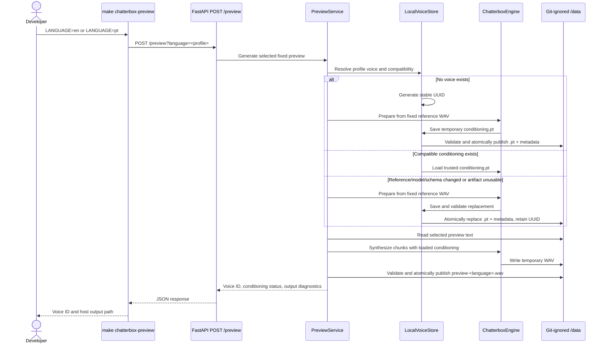

# Plan: Persistent Chatterbox Voice Conditioning POC

## Table of Contents

- [Plan: Persistent Chatterbox Voice Conditioning POC](#plan-persistent-chatterbox-voice-conditioning-poc)
  - [Summary](#summary)
  - [Technical Approach](#technical-approach)
  - [Component Breakdown](#component-breakdown)
  - [Dependencies](#dependencies)
  - [Microsoft Learn Evidence](#microsoft-learn-evidence)
  - [Flow](#flow)
  - [Risk Assessment](#risk-assessment)

## Summary

Extend the existing CPU-only Chatterbox Multilingual V3 POC with two allowlisted language profiles and a private local voice store. The first preview for each profile creates a stable UUID and conditioning `.pt`; later previews load that artifact—even after container restart—and synthesize changed tracked preview text without reprocessing the reference recording.

## Technical Approach

**Two fixed profiles.** Replace the single-path `Settings` design in `app/settings.py` with immutable profile configuration resolved from an internal `en`/`pt` map. English selects `/data/reference.wav`, `/app/config/preview.txt`, and Chatterbox language `en`. Portuguese selects `/data/pt-reference.wav`, `/app/config/pt-preview.txt`, and Chatterbox language `pt`. FastAPI may receive only the profile key, never a path. Omitting the language preserves the current English default.

**Automatic voice registration rather than a prepare command.** A developer continues to invoke preview generation. On a profile's first preview, a focused local voice store generates a UUID, creates `/data/voices/<voice-id>/`, and associates that voice with the fixed profile in service-owned metadata. No arbitrary WAV path, upload route, or separate preparation workflow is introduced. A later preview resolves the same profile-to-voice association and returns the same voice ID.

**Persisted conditioning.** Extend the engine boundary so it can prepare conditioning from a validated WAV, save the current `Conditionals` object, load saved conditioning onto CPU, and synthesize using already-selected conditioning. Chatterbox Multilingual V3's pinned `Conditionals.save()` serializes tensor dictionaries with `torch.save`; `Conditionals.load()` uses `torch.load(..., weights_only=True)` and reconstructs its T3/S3Gen conditionals. The service must call these official methods rather than duplicating Chatterbox's tensor schema. The official implementation is visible in the pinned [Chatterbox multilingual source](https://github.com/resemble-ai/chatterbox/blob/5de7a54aa4e5e2baadb0182dde554908b48b85c2/src/chatterbox/mtl_tts.py#L1085-L1155).

**Compatibility and integrity metadata.** Store an application-owned `metadata.json` beside `conditioning.pt`. Include the reference checksum, saved conditioning checksum, profile language, Chatterbox source revision pinned in `requirements.txt`, Hugging Face model snapshot already pinned by `PINNED_MODEL_REVISION`, model name, and an application conditioning format version. Resolve profile metadata by scanning only direct UUID directories beneath `/data/voices`, reject duplicate profile registrations as invalid local state, and validate all resolved paths stay beneath the configured roots.

**Reuse and invalidation.** Before inference, compare current reference/model/schema facts with metadata and verify the `.pt` checksum. If all match, load the saved conditioning and synthesize without `audio_prompt_path`. If the reference or compatibility identity changed, or if the artifact is missing/corrupt, prepare from the fixed validated WAV and atomically replace conditioning plus metadata while retaining the logical voice ID. Editing either preview text file is deliberately excluded from the compatibility identity, so new text reuses the voice.

**Atomic persistence.** Create conditioning and metadata temporary files inside the final voice directory, validate the newly saved `.pt` by restricted loading and verify checksums, then publish with `os.replace()`. Preserve an existing known-good artifact until its replacement is validated. Apply the current temporary-WAV validation and atomic replacement pattern to the new per-voice output path. Clean temporary artifacts on both success and failure.

**Singleton model safety.** `ChatterboxMultilingualTTS.conds` is mutable shared model state. Keep the existing process-wide inference lock around profile resolution, conditioning load/prepare, all chunks, and output publication. A request must load or prepare its selected conditioning immediately before synthesis so an English request cannot accidentally reuse Portuguese state.

**HTTP and Make workflow.** Evolve `POST /preview` to accept an allowlisted `language` query value while defaulting to `en`, for example `POST /preview?language=pt`. Keep the route intentionally fixed-text. Add `LANGUAGE ?= en` to the Make workflow, validate only `en` or `pt`, check the corresponding reference filename, invoke the query route, and report the returned voice ID/output. A single target remains easier to test than language-specific duplicate targets.

**SOLID boundaries.** FastAPI routes continue to translate HTTP results and errors only. `PreviewService` coordinates a request. A new focused voice-store abstraction owns UUID directories, metadata, checksums, compatibility decisions, and atomic artifact publication. The synthesis engine owns only Chatterbox model state and conditioning/speech operations. Tests provide fake engine and temporary-store inputs, keeping PyTorch and filesystem behavior independently testable.

**Documentation and scope.** Update the service-local `README.md` diagrams and operational guidance to describe actual persistence rather than the current future-state proposal. Keep the separate Compose project, bind mounts, CPU model, pinned dependencies, WebApp, Supertonic, database, and Microsoft Agent Framework boundaries unchanged. Do not update `Specs/Roadmap.md`, per the user's POC instruction.

## Component Breakdown

**Existing files to modify:**

- `.gitignore` — confirm the existing whole-directory ignores continue to cover voice IDs, `.pt`, metadata, outputs, and local references; clarify comments if necessary without adding exceptions for sensitive artifacts.
- `Makefile` — add validated `LANGUAGE` selection, profile-specific reference checks, language query invocation, and voice/output reporting to `chatterbox-preview`.
- `docker-compose.chatterbox.yml` — remove the single English preview/language environment assumptions and retain only shared data/model roots and pinned model settings needed by profile resolution.
- `services/ChatterboxTtsService/app/settings.py` — define validated `en` and `pt` profile configuration plus voices/outputs roots and conditioning format identity.
- `services/ChatterboxTtsService/app/engine.py` — add prepare/save/load conditioning operations and synthesize from the explicitly selected in-memory conditioning without reparsing a reference for each request.
- `services/ChatterboxTtsService/app/main.py` — coordinate profile selection, voice resolution, compatibility/integrity checks, conditioning reuse/regeneration, per-voice output, response metadata, and error mapping while retaining serialized inference.
- `services/ChatterboxTtsService/config/pt-br-preview.txt` — rename to `config/pt-preview.txt` while preserving the supplied Portuguese passage.
- `services/ChatterboxTtsService/tests/conftest.py` — provide two profile fixtures, fake local voice storage, and deterministic test WAV/text inputs.
- `services/ChatterboxTtsService/tests/test_api.py` — cover language selection/defaulting, response voice identity and conditioning status, unsupported values, profile isolation, restart reuse, and failure mapping.
- `services/ChatterboxTtsService/tests/test_chunking.py` — cover both tracked preview passages and retain deterministic complete-text chunking assertions.
- `services/ChatterboxTtsService/tests/test_output.py` — cover per-voice output paths and atomic preservation independently for English and Portuguese.
- `services/ChatterboxTtsService/README.md` — document the implemented voice store, `.pt` lifecycle, language mapping, Make commands, persistence/deletion, security boundary, file layout, and updated Mermaid flows.
- `README.md` — update the brief Chatterbox POC instructions if they currently imply English-only, memory-only conditioning, or one shared output.

**Local ignored artifact to rename during implementation:**

- `services/ChatterboxTtsService/data/pt-br-reference.wav` → `services/ChatterboxTtsService/data/pt-reference.wav` — align the fixed filename with Chatterbox's actual `pt` language ID while preserving the recording bytes.

**New files to create:**

- `services/ChatterboxTtsService/app/voice_store.py` — focused profile-to-UUID resolution, metadata model, checksum/compatibility validation, safe root-contained paths, and atomic artifact persistence.
- `services/ChatterboxTtsService/tests/test_voice_store.py` — first-use ID creation, stable resolution, checksum validation, invalidation, corrupt/missing artifact recovery decisions, atomic failure behavior, UUID/path containment, and profile-isolation tests.

## Dependencies

- Existing isolated `docker-compose.chatterbox.yml` and `make chatterbox-*` workflow.
- Existing Python 3.11 CPU image and pinned Chatterbox source revision `5de7a54aa4e5e2baadb0182dde554908b48b85c2`.
- Existing pinned Hugging Face model snapshot `5bb1f6ee58e50c3b8d408bc82a6d3740c2db6e18` and ignored model cache.
- Existing PyTorch/Chatterbox `Conditionals.save()` and `Conditionals.load()` implementation; no new package is planned.
- Local ignored `reference.wav` and `pt-br-reference.wav` recordings supplied by the user; the latter is renamed during implementation.
- Tracked English `config/preview.txt` and currently untracked Portuguese `config/pt-br-preview.txt`; the latter is renamed and tracked during implementation.
- Writable bind-mounted `services/ChatterboxTtsService/data/` storage. Container/image persistence does not protect against manual host deletion or disk failure.

## Microsoft Learn Evidence

Not applicable. This POC changes only the isolated Python/Chatterbox service, local filesystem artifacts, its separate Compose file, Make workflow, and documentation. It makes no .NET, ASP.NET Core, EF Core, Identity, Microsoft.Extensions.AI, Microsoft Agent Framework, or Microsoft testing decision, and existing Microsoft-based application boundaries remain unchanged.

## Flow

## Risk Assessment

| Risk | Evidence | Mitigation |
| --- | --- | --- |
| Loading malicious PyTorch data can be unsafe. | `.pt` is a PyTorch serialization container, and the service README already identifies unsafe deserialization as a security concern. | Never accept `.pt` uploads or request paths; load only service-created root-contained artifacts through Chatterbox's `weights_only=True` loader; verify UUID, metadata, and SHA-256 first. |
| Conditioning may become incompatible with model changes. | Chatterbox conditionals contain architecture-specific T3 and S3Gen tensors. | Store source/model/schema identity, invalidate mismatches, retain the reference WAV, and rebuild automatically. |
| A partial write could destroy a reusable voice. | Container interruption or disk exhaustion can occur during `torch.save` or metadata/output writes. | Save to same-directory temporary files, load-validate/checksum them, atomically replace only after success, and clean leftovers. |
| The singleton model may speak with the wrong voice under concurrent requests. | Chatterbox stores conditionals in mutable `model.conds`. | Keep one lock around conditioning selection and complete inference; explicitly load/prepare for every request profile. |
| An English or Portuguese request may select the other profile's artifacts. | Two profiles share one process and model. | Use an immutable allowlist, bind metadata to one profile, reject duplicate profile registrations, and test cross-profile isolation. |
| Generated UUIDs add orphan/duplicate state after a failed first preparation. | A crash can happen after directory creation but before publishing valid metadata. | Treat directories without valid metadata as incomplete, clean safe temporary state, and create/publish registration atomically. |
| A Portuguese recording may still produce regional pronunciation variation. | General multilingual V3 exposes `pt`, not a Brazilian-specific language ID. | Use the supplied Portuguese reference for accent/style, document that this is general Portuguese, and judge quality through the real manual preview. |
| Persisted local biometric-derived data may be accidentally exposed or lost. | `/data` contains personal recordings, embeddings/conditioning, and generated speech and is not backed up. | Keep it bind-mounted and Git-ignored, avoid logging content, document private retention/deletion and that manual deletion/disk failure is unrecoverable without a backup/reference. |
| Reusing `.pt` may not materially reduce total synthesis time. | Conditioning extraction is only part of the approximately seven-minute CPU preview; waveform generation remains dominant. | Validate reuse functionally and record timing, but set no real-time performance requirement. |
