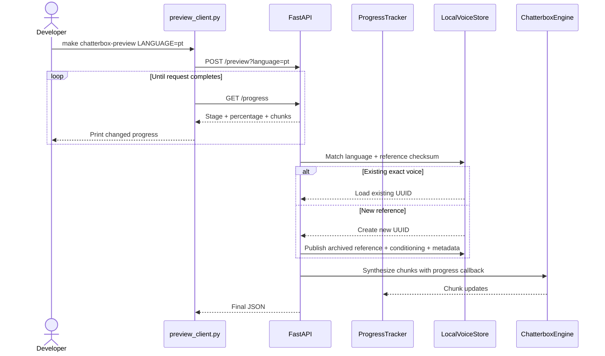

# Plan: Chatterbox Voice Versioning and Progress POC

## Summary

Change voice identity from “one voice per language” to “one voice per language plus reference checksum,” archive each successful reference, add explicit voice discovery/selection, expose thread-safe chunk-level progress, and reject short or silent audio before publication.

## Technical Approach

**Voice resolution.** Update `LocalVoiceStore` to scan all valid metadata records. Without `voice_id`, calculate the current fixed reference checksum: reuse an exact language/checksum match or create a new UUID when none exists. With `voice_id`, resolve exactly that UUID, verify language, and use its archived reference. Multiple language matches are valid; duplicate language/reference checksum pairs are invalid.

**Immutable reference archive.** Extend atomic voice publication to include `reference.wav`. For a new voice, copy the validated root reference to a temporary file inside the UUID directory, checksum it, and publish reference, conditioning, and metadata as one recoverable set. Existing previous-format voices may be backfilled only when their metadata checksum matches the current fixed reference. A format-version increment records the new invariant.

**Compatibility.** A selected/matched voice whose source/model/schema identity changes is regenerated under the same UUID from its archived reference. A changed root reference never regenerates another voice. If a historical voice lacks an archive and the current root reference does not match, fail explicitly instead of using the wrong speaker.

**Selection and discovery.** Add optional `voice_id` to `POST /preview` and a read-only `GET /voices` route. Responses list IDs, language, checksums/revisions, timestamps, and artifact readiness but no arbitrary paths or tensor/audio contents. Add `VOICE_ID` support to Make and a `chatterbox-voices` target.

**Progress.** Add a small thread-safe `ProgressTracker` owned by `PreviewService`. Update it at orchestration stages and pass a callback into `ChatterboxEngine.synthesize()` so each chunk reports a monotonic percentage. `GET /progress` returns snapshots. A new `app/preview_client.py` starts the blocking POST in a worker thread, polls progress, prints only changed snapshots with `flush=True`, then prints the final response. Make invokes this client rather than a one-line blocking `urllib` request.

**Audio validation.** Extend PCM WAV validation to calculate duration and absolute sample peak. References must be at least three seconds and exceed a conservative near-silence threshold. Generated output must also exceed the threshold before atomic replacement. This catches genuinely empty output but does not classify pronunciation or playback-device problems as silence.

**Boundaries.** FastAPI maps routes; `PreviewService` orchestrates; `LocalVoiceStore` owns identity/artifacts; `ProgressTracker` owns state; `ChatterboxEngine` owns model callbacks. Tests continue using `FakeEngine` and temporary directories.

## Component Breakdown

**Existing files to modify:**

- `Makefile` — progress client, optional `VOICE_ID`, voice-list target.
- `services/ChatterboxTtsService/app/settings.py` — increment conditioning format and audio validation thresholds.
- `services/ChatterboxTtsService/app/voice_store.py` — multiple voices, checksum matching, exact selection, archived references, backfill, and atomic set publication.
- `services/ChatterboxTtsService/app/engine.py` — chunk progress callback.
- `services/ChatterboxTtsService/app/main.py` — progress tracking/routes, voice selection/listing, audible validation, and orchestration.
- `services/ChatterboxTtsService/tests/conftest.py` — audible references long enough for new validation.
- `services/ChatterboxTtsService/tests/test_api.py` — multi-voice, selection/list, progress, silence, and rollback coverage.
- `services/ChatterboxTtsService/tests/test_output.py` — audible-output validation.
- `services/ChatterboxTtsService/tests/test_voice_store.py` — new identity/archive/backfill semantics.
- `services/ChatterboxTtsService/README.md` and root `README.md` — commands, progress, multi-voice lifecycle, and recovery limits.

**New files to create:**

- `services/ChatterboxTtsService/app/progress.py` — thread-safe progress snapshots and monotonic updates.
- `services/ChatterboxTtsService/app/preview_client.py` — polling terminal client used by Make.
- `services/ChatterboxTtsService/tests/test_progress.py` — tracker and client rendering tests.

## Dependencies

- Existing Python standard library, FastAPI, Chatterbox, Docker/Make workflow, and bind-mounted data/model directories.
- No new package or service.

## Microsoft Learn Evidence

Not applicable. This follow-up changes only the isolated Python/Chatterbox POC.

## Flow

## Risk Assessment

| Risk | Mitigation |
| --- | --- |
| Older overwritten Portuguese voice cannot be recovered. | State this explicitly; never manufacture a historical voice from the new reference. |
| Multiple voices become undiscoverable. | Add `GET /voices`, `make chatterbox-voices`, response IDs, and optional `VOICE_ID`. |
| Percentages imply unsupported token precision. | Report honest orchestration/chunk percentages only. |
| Archived reference publication partially fails. | Use temporary files, checksums, rollback, and metadata-last publication. |
| Short fake test WAVs break tests. | Generate deterministic audible three-second fixtures. |
| Silence threshold rejects very quiet valid recordings. | Use a conservative threshold and return the measured validation reason. |
