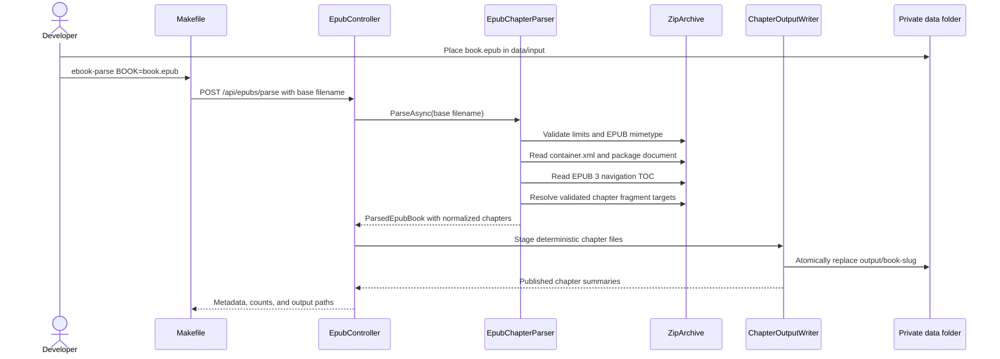

# Plan: EPUB Chapter Text Parser POC

## Table of Contents

- [Summary](#summary)
- [Technical Approach](#technical-approach)
- [Component Breakdown](#component-breakdown)
- [Dependencies](#dependencies)
- [EPUB Standards Evidence](#epub-standards-evidence)
- [Microsoft Learn Evidence](#microsoft-learn-evidence)
- [Flow](#flow)
- [Risk Assessment](#risk-assessment)

## Summary

Rename the empty experimental service boundary to `services/EbookParseService.Api/` and build an isolated ASP.NET Core .NET 10 controller API that selectively reads EPUB 3 container/package/navigation resources, extracts explicitly identified chapters, and atomically publishes deterministic narration-ready UTF-8 files. A separate xUnit project will use synthetic EPUB archives, while Docker Compose and Make provide the only supported build, test, and local parse workflow.

## Technical Approach

**Service boundary and API.** Follow the small controller/service pattern already visible in `services/TtsService.Api/`: `Program.cs` registers controllers, configuration, Problem Details, and focused services; `EpubController` owns routing and maps domain outcomes to HTTP results; `IEpubChapterParser` owns the publication-reading workflow; and `IChapterOutputWriter` owns staging and atomic filesystem publication. No WebApp controller, EF Core context, Microsoft Agent Framework component, or TTS abstraction participates.

**Local input contract.** `POST /api/epubs/parse` receives a JSON `ParseEpubRequest` with a base filename. `EpubParserOptions` supplies absolute `/data/input` and `/data/output` roots plus resource limits. The controller/service rejects anything other than a base `.epub` name, resolves it with `Path.GetFullPath`, and verifies it remains directly beneath the configured input root. This intentionally avoids multipart upload buffering in the first POC.

**EPUB container and package discovery.** `EpubChapterParser` opens the file with `ZipFile.OpenRead`/`ZipArchiveMode.Read`, validates archive limits and the EPUB media-type marker, then opens only selected entries. It securely parses `META-INF/container.xml`, resolves the declared rootfile, and reads the package manifest, spine, metadata, and EPUB 3 navigation item. Internal href resolution is relative to the referring archive entry, normalized with URI/path rules, and rejected if rooted, traversal-based, duplicated, missing, or outside declared manifest XHTML resources. Nothing is extracted wholesale to disk.

**Chapter discovery without broad guessing.** Parse the navigation XHTML and select the `nav` carrying EPUB `toc` semantics. Resolve TOC links in document order. A target is accepted when EPUB structural semantics explicitly mark it as a chapter. To support the inspected sample, the only controlled non-semantic form accepts an Arabic-numeric TOC label whose resolved target section heading contains the same normalized number. This is an explicit format requirement supplied by the user, not a filename/size/spine heuristic. Part labels, including the sample's `PART ONE`, `PART TWO`, and `CODA` entries, are ignored. If no chapters or ambiguous/duplicate/missing targets remain, parsing fails with `unsupported-structure` rather than treating spine items as chapters.

**Boundary-aware XHTML extraction.** Cache each selected XHTML document once. Prefer the resolved structural target element (`section`/`article`) as the extraction boundary. Where a valid chapter fragment points to its heading instead, collect subsequent block nodes only until the next validated chapter target in the same document. Reject a target when neither boundary is unambiguous. Exclude the numeric heading already represented by the generated prefix and skip non-narrative elements (`script`, `style`, `nav`, media-only nodes, and footnote backlink controls). Convert block elements into paragraphs, preserve meaningful inline text and Unicode punctuation, normalize whitespace, and reject empty results.

**Deterministic text and publication.** `ChapterTextDocument` contains chapter number, normalized paragraphs, and counts. `ChapterOutputWriter` renders UTF-8 `chapter-NNN.txt` with `Chapter N.` as the first sentence. It writes the full result under a unique temporary sibling directory, validates the expected file set, then replaces `data/output/<book-slug>/` as a unit. The writer keeps the last successful directory until staging has completed; replacement uses a backup/restore sequence where direct directory replacement is not portable. Temporary and backup directories are cleaned after success, and rollback restores the prior output on failure.

**Safe diagnostics.** `ParseEpubResponse` reports safe metadata and output summaries, not prose. Domain exceptions distinguish invalid requests, invalid/corrupt EPUBs, unsupported or encrypted publications, and output conflicts. ASP.NET Core Problem Details maps these to stable 400/409/415/422 responses, while unexpected errors remain generic 500 responses and detailed exceptions stay in internal structured logs.

**Testing strategy.** `services/EbookParseService.Tests/` constructs miniature standards-shaped EPUB ZIP files in temporary directories. A reusable `SyntheticEpubBuilder` writes the media type, container, OPF, navigation XHTML, and chapter XHTML necessary for each case. The key fixture deliberately stores several chapters in one XHTML file and includes part/title entries so tests prove navigation fragments and exclusions. Parser and writer tests use temporary roots; controller tests fake `IEpubChapterParser`. No copyrighted source text enters Git or test output.

**Docker-first workflow.** Add a dedicated `docker-compose.ebook-parser.yml`, modeled after the isolated Chatterbox Compose boundary but using an ASP.NET runtime container and `/data` bind mount. `make ebook-parse BOOK=...` validates the local input, starts/builds the service, waits on `/health`, and posts JSON. `make ebook-parser-test` runs only the new tests. The solution and `docker-compose.test.yml` add the new projects so `make test` remains the full regression gate.

## Component Breakdown

**Existing files/directories to modify:**

- `services/EbookParceService/` — rename the experimental boundary to `services/EbookParseService.Api/`; relocate the local book under the new ignored `data/input/` path without committing it.
- `.gitignore` — ignore EPUB parser input, staged/backup output, generated chapter text, and other private data while allowing optional empty-directory placeholders if needed.
- `Makefile` — add isolated parser compose variables and `ebook-parse`, `ebook-parser-test`, `ebook-parser-logs`, and `ebook-parser-down` targets with `BOOK` validation.
- `docker-compose.test.yml` — run `EbookParseService.Tests` after the existing WebApp and TTS suites in the Dockerized regression workflow.
- `book-notes-ia.sln` — register the API and test projects.
- `README.md` — document the concise local EPUB-to-chapter-text POC workflow and isolation boundary.

**New files to create:**

- `docker-compose.ebook-parser.yml` — isolated service, port, health check, and private `/data` bind mount.
- `services/EbookParseService.Api/EbookParseService.Api.csproj` — .NET 10 Web API project using platform archive/XML APIs.
- `services/EbookParseService.Api/Program.cs` — controllers, options, Problem Details, parser, writer, and health registrations.
- `services/EbookParseService.Api/Dockerfile` — multi-stage .NET 10 SDK publish and ASP.NET runtime image.
- `services/EbookParseService.Api/appsettings.json` — input/output roots and archive/XML resource limits.
- `services/EbookParseService.Api/Controllers/EpubController.cs` — health-independent parse endpoint coordination and Problem Details mapping.
- `services/EbookParseService.Api/Models/ParseEpubRequest.cs` — local base-filename request contract.
- `services/EbookParseService.Api/Models/ParseEpubResponse.cs` — safe book/chapter output summary.
- `services/EbookParseService.Api/Models/ParsedEpubBook.cs` — internal parsed publication result.
- `services/EbookParseService.Api/Models/ParsedChapter.cs` — chapter number and normalized paragraph model.
- `services/EbookParseService.Api/Options/EpubParserOptions.cs` — roots and bounded archive/XML limits.
- `services/EbookParseService.Api/Services/IEpubChapterParser.cs` — narrow parsing contract.
- `services/EbookParseService.Api/Services/EpubChapterParser.cs` — container, package, navigation, XHTML boundary, and text extraction implementation.
- `services/EbookParseService.Api/Services/IChapterOutputWriter.cs` — narrow publication contract.
- `services/EbookParseService.Api/Services/ChapterOutputWriter.cs` — deterministic rendering, staging, replacement, rollback, and cleanup.
- `services/EbookParseService.Api/Services/EpubParseException.cs` — sanitized categorized domain failures.
- `services/EbookParseService.Api/README.md` — detailed supported structures, examples, privacy, limits, and troubleshooting.
- `services/EbookParseService.Tests/EbookParseService.Tests.csproj` — .NET 10 xUnit test project referencing the API.
- `services/EbookParseService.Tests/SyntheticEpubBuilder.cs` — generated non-copyrighted test fixture builder.
- `services/EbookParseService.Tests/EpubChapterParserTests.cs` — EPUB structure, safety, boundary, and normalization coverage.
- `services/EbookParseService.Tests/ChapterOutputWriterTests.cs` — deterministic output and atomic rollback coverage.
- `services/EbookParseService.Tests/EpubControllerTests.cs` — request/result/error mapping with fakes.

## Dependencies

- .NET 10 SDK for Dockerized build/tests and ASP.NET Core 10 runtime for the service.
- Platform assemblies `System.IO.Compression`, `System.Xml`, and `System.Xml.Linq`; no new runtime NuGet parser dependency is expected.
- Docker Compose/Podman selected through the repository Makefile's existing socket detection.
- A local, legally obtained EPUB 3 file under `services/EbookParseService.Api/data/input/` for manual validation.
- No PostgreSQL, Redis, Ollama, Chatterbox, Supertonic, network service, or WebApp dependency.

## EPUB Standards Evidence

- The [W3C EPUB 3.3 Recommendation](https://www.w3.org/TR/epub-33/) defines EPUB as an OCF ZIP container, requires `META-INF/container.xml` to identify package documents, defines the package manifest and spine, and defines the EPUB navigation document and its `toc` navigation. These structures drive discovery and reading order instead of fixed paths or content filenames.
- The [W3C EPUB 3 Overview](https://www.w3.org/TR/epub-overview-33/) explains that the package document enumerates resources and default reading order while the navigation document supplies a declarative table of contents. The inspected sample confirms that TOC fragment targets, not spine-resource granularity, represent its numbered chapters.

## Microsoft Learn Evidence

- [Best practices for working with ZIP and TAR archives in .NET](https://learn.microsoft.com/dotnet/standard/io/zip-tar-best-practices) recommends `ZipArchive` streaming APIs for untrusted archives and explicitly requires application-enforced entry-count, per-entry size, aggregate decompressed-size, filename, and normalized path limits to mitigate ZIP bombs and traversal. The parser therefore reads selected entries and validates limits rather than calling whole-archive extraction.
- [`ZipArchive` in .NET 10](https://learn.microsoft.com/dotnet/api/system.io.compression.ziparchive?view=net-10.0) documents `Entries`, `GetEntry`, and `ZipArchiveEntry.Open` for selective stream access. These platform APIs are sufficient for the valid EPUB 3 fixture, so the plan avoids an unneeded parser package.
- [LINQ to XML security](https://learn.microsoft.com/dotnet/standard/linq/linq-xml-security) recommends a configured `XmlReader` for unknown input and warns about DTD/entity and resource-exhaustion attacks. Required EPUB XML/XHTML will therefore be loaded through bounded readers with external resolution disabled instead of direct unrestricted deserialization.
- [Upload files in ASP.NET Core](https://learn.microsoft.com/aspnet/core/mvc/models/file-uploads?view=aspnetcore-10.0) warns against trusting client filenames and recommends dedicated storage, extension/content validation, and size limits. Although multipart upload is out of scope, the local filename request is still treated as untrusted and constrained to the private input root.
- [Handle errors in ASP.NET Core APIs](https://learn.microsoft.com/aspnet/core/fundamentals/error-handling-api?view=aspnetcore-10.0) documents `AddProblemDetails`, exception handling, and standardized API errors without exposing sensitive exception information. The isolated controller will return categorized Problem Details and keep private text/internal paths out of responses.

## Flow

## Risk Assessment

| Risk | Evidence | Mitigation |
| --- | --- | --- |
| Treating one spine/XHTML item as one chapter creates incorrect boundaries. | The sample stores chapters 1–7 inside `ch002.xhtml`. | Use EPUB navigation fragment targets and structural sections; test several chapters in one synthetic resource. |
| EPUB metadata does not universally label every chapter. | EPUB defines navigation and structural semantics but publishers vary in granularity. | Accept explicit chapter semantics plus the user's exact numeric TOC/target contract; reject all other ambiguous structures without guessing. |
| A crafted EPUB consumes disk, memory, or CPU. | Microsoft Learn warns that .NET archive convenience APIs do not impose ZIP bomb limits. | Stream selected entries and enforce source, entry-count, per-entry, aggregate, XML-character, and depth limits before publication. |
| Archive hrefs or requested filenames escape private roots. | ZIP/internal hrefs and API filenames are untrusted path material. | Permit only a base input filename; normalize archive resource resolution; reject rooted/traversal targets; generate output filenames internally. |
| XHTML DTD/entity processing accesses external resources or expands malicious content. | Microsoft Learn recommends configured `XmlReader` for untrusted XML. | Disable external resolution, ignore/prohibit DTD safely, cap characters, and expose sanitized failures. |
| A failed rerun deletes the only complete chapter set. | Reruns intentionally replace a deterministic output directory. | Stage and validate the full set, retain a backup during replacement, restore it on failure, and test injected publication failures. |
| Copyrighted source or extracted prose is committed or logged. | `Neuromancer.epub` is currently untracked but not ignored. | Ignore the entire private data tree, use only synthetic test prose, and return/log metadata rather than chapter content. |
| DRM or encrypted resources produce garbage or invite circumvention. | EPUB containers may declare encrypted resources. | Reject protected publications with an unsupported-content result; do not add decryption logic. |
| New isolated tests silently fall outside the main regression target. | `docker-compose.test.yml` currently runs only WebApp and TTS tests. | Add both projects to the solution and explicitly execute the parser tests in `make test`. |
