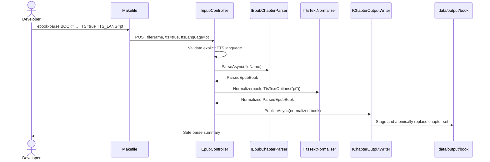

# Plan: Chatterbox TTS Text Normalization POC

## Table of Contents

- [Summary](#summary)
- [Technical Approach](#technical-approach)
- [Component Breakdown](#component-breakdown)
- [Dependencies](#dependencies)
- [Microsoft Learn Evidence](#microsoft-learn-evidence)
- [Flow](#flow)
- [Risk Assessment](#risk-assessment)

## Summary

Extend the isolated EPUB parser request with an opt-in TTS mode and explicit `en` or `pt` language, then pass extracted chapters through a focused, deterministic C# normalizer before the existing atomic writer publishes them. The default parse path remains unchanged, and the feature prepares text only; it does not call Chatterbox.

## Technical Approach

`Makefile` will validate the developer-facing variables and include `tts` and `ttsLanguage` in the JSON sent to the existing endpoint. The API remains the authority for validation so direct callers receive the same behavior: TTS mode requires exact `en` or `pt`, ignores EPUB metadata for normalization selection, and maps invalid combinations to the existing safe invalid-request Problem Details category.

`EpubController` will continue to coordinate the flow. It will parse the EPUB first, create validated `TtsTextOptions` only when requested, call an injected `ITtsTextNormalizer`, and pass either the original or normalized `ParsedEpubBook` to `IChapterOutputWriter`. It will contain no regexes or punctuation transformations.

The new stateless `TtsTextNormalizer` will return a new chapter/book value rather than mutating parser results. It will apply common rules (`***`, repeated periods, whitespace) for `en` and `pt`, a Portuguese-specific dialogue pass for leading and context-qualified inline en/em dashes, and the language-specific chapter label carried by the normalized book. Rules will run in a fixed order so removing a scene marker or dash cannot accidentally concatenate words or paragraphs. The normalizer will throw a sanitized invalid-request/normalization exception for unsupported options or an invalid normalized chapter set before publication starts.

`ChapterOutputWriter` remains the sole filesystem owner. It will receive the final book representation, render its language-selected `Chapter` or `Capítulo` label with the existing decimal chapter number, and preserve its current UTF-8 rendering, staging directory, backup, atomic replacement, rollback, and stale-file removal behavior. Because normalization happens before `PublishAsync`, a failure cannot move or replace the current destination. In TTS mode the normalized set is published to the same deterministic path, intentionally replacing any previous raw set as one unit.

This follows SOLID boundaries: `IEpubChapterParser` owns EPUB semantics, `ITtsTextNormalizer` owns TTS punctuation policy, `IChapterOutputWriter` owns filesystem publication, and `EpubController` depends on their narrow interfaces. The normalizer has no provider or external-service dependency and can be tested with pure input/output cases. No EF Core, MVC UI, Microsoft Agent Framework, cache, database, or user-owned data path is involved.

## Component Breakdown

**Existing files to modify:**

- `Makefile` — accept and validate `TTS`/`TTS_LANG`, update usage text, and forward both JSON fields to the parse endpoint.
- `services/EbookParseService.Api/Models/ParseEpubRequest.cs` — add request fields for TTS mode and language while retaining filename validation.
- `services/EbookParseService.Api/Models/ParsedEpubBook.cs` — carry the generated chapter label, defaulting to `Chapter` for existing and non-TTS paths.
- `services/EbookParseService.Api/Controllers/EpubController.cs` — validate TTS request combinations, invoke normalization only when opted in, and preserve sanitized Problem Details mapping.
- `services/EbookParseService.Api/Program.cs` — register the stateless normalizer behind its interface.
- `services/EbookParseService.Api/Services/ChapterOutputWriter.cs` — render the chapter label supplied by the final book representation.
- `services/EbookParseService.Api/README.md` — document commands, supported languages, transformations, one-output behavior, and POC boundaries.
- `services/EbookParseService.Tests/EpubControllerTests.cs` — cover opt-in coordination, invalid language combinations, safe errors, and unchanged default flow.
- `services/EbookParseService.Tests/ChapterOutputWriterTests.cs` — confirm normalized input retains existing atomic replacement, UTF-8, and character-count behavior where additional coverage is necessary.

**New files to create:**

- `services/EbookParseService.Api/Models/TtsTextOptions.cs` — immutable validated normalization options containing the explicit language.
- `services/EbookParseService.Api/Services/ITtsTextNormalizer.cs` — narrow normalization contract.
- `services/EbookParseService.Api/Services/TtsTextNormalizer.cs` — common and Portuguese-specific deterministic paragraph transformations.
- `services/EbookParseService.Tests/TtsTextNormalizerTests.cs` — synthetic unit cases for language selection, scene separators, dialogue dashes, ellipses, whitespace, headings, and content preservation.

No migration, UI file, Chatterbox file, Docker Compose service, or runtime package is required.

## Dependencies

- The existing isolated `ebook-parser` .NET 10 container and `docker-compose.ebook-parser.yml` workflow.
- The existing private input/output bind mount under `services/EbookParseService.Api/data/`.
- The existing ASP.NET Core controllers, dependency injection, Problem Details, and xUnit test infrastructure.
- Chatterbox is not a runtime dependency; exact `en` and `pt` identifiers merely align this POC's public interface with the repository's current Chatterbox commands.

## Microsoft Learn Evidence

- [Model validation in ASP.NET Core MVC and Razor Pages](https://learn.microsoft.com/aspnet/core/mvc/models/validation?view=aspnetcore-10.0) confirms that model binding and validation occur before controller execution and that `[ApiController]` produces automatic HTTP 400 responses for invalid model state. The implementation will use API validation for simple field constraints and explicit request-combination validation for the conditional `TTS=true` language rule.
- [Dependency injection in ASP.NET Core](https://learn.microsoft.com/aspnet/core/fundamentals/dependency-injection?view=aspnetcore-10.0) recommends depending on an interface, registering its implementation in `Program.cs`, and injecting it into consumers for replaceability and unit testing. This supports the separate `ITtsTextNormalizer` service rather than embedding normalization rules in the controller or writer.

The repository's .NET 10, controller, primary-constructor, and singleton-service conventions are preserved; no discrepancy with current Microsoft guidance was identified.

## Flow

## Risk Assessment

| Risk | Evidence | Mitigation |
| --- | --- | --- |
| A broad dash replacement changes punctuation or joins words. | The observed Portuguese output uses both leading and inline en dashes as meaningful dialogue notation. | Match only leading or whitespace-delimited en/em dialogue dashes, inspect terminal punctuation, and cover positive and preservation cases with synthetic tests. |
| Removing `***` loses scene separation. | The marker is a standalone paragraph in the generated chapter. | Remove only a paragraph whose trimmed content is exactly `***`; retain the distinct surrounding paragraphs and writer paragraph separation. |
| EPUB metadata silently selects the wrong normalization rules. | Earlier EPUBs in this POC had missing or unreliable language metadata. | Require exact `TTS_LANG=en|pt` whenever TTS mode is enabled and never infer it from the parsed book. |
| A normalization exception destroys a previously valid directory. | `ChapterOutputWriter` currently stages and swaps a complete directory atomically. | Complete normalization before calling the writer and retain its existing rollback tests. |
| Make-only validation can be bypassed. | The endpoint is callable directly with JSON. | Repeat authoritative conditional validation inside the API and test direct requests. |
| Plain text cannot encode a guaranteed duration for a scene pause. | Chatterbox consumes text, and SSML/timed metadata is out of scope. | Define the POC guarantee as removal of spoken symbols plus preservation of paragraph separation; evaluate timed pauses in a later synthesis/chunking feature. |
| Number-to-word conversion introduces language grammar beyond a small heading fix. | English and Portuguese number words require separate rules and coverage beyond the observed 24 chapters. | Keep decimal chapter numbers and localize only the generated `Chapter`/`Capítulo` label. |
