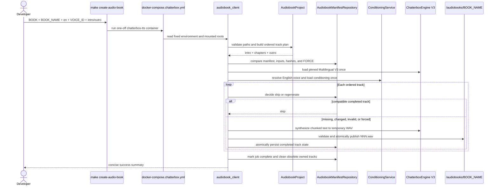

# Plan: Chatterbox Audiobook Batch Generation POC

## Table of Contents

- [Summary](#summary)
- [Technical Approach](#technical-approach)
- [Component Breakdown](#component-breakdown)
- [Dependencies](#dependencies)
- [Microsoft Learn Evidence](#microsoft-learn-evidence)
- [First-Party Chatterbox Evidence](#first-party-chatterbox-evidence)
- [Flow](#flow)
- [Risk Assessment](#risk-assessment)

## Summary

Add a one-off audiobook CLI to the isolated `ChatterboxTtsService` container and invoke it through `make create-audio-book`. The CLI reads a strictly contained parser output folder, resolves one preserved English voice, loads Multilingual V3 once, generates atomic three-digit WAV tracks sequentially, and maintains a checksum manifest for safe resume and force regeneration.

## Technical Approach

The feature extends the current isolated Chatterbox POC rather than the ASP.NET Core WebApp or `EbookParseService.Api`. The parser remains responsible only for publishing chapter text through `ChapterOutputWriter`; the developer remains responsible for placing the required intro and outro beside those chapter files. Chatterbox owns audio synthesis, output validation, and audiobook job state.

`make create-audio-book` will validate presence and simple enumerated values before starting expensive work. It will pass configuration to a one-off `chatterbox-tts` container without interpolating caller-controlled book text into a shell command body. The container will receive the repository parser output at a fixed read-only path such as `/books` and the configurable host `AUDIOBOOK_ROOT` at a fixed writable path such as `/audiobooks`. The target will force `CHATTERBOX_MODEL=v3`; the CLI will independently reject any engine other than `multilingual-v3` and any language other than `en` as defense in depth.

The CLI will perform all inexpensive project validation before loading the model. An audiobook project component will resolve `BOOK`, the intro/outro basenames, contiguous `chapter-NNN.txt` files, `BOOK_NAME`, and the contained destination. It will create an immutable ordered track plan whose first item is the intro, whose middle items are numeric chapters, and whose last item is the outro. Track filenames will be derived from their one-based position with fixed `:03d` formatting.

A manifest repository will read, validate, and atomically replace `audiobook-manifest.json`. It will use a versioned schema and retain enough source, output, model, and voice compatibility data to make resume decisions deterministic. The orchestration service will refuse an incompatible manifest unless `FORCE=true`. For a compatible normal rerun, it will validate both hashes and WAV structure before skipping. It will save manifest state after every published track. A force run will synthesize all expected tracks; only obsolete paths explicitly owned by the prior manifest may be removed after the full run succeeds.

The current `PreviewService` privately combines voice resolution, conditioning selection, text synthesis, output validation, and preview-specific publication. Implementation should extract only the reusable conditioning and WAV-validation behavior into focused modules rather than making the audiobook CLI call the HTTP `/preview` route or mutate `config/preview.txt`. Both preview and audiobook orchestration will depend on the existing `SynthesisEngine` protocol and `LocalVoiceStore`. The audiobook service will call `chunk_text` and `SynthesisEngine.synthesize` once per source part, but will resolve and load compatible conditioning only once for the complete job.

Because Chatterbox samples at a nonzero temperature, otherwise identical calls can produce different audio. `Settings` and `SynthesisEngine` will therefore share a positive seed, defaulting to `1234`, and reset Torch, NumPy, and Python random state per chunk using `seed + chunk index`. The engine will pass the current upstream quality defaults explicitly (`exaggeration=0.5`, `cfg_weight=0.5`, `temperature=0.8`, `repetition_penalty=1.2`, `min_p=0.05`, and `top_p=1.0`) so preview and audiobook cannot drift. The manifest schema will advance while continuing to read legacy seedless manifests as incompatible, allowing a safe forced regeneration. Two exact third-party FutureWarning messages will be suppressed at the integration boundary rather than adding PEFT or changing pinned dependencies during this POC.

This split follows SOLID boundaries:

- The CLI parses configuration and maps failures to process exit codes.
- Project discovery owns safe paths, input validation, ordering, and output naming.
- The manifest repository owns schema validation, compatibility checks, checksums, and atomic manifest persistence.
- A reusable conditioning collaborator owns `LocalVoiceStore.resolve`, compatibility selection, and prepare/load/publish behavior.
- Audiobook orchestration owns the sequential workflow and progress reporting while depending on narrow filesystem/engine collaborators that tests can fake.
- `ChatterboxEngine` remains the provider adapter responsible for actual model inference.

No new HTTP route, package, infrastructure service, database, or WebApp registration is necessary. Existing Python `hashlib`, `json`, `pathlib`, `tempfile`, `os.replace`, `argparse`, and WAV validation behavior are sufficient.

## Component Breakdown

**Existing files to modify:**

- `Makefile` — add validated audiobook variables, shared `SEED`, and the `create-audio-book` Docker-first target without making `TTS=true` necessary.
- `docker-compose.chatterbox.yml` — add fixed parser-input and configurable audiobook-output bind mounts used by the one-off CLI.
- `services/ChatterboxTtsService/app/main.py` — delegate reusable conditioning selection and WAV validation to focused collaborators while preserving all existing API behavior.
- `services/ChatterboxTtsService/app/settings.py` — expose shared, validated deterministic seed configuration required by both preview and batch execution while leaving V3 quality defaults compatible.
- `services/ChatterboxTtsService/app/engine.py` — apply the shared per-chunk seed, pass explicit V3 sampling defaults, and narrowly suppress the two known pinned-dependency FutureWarnings.
- `services/ChatterboxTtsService/tests/conftest.py` — add temporary audiobook roots and reusable fake project/audio fixtures.
- `services/ChatterboxTtsService/tests/test_api.py` — verify the conditioning extraction does not regress `/preview`, serialization, or compatibility recovery.
- `services/ChatterboxTtsService/tests/test_output.py` — verify shared WAV validation and atomic-publication behavior remains unchanged.
- `services/ChatterboxTtsService/README.md` — document the audiobook POC contract, examples, storage, resume, force, limitations, and recovery.

**New files to create:**

- `services/ChatterboxTtsService/app/audio_validation.py` — shared 16-bit PCM WAV validation and concise output-write errors currently embedded in `main.py`.
- `services/ChatterboxTtsService/app/conditioning.py` — reusable voice compatibility resolution and one-time conditioning load/prepare/publish workflow used by preview and audiobook orchestration.
- `services/ChatterboxTtsService/app/audiobook_project.py` — safe input discovery, contiguous chapter validation, destination containment, ordered track planning, and three-digit filename construction.
- `services/ChatterboxTtsService/app/audiobook_manifest.py` — versioned manifest models, compatibility/resume decisions, hashes, and atomic JSON persistence.
- `services/ChatterboxTtsService/app/audiobook_service.py` — sequential batch orchestration, per-track temporary publication, progress, resume, force, and cleanup coordination.
- `services/ChatterboxTtsService/app/audiobook_client.py` — environment/argument parsing and process-level entry point used by Make.
- `services/ChatterboxTtsService/tests/test_audiobook_project.py` — ordering, required-file, numbering, naming, UTF-8, and containment tests.
- `services/ChatterboxTtsService/tests/test_audiobook_manifest.py` — schema, compatibility, checksums, atomic replacement, and corrupt-state tests.
- `services/ChatterboxTtsService/tests/test_audiobook_service.py` — fake-engine tests for one-time loading, sequential generation, skip/resume, force, failures, and obsolete owned-track cleanup.
- `services/ChatterboxTtsService/tests/test_audiobook_client.py` — configuration validation, fixed English/V3 behavior, summaries, and exit-code tests.

## Dependencies

- A Docker- or Podman-compatible Compose runtime discoverable through the existing `Makefile` socket detection.
- A prepared folder under `services/EbookParseService.Api/data/output/<BOOK>/` containing required intro/outro text and contiguous `chapter-NNN.txt` files. For narration-ready chapter text, it should normally come from `make ebook-parse ... TTS=true TTS_LANG=en`.
- An existing preserved English voice under `services/ChatterboxTtsService/data/voices/<VOICE_ID>/` compatible with the pinned Multilingual V3 source/model revisions.
- The existing persistent Hugging Face model cache under `services/ChatterboxTtsService/models/`; the first uncached real run requires model-download access.
- Writable host storage at `AUDIOBOOK_ROOT`, defaulting to `/home/deck/Music`, with enough capacity for uncompressed WAV tracks.
- Existing pinned Python packages only; no new dependency is planned.

## Microsoft Learn Evidence

Not applicable. This POC changes a Python Chatterbox container, Docker Compose configuration, Make orchestration, and local files only. It makes no decision involving .NET, ASP.NET Core, Entity Framework Core, Identity, Microsoft.Extensions.AI, Microsoft Agent Framework, or another Microsoft application API.

## First-Party Chatterbox Evidence

- [ResembleAI Chatterbox README](https://github.com/resemble-ai/chatterbox/blob/master/README.md) documents loading `ChatterboxMultilingualTTS` with `t3_model="v3"`, passing `language_id` during generation, and using a reference audio prompt for voice cloning. The POC preserves the repository's pinned V3 loading and narrows batch generation to `language_id="en"`.
- [ResembleAI multilingual implementation](https://github.com/resemble-ai/chatterbox/blob/master/src/chatterbox/mtl_tts.py) identifies `v3` as a supported multilingual checkpoint and `en` as a supported language identifier. The implementation will still rely on the repository-pinned source and model revisions rather than an unpinned upstream branch.

## Flow

## Risk Assessment

| Risk | Evidence | Mitigation |
| --- | --- | --- |
| A full book can take many hours on CPU. | Existing preview benchmarks take minutes for a few chunks and the service intentionally uses CPU. | Load model/conditioning once, persist after every track, skip verified tracks, and support interruption-safe reruns. |
| Uncompressed WAV output can exhaust disk space. | Existing sample chapter WAVs are tens of megabytes each. | Report destination and completed sizes, fail cleanly on write errors, preserve prior valid tracks, and document capacity planning. |
| Lexical order can diverge from narrative order. | The parser publishes `chapter-NNN.txt`, while the sample Music folder uses two digits. | Require contiguous numeric chapters and publish a fixed three-digit track sequence with explicit intro/outro positions. |
| Caller-controlled paths could read or write outside private roots. | The command accepts book, intro/outro, display name, and host output values. | Use fixed container mount roots, direct-child basename rules, resolved containment checks, a read-only input mount, and safe environment transport. |
| A crash can leave an apparently complete but corrupt track. | WAV generation is long-running and currently validates preview output only at completion. | Generate beside the destination, validate PCM content, hash it, atomically replace the final path, then atomically update the manifest. |
| A changed track set can leave stale WAVs or map prose to the wrong number. | Inserting/removing a chapter shifts all later output names. | Treat ordered track-set changes as manifest incompatibility unless forced; delete only obsolete paths owned by the previous manifest after successful forced completion. |
| Refactoring preview helpers can regress existing voice behavior. | Conditioning selection and WAV validation currently live privately in `PreviewService`/`main.py`. | Preserve API contracts and expand fake-engine regression tests before exercising audiobook behavior. |
| An ambient Nano selection could violate the agreed POC. | `CHATTERBOX_MODEL` is externally configurable today. | Force V3 in the Make run and reject non-`multilingual-v3` engines in the CLI. |
| Voice data and book prose are sensitive local content. | The repository already classifies conditioning as biometric-derived and ignores both service data trees. | Keep mounts local/private, never log text or tensor contents, add no network endpoint, and retain current Git ignore coverage. |
