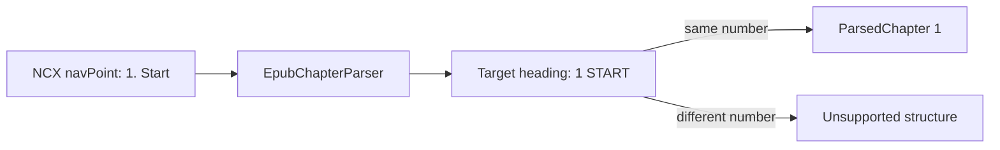

# Plan: EPUB 2 Numbered NCX Titles

## Summary

Extend `EpubChapterParser`'s existing constrained NCX discovery with a numbered-title label form and leading-number heading validation. The parser continues to own EPUB semantics; no API, model, or runtime dependency changes are needed.

## Technical Approach

`EpubChapterParser` will centralize NCX number extraction so the existing `Chapter N` and exact-number forms, plus `N. Title`, map to one validated positive integer. Its numeric-boundary and whole-document heading checks will compare that integer to a heading's leading numeric token, allowing the observed `1START` form created by ` ` markup while rejecting a different number. For whole-document NCX targets, it will extract contiguous XHTML spine resources through the next qualifying NCX target; this handles Calibre-style title-only target files without using filenames as chapter identity.

All established archive, manifest, safe-target, duplicate, `xml:lang`, prose, and atomic-output boundaries remain in place. `EpubChapterParserTests` will use only synthetic EPUB resources to test successful numbered labels and mismatched headings.

## Component Breakdown

- `services/EbookParseService.Api/Services/EpubChapterParser.cs` — recognize numbered NCX titles and leading-number headings.
- `services/EbookParseService.Tests/EpubChapterParserTests.cs` — cover accepted title labels and rejected number mismatches.
- `README.md` and `services/EbookParseService.Api/README.md` — document the accepted form and retained limits.

## Dependencies

- Existing .NET 10 isolated parser container and `make ebook-parser-test` workflow.

## Microsoft Learn Evidence

Not applicable. This is a local parser-rule extension using established `System.Xml` and regular-expression code; it changes no Microsoft platform API or security configuration.

## Flow

