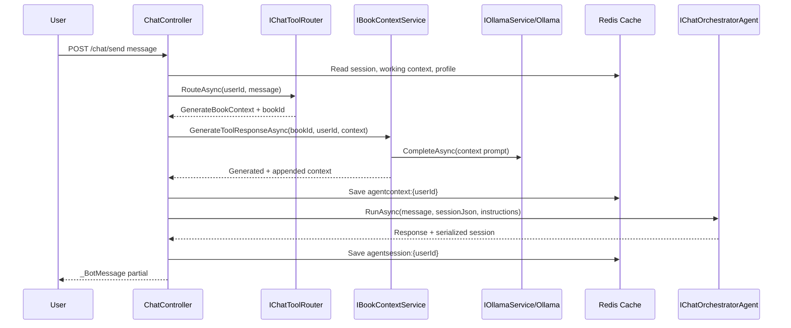

# Plan: Chat-Triggered Book Context Generation

## Table of Contents

- [Plan: Chat-Triggered Book Context Generation](#plan-chat-triggered-book-context-generation)
  - [Summary](#summary)
  - [Technical Approach](#technical-approach)
  - [Component Breakdown](#component-breakdown)
  - [Dependencies](#dependencies)
  - [Flow](#flow)
  - [Risk Assessment](#risk-assessment)

## Summary

Allow a signed-in user to ask chat for context about a saved book and have the chat flow generate, persist, append, and use that book context through the existing tool-routing path.

## Technical Approach

The implementation follows the pattern already present in `WebApp/Controllers/ChatController.cs`, `WebApp/Services/IChatToolRouter.cs`, and `WebApp/Services/BookContextService.cs`. `ChatController.Send` asks `IChatToolRouter` whether the message should call `GenerateBookContext`. If a specific user-owned book is selected, `IBookContextService.GenerateToolResponseAsync` generates context through `IOllamaService`, saves it on `Book.Context`, appends a `[GenerateBookContext]` block to the Redis working context, and passes the enriched instructions to `IChatOrchestratorAgent`.

## Component Breakdown

Existing files involved:

- `WebApp/Controllers/ChatController.cs` - orchestrates send/reset flow and working context cache keys.
- `WebApp/Services/IChatToolRouter.cs` - routes messages to `GenerateBookContext` using heuristics and model-assisted JSON routing.
- `WebApp/Services/ChatToolRouteDecision.cs` - carries selected tool and book id.
- `WebApp/Services/BookContextService.cs` - generates, saves, clears, and appends book context.
- `WebApp/Services/OllamaService.cs` and `WebApp/Services/IOllamaService.cs` - send prompts through `IChatClient`.
- `WebApp/Controllers/BookContextController.cs` - exposes direct API operations for context generation and management.
- `WebApp.Tests/Controllers/ChatControllerTests.cs` - verifies chat tool selection appends context and persists session.
- `WebApp.Tests/Controllers/BookContextControllerTests.cs` - verifies API generation payload behavior.
- `WebApp.Tests/Services/BookContextServiceTests.cs` - verifies generated context persistence and profile language use.

New files:

- None required for the currently implemented path.

## Dependencies

- Authenticated ASP.NET Core Identity user.
- At least one `Book` row owned by the user.
- PostgreSQL connection and EF Core migrations applied.
- Redis connection for `agentsession:{userId}` and `agentcontext:{userId}`.
- Ollama reachable at `Ollama:OllamaURL` with model `qwen3.5:4b`.
- Microsoft Agent Framework `AIAgent` and `AgentSession` registration in `Program.cs`.

## Flow

## Risk Assessment

| Risk | Evidence | Mitigation |
| --- | --- | --- |
| Router selects the wrong book for ambiguous requests. | Router returns `none` when multiple or unclear books are involved. | Keep `IChatToolRouter` conservative and add tests for ambiguous messages before broadening routing. |
| Ollama is unavailable or model is missing. | Compose pulls `qwen3.5:4b`, but runtime still depends on the container. | Use `make ollama-logs` and direct `ollama list`; keep controller error handling. |
| Generated context leaks across users. | Queries filter by both `bookId` and `userId`. | Preserve user id filters in service and controller tests. |
| Redis context grows over long sessions. | `AppendContext` concatenates generated context blocks. | Keep generated context under 120 words as in the prompt; consider future pruning if specs require it. |
