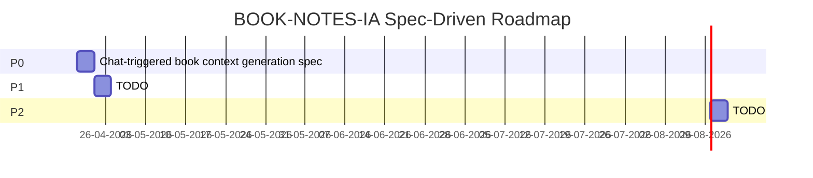

# Roadmap

## Table of Contents

- [Roadmap](#roadmap)
  - [Current State](#current-state)
  - [Phases](#phases)
  - [Gantt](#gantt)
  - [Milestones](#milestones)
  - [Evidence and Gaps](#evidence-and-gaps)

## Current State

The checked-out app has a working ASP.NET Core MVC structure with Identity authentication, PostgreSQL persistence, Redis-backed cache, local Ollama chat through Microsoft Agent Framework, Kindle `.txt` notes import, a per-user notes library, and generated book context stored on `Book.Context`. The test project currently covers the chat tool path, book context API generation response, and book context service persistence behavior.

No completed priority-labeled spec files exist yet. The only spec folder is [21-04-2026-example-task](21-04-2026-example-task/Requirements.md), so the phases below use that real feature as P0 and leave explicit TODOs for missing P1/P2 specs.

## Phases

| Phase | Priority | Item | Spec | Effort | Source |
| --- | --- | --- | --- | --- | --- |
| Phase 1 | P0 | Document and harden chat-triggered book context generation | [21-04-2026-example-task/Requirements.md](21-04-2026-example-task/Requirements.md) | Medium | Existing `IChatToolRouter`, `ChatController`, `BookContextService`, and tests. |
| Phase 2 | P1 | Add a `make release` command that updates CHANGELOG, commits, and tags | [20260424165257-release-command/Requirements.md](20260424165257-release-command/Requirements.md) | Small | New `scripts/release.sh` + `Makefile` target; no application code changes. |
| Phase 3 | P1 | Add a GitHub Actions CI workflow that runs `dotnet test` on push/PR to `main` | [20260424212700-ci-test-workflow/Requirements.md](20260424212700-ci-test-workflow/Requirements.md) | Small | New `.github/workflows/ci.yml`; no application code changes. |
| Phase 4 | P1 | Upgrade `Microsoft.Agents.AI` from `1.0.0-preview.260212.1` to stable `1.3.0` | [20260424212800-upgrade-microsoft-agents-ai/Requirements.md](20260424212800-upgrade-microsoft-agents-ai/Requirements.md) | Small | One `PackageReference` change + possible API call-site fixes in `WebApp.csproj`, `Program.cs`, `IChatOrchestratorAgent.cs`. |
| Phase 5 | P2 | ⚠️ TODO: Add a real P2 spec for later polish or expansion. | ⚠️ TODO: Create a `DD-MM-YYYY-feature-name` folder in `Specs/`. | ⚠️ TODO | Existing Specs do not define a P2 item. |

## Gantt

## Milestones

- Book context tool path documented: [21-04-2026-example-task/Plan.md](21-04-2026-example-task/Plan.md), [Requirements.md](21-04-2026-example-task/Requirements.md), and [Validation.md](21-04-2026-example-task/Validation.md) describe the existing chat-triggered context generation flow.
- Testable local stack: `make docker-run`, `make docker-run-mac`, or `make docker-run-windows` starts the app, Ollama, PostgreSQL, and Redis with the appropriate compose override.
- Testable regression suite: `make test` runs `dotnet test WebApp.Tests/WebApp.Tests.csproj` through `docker-compose.test.yml`.
- Automated CI gate: `.github/workflows/ci.yml` runs `dotnet test` on every push and pull request targeting `main`, uploading a `test-results` artifact on each run.

## Evidence and Gaps

- Current implementation evidence: [../README.md](../README.md), [../CHANGELOG.md](../CHANGELOG.md), [../WebApp/Controllers/ChatController.cs](../WebApp/Controllers/ChatController.cs), [../WebApp/Services/IChatToolRouter.cs](../WebApp/Services/IChatToolRouter.cs), [../WebApp/Services/BookContextService.cs](../WebApp/Services/BookContextService.cs).
- ⚠️ TODO: Add explicit P0/P1/P2 labels to future spec folders so prioritization does not need to be inferred from code history.
- ⚠️ TODO: Decide whether the stashed spec-kit/devcontainer work visible in `git stash list` should become checked-in roadmap scope.
