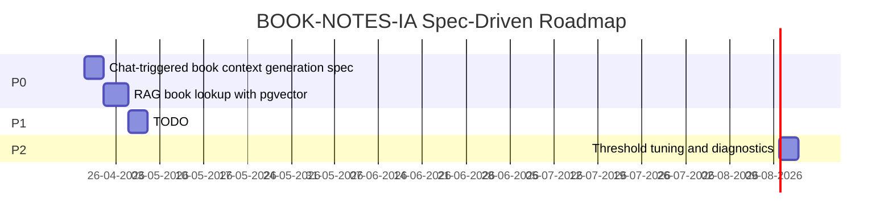

# Roadmap

## Table of Contents

- [Roadmap](#roadmap)
  - [Current State](#current-state)
  - [Phases](#phases)
  - [Gantt](#gantt)
  - [Milestones](#milestones)
  - [Evidence and Gaps](#evidence-and-gaps)

## Current State

The checked-out app has a working ASP.NET Core MVC structure with Identity authentication, PostgreSQL + pgvector persistence, Redis-backed Microsoft Agent Framework session cache, local Ollama chat, local Ollama embeddings, Kindle `.txt` notes import, a per-user notes library, semantic book lookup, and generated book context stored on `Book.Context`. The test project covers controller/service behavior plus Docker-backed PostgreSQL pgvector integration tests for embedding lookup and context persistence.

The roadmap below is derived from the checked-in specs and current implementation. The most recent P0 work moves book lookup from fragile title matching to a RAG-style vector lookup over the user's saved library.

## Phases

| Phase | Priority | Item | Spec | Effort | Source |
| --- | --- | --- | --- | --- | --- |
| Phase 1 | P0 | Document and harden chat-triggered book context generation | [21-04-2026-example-task/Requirements.md](21-04-2026-example-task/Requirements.md) | Medium | Existing `ChatController`, `BookContextAgentTool`, `BookContextService`, and tests. |
| Phase 2 | P1 | Add a `make release` command that updates CHANGELOG, commits, and tags | [20260424165257-release-command/Requirements.md](20260424165257-release-command/Requirements.md) | Small | New `scripts/release.sh` + `Makefile` target; no application code changes. |
| Phase 3 | P1 | Add a GitHub Actions CI workflow that runs `dotnet test` on push/PR to `main` | [20260424212700-ci-test-workflow/Requirements.md](20260424212700-ci-test-workflow/Requirements.md) | Small | New `.github/workflows/ci.yml`; no application code changes. |
| Phase 4 | P1 | Upgrade `Microsoft.Agents.AI` from `1.0.0-preview.260212.1` to stable `1.3.0` | [20260424212800-upgrade-microsoft-agents-ai/Requirements.md](20260424212800-upgrade-microsoft-agents-ai/Requirements.md) | Small | One `PackageReference` change + possible API call-site fixes in `WebApp.csproj`, `Program.cs`, `IChatOrchestratorAgent.cs`. |
| Phase 5 | P0 | Refactor agent to MAF agent-as-tools pattern: replace `ChatToolRouter` with native `AIFunction` registration on `ChatClientAgent` | [20260427110015-maf-agent-as-tools-refactor/Requirements.md](20260427110015-maf-agent-as-tools-refactor/Requirements.md) | Medium | Delete `IChatToolRouter`/`ChatToolRouter`; create `BookContextAgentTool`; update `ChatOrchestratorAgent` and `ChatController`. |
| Phase 6 | P0 | Replace fragile string matching in `BookContextAgentTool` with pgvector semantic lookup: embed `"Title by Author"` at import time via `mxbai-embed-large`; cosine-distance query at chat time | [20260510224009-rag-book-lookup-pgvector/Requirements.md](20260510224009-rag-book-lookup-pgvector/Requirements.md) | Medium | New `BookEmbedding` table + HNSW index; `IEmbeddingService`; updates to `KindleClippingsImportService`, `BookContextAgentTool`, Docker Postgres image, and Docker-backed pgvector tests. |
| Phase 7 | P0 | Move logout from the global top navbar into the home dock after `My Profile` and remove the navbar partial. | [20260604115201-home-dock-logout/Requirements.md](20260604115201-home-dock-logout/Requirements.md) | Small | UI-only Razor change in `_Layout.cshtml`, `Index.cshtml`, and `_TopNavbar.cshtml`; no service or Microsoft Agent Framework changes. |
| Phase 8 | P2 | Tune semantic lookup threshold and add user-facing diagnostics for unresolved books. | ⚠️ TODO: Create a dedicated `YYYYMMDDHHMMSS-feature-name` folder in `Specs/`. | Small/Medium | Current threshold is `0.5`; real usage should validate it against imported libraries and aliases. |

## Gantt

## Milestones

- Book context tool path documented: [21-04-2026-example-task/Plan.md](21-04-2026-example-task/Plan.md), [Requirements.md](21-04-2026-example-task/Requirements.md), and [Validation.md](21-04-2026-example-task/Validation.md) describe the existing chat-triggered context generation flow.
- Testable local stack: `make docker-run`, `make docker-run-mac`, or `make docker-run-windows` starts the app, Ollama, PostgreSQL, and Redis with the appropriate compose override.
- Testable regression suite: `make test` runs `dotnet test WebApp.Tests/WebApp.Tests.csproj` through `docker-compose.test.yml`.
- Automated CI gate: `.github/workflows/ci.yml` runs `dotnet test` on every push and pull request targeting `main`, uploading a `test-results` artifact on each run.
- Semantic RAG lookup: [20260510224009-rag-book-lookup-pgvector](20260510224009-rag-book-lookup-pgvector/Requirements.md) adds `BookEmbedding`, `IEmbeddingService`, pgvector HNSW cosine lookup, and fallback string matching.
- Observed end-to-end flow: Microsoft Agent Framework calls `GenerateBookContext`, the tool embeds the query with `mxbai-embed-large`, pgvector resolves the closest user-owned book, missing context is generated with Ollama, saved to `Book.Context`, and returned to the agent for the final answer.

## Evidence and Gaps

- Current implementation evidence: [../README.md](../README.md), [../CHANGELOG.md](../CHANGELOG.md), [../WebApp/Controllers/ChatController.cs](../WebApp/Controllers/ChatController.cs), [../WebApp/Services/BookContextAgentTool.cs](../WebApp/Services/BookContextAgentTool.cs), [../WebApp/Services/EmbeddingService.cs](../WebApp/Services/EmbeddingService.cs), [../WebApp/Services/BookContextService.cs](../WebApp/Services/BookContextService.cs), [../WebApp.Tests/Integration/AgentToolsPostgresTests.cs](../WebApp.Tests/Integration/AgentToolsPostgresTests.cs).
- ⚠️ TODO: Add explicit P0/P1/P2 labels to future spec folders so prioritization does not need to be inferred from code history.
- ⚠️ TODO: Add a spec for threshold tuning, alias handling, and user-facing diagnostics for unresolved book questions.
