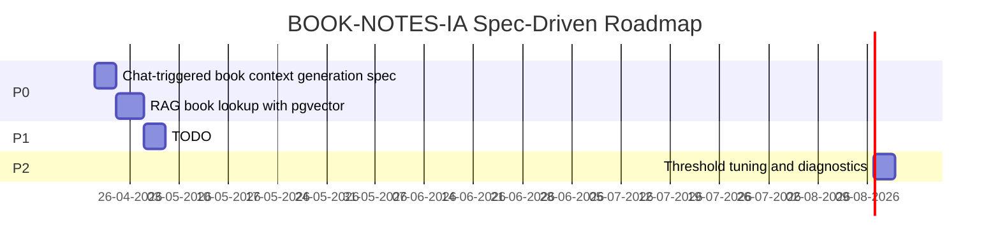

# Roadmap

## Table of Contents

- [Roadmap](#roadmap)
  - [Current State](#current-state)
  - [Phases](#phases)
  - [Gantt](#gantt)
  - [Milestones](#milestones)
  - [Evidence and Gaps](#evidence-and-gaps)

## Current State

The checked-out app has a working ASP.NET Core MVC structure with Identity authentication, PostgreSQL + pgvector persistence, Redis-backed Microsoft Agent Framework session cache, four selectable free local Ollama chat agents (Qwen 3.5, Llama 3.2, Phi-4 Mini, Granite 4 — all tool-calling capable) plus a Premium Azure OpenAI agent, local Ollama embeddings, Kindle `.txt` notes import, a per-user notes library, semantic book lookup, and generated book context stored on `Book.Context`. The test project covers controller/service behavior plus Docker-backed PostgreSQL pgvector integration tests for embedding lookup and context persistence.

The roadmap below is derived from the checked-in specs and current implementation. The most recent P0 work moves book lookup from fragile title matching to a RAG-style vector lookup over the user's saved library.

## Phases

| Phase | Priority | Item | Spec | Effort | Source |
| --- | --- | --- | --- | --- | --- |
| Phase 1 | P0 | Document and harden chat-triggered book context generation | [21-04-2026-example-task/Requirements.md](21-04-2026-example-task/Requirements.md) | Medium | Existing `ChatController`, `BookContextAgentTool`, `BookContextService`, and tests. |
| Phase 2 | P1 | Add a `make release` command that updates CHANGELOG, commits, and tags | [20260424165257-release-command/Requirements.md](20260424165257-release-command/Requirements.md) | Small | New `scripts/release.sh` + `Makefile` target; no application code changes. |
| Phase 3 | P1 | Add a GitHub Actions CI workflow that runs `dotnet test` on push/PR to `main` | [20260424212700-ci-test-workflow/Requirements.md](20260424212700-ci-test-workflow/Requirements.md) | Small | New `.github/workflows/ci.yml`; no application code changes. |
| Phase 4 | P1 | Upgrade `Microsoft.Agents.AI` from `1.0.0-preview.260212.1` to stable `1.3.0` | [20260424212800-upgrade-microsoft-agents-ai/Requirements.md](20260424212800-upgrade-microsoft-agents-ai/Requirements.md) | Small | One `PackageReference` change + possible API call-site fixes in `WebApp.csproj`, `Program.cs`, `IChatOrchestratorAgent.cs`. |
| Phase 5 | P0 | Refactor agent to MAF agent-as-tools pattern: replace `ChatToolRouter` with native `AIFunction` registration on `ChatClientAgent` | [20260427110015-maf-agent-as-tools-refactor/Requirements.md](20260427110015-maf-agent-as-tools-refactor/Requirements.md) | Medium | Delete `IChatToolRouter`/`ChatToolRouter`; create `BookContextAgentTool`; update `ChatOrchestratorAgent` and `ChatController`. |
| Phase 6 | P0 | Replace fragile string matching in `BookContextAgentTool` with pgvector semantic lookup: embed `"Title by Author"` at import time via `mxbai-embed-large`; cosine-distance query at chat time | [20260510224009-rag-book-lookup-pgvector/Requirements.md](20260510224009-rag-book-lookup-pgvector/Requirements.md) | Medium | New `BookEmbedding` table + HNSW index; `IEmbeddingService`; updates to `KindleClippingsImportService`, `BookContextAgentTool`, Docker Postgres image, and Docker-backed pgvector tests. |
| Phase 7 | P0 | Move logout from the global top navbar into the home dock after `My Profile` and remove the navbar partial. | [20260604115201-home-dock-logout/Requirements.md](20260604115201-home-dock-logout/Requirements.md) | Small | UI-only Razor change in `_Layout.cshtml`, `Index.cshtml`, and `_TopNavbar.cshtml`; no service or Microsoft Agent Framework changes. |
| Phase 8 | P1 | Add `GetBookNotesWithAnalysis` MAF tool: fetch raw notes for a book and generate a thematic analysis via Ollama | [20260604133551-book-notes-agent-tool/Requirements.md](20260604133551-book-notes-agent-tool/Requirements.md) | Medium | New `IBookNotesAnalysisService` + `BookNotesAnalysisService`; new `IBookNotesAgentTool` + `BookNotesAgentTool`; updates to `ChatController`, `Program.cs`, and integration tests. Establishes `<note>` tag format. |
| Phase 9 | P1 | Add note-level pgvector embeddings and `GetRelevantBookNotes` MAF tool for semantic retrieval of highlights within a book | [20260604140620-book-note-embeddings/Requirements.md](20260604140620-book-note-embeddings/Requirements.md) | Medium | **Depends on Phase 8.** New `BookNoteEmbedding` model + HNSW migration; embed notes at import time in `KindleClippingsImportService`; new `IBookNoteSearchService` + `BookNoteSearchAgentTool`; updates to `ChatController`, `Program.cs`, and integration tests. |
| Phase 10 | P1 | Context token awareness: track `prompt_eval_count` across all LLM calls, persist chat messages to DB, surface a `<sl-progress-ring>` context meter in the UI, remove book list from instructions, compress profile to one sentence | [20260605112315-context-token-awareness/Requirements.md](20260605112315-context-token-awareness/Requirements.md) | Large | New `TokenCountingChatClient` DelegatingChatClient; new `ChatMessage` model + migration; `ChatOrchestratorAgent` extended with token counts + elapsed time; `ChatController` reworked for DB-based display; `_BotMessage.cshtml` OOB ring swap; `Index.cshtml` ring placeholder; orchestrator instruction cleanup. |
| Phase 11 | P1 | Enrich book context generation with Open Library synopsis: fetch, persist to `Book.Synopsis`, and include in the Ollama prompt for more reliable literary context | [20260606221009-open-library-synopsis-enrichment/Requirements.md](20260606221009-open-library-synopsis-enrichment/Requirements.md) | Small | New `IOpenLibraryService` + `OpenLibraryService`; update `Book` model + EF migration; update `BookContextService.GenerateAndSaveAsync` and `GenerateContextAsync`; register with `AddHttpClient` in `Program.cs`. |
| Phase 12 | P1 | Add inline book title editing in the Notes detail view with a title-only HTMX partial, Shoelace pencil/save controls, validation, and user-scoped persistence | [20260606233114-inline-book-title-editing/Requirements.md](20260606233114-inline-book-title-editing/Requirements.md) | Small | New `IBookTitleService` + `BookTitleService`; new `_BookTitle.cshtml` partial and `BookTitleEditViewModel`; `NotesController` title edit/save endpoints; tests for validation and user isolation. |
| Phase 13 | P1 | Stabilize Kindle import identity with `Book.SourceBookTitle`, strip author-prefixed display titles, and dedupe re-uploads against the original source title even after users edit `Book.Title` | [20260607000438-kindle-author-prefixed-title-normalization/Requirements.md](20260607000438-kindle-author-prefixed-title-normalization/Requirements.md) | Small/Medium | New `Book.SourceBookTitle` column + migration; `KindleClippingsImportService` stores raw Kindle titles and uses normalized source-title lookup; tests cover prefixed titles and re-upload duplicate prevention. |
| Phase 14 | P0 | Sync `BookEmbedding` when book title is renamed: regenerate the vector in `BookTitleService.UpdateTitleAsync` so agent vector lookup works after inline title edits | [20260607124524-book-title-embedding-sync/Requirements.md](20260607124524-book-title-embedding-sync/Requirements.md) | Small | Inject `IEmbeddingService` + `ILogger` into `BookTitleService`; upsert `BookEmbedding` on title save; catch embedding errors and log warning; update `BookTitleServiceTests`. |
| Phase 15 | P1 | Add a local Supertonic Text-to-Speech service with click-to-play assistant audio, profile-language and profile-voice synthesis, cached `chat_message_audio` metadata, filesystem-backed audio storage, and Docker/Make integration | [20260614141215-supertonic-tts-service/Requirements.md](20260614141215-supertonic-tts-service/Requirements.md) | Large | New `services/tts-service/TtsService.Api`; `UserProfile` voice preference; `chat_message_audio` table; TTS HTTP client and audio storage services; chat play controls in `Chat.cshtml`, `_BotMessage.cshtml`, and `site.js`; base Compose service with read-only mounted Supertonic assets. |
| Phase 16 | P2 | Default book library to alphabetical (Title A→Z) order instead of recently-updated order | [20260617165326-book-library-alphabetical-default-sort/Requirements.md](20260617165326-book-library-alphabetical-default-sort/Requirements.md) | Small | One-line `.OrderBy(b => b.Title)` change in `BookLibrarySearchService`; update unit and integration test assertions. |
| Phase 17 | P2 | Tune semantic lookup threshold and add user-facing diagnostics for unresolved books. | ⚠️ TODO: Create a dedicated `YYYYMMDDHHMMSS-feature-name` folder in `Specs/`. | Small/Medium | Current threshold is `0.5`; real usage should validate it against imported libraries and aliases. |
| Phase 18 | P1 | Restyle `_Alert.cshtml` with warm sepia notice design, Shoelace countdown auto-dismiss, and bottom-right repositioning | [20260617172923-alert-notice-restyle-shoelace-countdown/Requirements.md](20260617172923-alert-notice-restyle-shoelace-countdown/Requirements.md) | Small | `_Alert.cshtml` markup, `_Layout.cshtml` `#alert` position, new `notice.sass` component, no controller or model changes. |
| Phase 19 | P0 | Add a selectable AI agent on the home page: Premium (Azure OpenAI ChatGPT) vs. Free (local Ollama Qwen 3.5), with full-parity provider routing for chat, tools, and book context generation | [20260718143136-selectable-ai-agent-premium-free/Requirements.md](20260718143136-selectable-ai-agent-premium-free/Requirements.md) | Large | New keyed `IChatClient`/`AIAgent` registrations, `IChatAgentProvider`/`IChatClientProvider`; `ChatOrchestratorAgent`, `BookContextService`, `BookContextAgentTool`, `OllamaService`→`ChatCompletionService` become provider-aware; `sl-select` on `Index.cshtml`; new `ChatMessage.AgentType` column + migration; new `Azure.AI.OpenAI` package dependency. |
| Phase 20 | P1 | Add a reusable TTS audio progress and seeking control with timestamps, loading state, click/drag seeking, and per-page message position memory | [20260718175413-tts-audio-progress-seeking/Requirements.md](20260718175413-tts-audio-progress-seeking/Requirements.md) | Small | UI-focused Razor, Sass, and `site.js` changes in the existing chat TTS widget; no audio service, database, Microsoft Agent Framework, or TTS sidecar changes expected. |
| Phase 21 | P1 | Add a download control to the chat TTS widget that saves a message's generated audio locally, reusing the blob already fetched for playback instead of adding server-side MP3 conversion | [20260718190351-tts-audio-download/Requirements.md](20260718190351-tts-audio-download/Requirements.md) | Small | `_TtsAudioPlayer.cshtml` gets a `.tts-download-btn`; `site.js` gets `handleDownloadClick`; no controller, service, database, or TTS sidecar changes. Downloaded file is `.wav`, not `.mp3` (no conversion dependency introduced). |
| Phase 22 | P0 | Replace the single free Ollama agent with four selectable free local agents (Qwen 3.5, Llama 3.2, Phi-4 Mini, Granite 4 — chosen for confirmed Ollama tool-calling support, replacing an initial DeepSeek R1/Gemma 3 pick that turned out not to support tools) behind a centralized `ChatAgentCatalog`, keeping Premium/Azure OpenAI routing and book-context parity | [20260718193541-multiple-free-ollama-agents/Requirements.md](20260718193541-multiple-free-ollama-agents/Requirements.md) | Large | New `ChatAgentCatalog`; catalog-driven keyed `IChatClient`/`AIAgent` registrations in `Program.cs`; `ChatController`/`HomeController`/`BotMessageViewModel` delegate key normalization and labels to the catalog; `_AgentIndicator.cshtml` and `site.js` render/support five keys; `docker-compose.yml` pulls all free models. |

## Gantt

## Milestones

- Book context tool path documented: [21-04-2026-example-task/Plan.md](21-04-2026-example-task/Plan.md), [Requirements.md](21-04-2026-example-task/Requirements.md), and [Validation.md](21-04-2026-example-task/Validation.md) describe the existing chat-triggered context generation flow.
- Testable local stack: `make docker-run`, `make docker-run-mac`, or `make docker-run-windows` starts the app, Ollama, PostgreSQL, and Redis with the appropriate compose override.
- Testable regression suite: `make test` runs `dotnet test WebApp.Tests/WebApp.Tests.csproj` through `docker-compose.test.yml`.
- Automated CI gate: `.github/workflows/ci.yml` runs `dotnet test` on every push and pull request targeting `main`, uploading a `test-results` artifact on each run.
- Semantic RAG lookup: [20260510224009-rag-book-lookup-pgvector](20260510224009-rag-book-lookup-pgvector/Requirements.md) adds `BookEmbedding`, `IEmbeddingService`, pgvector HNSW cosine lookup, and fallback string matching.
- Editable book titles: [20260606233114-inline-book-title-editing](20260606233114-inline-book-title-editing/Requirements.md) lets users update the displayed title from the Notes detail header while keeping the change user-scoped and validated.
- Stable Kindle import identity: [20260607000438-kindle-author-prefixed-title-normalization](20260607000438-kindle-author-prefixed-title-normalization/Requirements.md) separates raw `SourceBookTitle` from editable `Title` so re-uploads dedupe against Kindle source data while the displayed title remains user-editable.
- Observed end-to-end flow: Microsoft Agent Framework calls `GenerateBookContext`, the tool embeds the query with `mxbai-embed-large`, pgvector resolves the closest user-owned book, missing context is generated with Ollama, saved to `Book.Context`, and returned to the agent for the final answer.

## Evidence and Gaps

- Current implementation evidence: [../README.md](../README.md), [../CHANGELOG.md](../CHANGELOG.md), [../WebApp/Controllers/ChatController.cs](../WebApp/Controllers/ChatController.cs), [../WebApp/Services/BookContextAgentTool.cs](../WebApp/Services/BookContextAgentTool.cs), [../WebApp/Services/EmbeddingService.cs](../WebApp/Services/EmbeddingService.cs), [../WebApp/Services/BookContextService.cs](../WebApp/Services/BookContextService.cs), [../WebApp.Tests/Integration/AgentToolsPostgresTests.cs](../WebApp.Tests/Integration/AgentToolsPostgresTests.cs).
- ⚠️ TODO: Add explicit P0/P1/P2 labels to future spec folders so prioritization does not need to be inferred from code history.
- ⚠️ TODO: Add a spec for threshold tuning, alias handling, and user-facing diagnostics for unresolved book questions.
