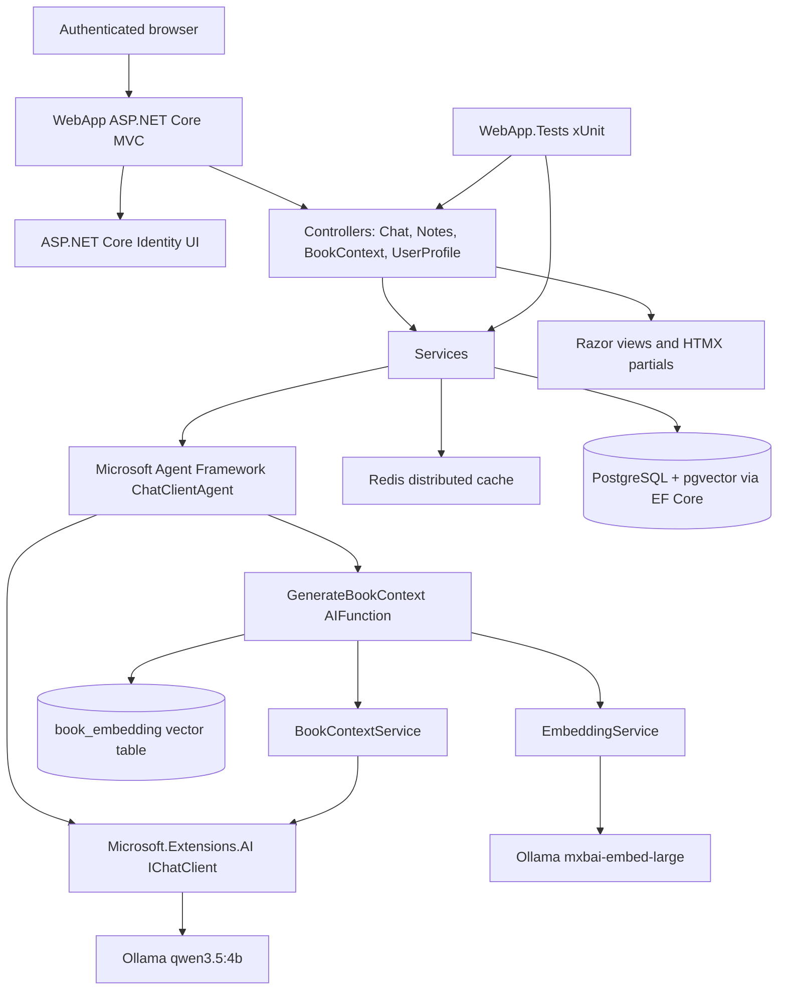

# Tech Stack

## Table of Contents

- [Tech Stack](#tech-stack)
  - [Technology Inventory](#technology-inventory)
  - [Docker Compose Services](#docker-compose-services)
  - [Architecture](#architecture)
  - [Key Design Decisions](#key-design-decisions)
  - [Version Gaps](#version-gaps)

## Technology Inventory

| Layer | Technology | Version | Justification | Official Docs URL |
| --- | --- | --- | --- | --- |
| Runtime | .NET / ASP.NET Core | `net9.0`, SDK image `mcr.microsoft.com/dotnet/sdk:9.0` | Web MVC app and test project both target .NET 9; Dockerfile and test compose use the 9.0 SDK image. | https://learn.microsoft.com/aspnet/core/ |
| Web framework | ASP.NET Core MVC | `net9.0` | `WebApp` uses `Microsoft.NET.Sdk.Web`, MVC controllers, Razor views, and Identity Razor Pages. | https://learn.microsoft.com/aspnet/core/mvc/overview |
| Authentication | ASP.NET Core Identity | `9.0.0` | Identity packages, Identity UI area, and `AddDefaultIdentity<IdentityUser>()` provide login/registration. | https://learn.microsoft.com/aspnet/core/security/authentication/identity |
| Database ORM | Entity Framework Core Tools | `9.0.0` | EF migrations exist under `WebApp/Migrations`; startup runs `db.Database.Migrate()`. | https://learn.microsoft.com/ef/core/ |
| Database provider | Npgsql EF Core Provider | `9.0.4` | `UseNpgsql` configures PostgreSQL access for `AppDbContext`. | https://www.npgsql.org/efcore/ |
| Database service | PostgreSQL + pgvector | `pgvector/pgvector:0.8.2-pg18-trixie` | Base compose defines the `postgres` service for `booknotes`; pgvector stores semantic book embeddings. | https://github.com/pgvector/pgvector |
| Cache service | Redis | `redis:7-alpine` | Base compose defines Redis; app registers `AddStackExchangeRedisCache`. | https://redis.io/docs/latest/ |
| Distributed cache package | Microsoft.Extensions.Caching.StackExchangeRedis | `9.0.*` | `CacheHandler` uses the registered distributed cache for chat/session keys. | https://learn.microsoft.com/aspnet/core/performance/caching/distributed |
| AI abstraction | Microsoft.Extensions.AI | `10.5.0` | `IChatClient` is the app-wide chat abstraction. | https://learn.microsoft.com/dotnet/ai/microsoft-extensions-ai |
| Agent framework | Microsoft Agent Framework | `Microsoft.Agents.AI` `1.3.0` | `ChatClientAgent`, `AIAgent`, `AgentSession`, and agent serialization power chat sessions. | https://learn.microsoft.com/agent-framework/ |
| Local LLM client | OllamaSharp | `5.4.16` | `OllamaApiClient` connects the app to local Ollama chat and embedding models. | https://github.com/awaescher/OllamaSharp |
| Local LLM runtime | Ollama | `ollama/ollama:latest`; chat model `qwen3.5:4b`; embedding model `mxbai-embed-large` | Compose starts Ollama and pulls the chat and embedding models used by `Program.cs`. | https://ollama.com/ |
| Vector extension | Pgvector.EntityFrameworkCore | `0.3.0` | EF Core model maps `BookEmbedding.Embedding` as `vector(1024)` and configures the HNSW cosine index. | https://github.com/pgvector/pgvector-dotnet |
| Markdown rendering | Markdig | `0.43.0` | Chat assistant responses are rendered to HTML with Markdig advanced extensions. | https://github.com/xoofx/markdig |
| Sass compilation | AspNetCore.SassCompiler | `1.93.2` | `WebApp/appsettings.json` maps `Styles` to generated CSS under `wwwroot/css`. | https://github.com/koenvzeijl/AspNetCore.SassCompiler |
| MVC scaffolding | Microsoft.VisualStudio.Web.CodeGeneration.Design | `9.0.0` | `GENERATE.md` documents controller/view scaffolding inside the Docker container. | https://learn.microsoft.com/aspnet/core/fundamentals/tools/dotnet-aspnet-codegenerator |
| Unit testing | xUnit | `2.9.2` | `WebApp.Tests` uses `[Fact]` tests for controllers and services. | https://xunit.net/ |
| Test runner | xUnit runner for Visual Studio | `2.8.2` | Test project references the Visual Studio xUnit runner. | https://xunit.net/docs/getting-started/netcore/cmdline |
| Test SDK | Microsoft.NET.Test.Sdk | `17.12.0` | Enables `dotnet test` in `docker-compose.test.yml`. | https://learn.microsoft.com/dotnet/core/testing/ |
| Coverage collector | coverlet.collector | `6.0.2` | Present in the test project for coverage collection support. | https://github.com/coverlet-coverage/coverlet |
| EF test provider | Microsoft.EntityFrameworkCore.InMemory | `9.0.4` | `BookContextServiceTests` creates an in-memory `AppDbContext`. | https://learn.microsoft.com/ef/core/providers/in-memory/ |

## Docker Compose Services

| Service | Compose file(s) | Image / Build | Purpose |
| --- | --- | --- | --- |
| `webapp` | `docker-compose.yml` | Builds `./WebApp/Dockerfile` (final stage: `mcr.microsoft.com/dotnet/sdk:9.0`) | Runs the ASP.NET Core MVC app on `http://localhost:8080`; the full .NET SDK is available inside — exec with `docker compose exec webapp bash` to run `dotnet` commands against the live stack. |
| `ollama` | `docker-compose.yml`, `docker-compose.linux.yml`, `docker-compose.mac.yml`, `docker-compose.windows.yml` | `ollama/ollama:latest` | Runs local model inference and pulls `qwen3.5:4b` plus `mxbai-embed-large`. |
| `postgres` | `docker-compose.yml` | `pgvector/pgvector:0.8.2-pg18-trixie` | Stores Identity, profile, book, note, context, and vector embedding data. |
| `redis` | `docker-compose.yml` | `redis:7-alpine` | Stores chat session/context/profile cache entries. |
| `tests` | `docker-compose.test.yml` | `mcr.microsoft.com/dotnet/sdk:9.0` | Restores and runs `WebApp.Tests`. |

The base file is `docker-compose.yml`. Linux, macOS, and Windows files are overrides for the `ollama` service: Linux maps `/dev/dri` and `/dev/kfd` with `OLLAMA_VULKAN=1`, macOS sets `platform: linux/arm64`, and Windows enables `gpus: all` plus NVIDIA environment variables.

## Architecture

## Key Design Decisions

- The app uses local Ollama inference because the checked-in configuration creates `OllamaApiClient` instances, starts an `ollama` container, and has no cloud LLM configuration.
- Chat state is serialized through Microsoft Agent Framework sessions and cached per user in Redis keys such as `agentsession:{userId}`.
- Book context generation is implemented both as a visible notes action and as a Microsoft Agent Framework native tool path through `BookContextAgentTool`.
- Semantic book lookup is handled by pgvector: imported books get `mxbai-embed-large` title/author embeddings, and chat-time tool calls embed the incoming book phrase and perform a user-scoped cosine-distance lookup.
- Npgsql pgvector support is registered through `NpgsqlDataSourceBuilder.UseVector()`, and startup reloads Npgsql types after migrations so the `vector` extension can be used for inserts and queries.
- Docker Compose is split into a base file plus OS-specific Ollama overrides because only the Ollama runtime needs GPU/platform differences across Linux, macOS, and Windows.
- PostgreSQL 18 requires the volume mount at `/var/lib/postgresql`; mounting directly at `/var/lib/postgresql/data` can trigger image layout errors.
- Generated CSS is excluded from Git by `.gitignore`; Sass source under `WebApp/Styles` is the editable styling source.

## Version Gaps

- `ollama/ollama:latest` does not pin an immutable Ollama version.
- `Microsoft.Extensions.Caching.StackExchangeRedis` uses the floating package version `9.0.*`.
- `dotnet-ef` and `dotnet-aspnet-codegenerator` are installed with `9.*` in the Dockerfile and documented with `9.*` in [../GENERATE.md](../GENERATE.md).
