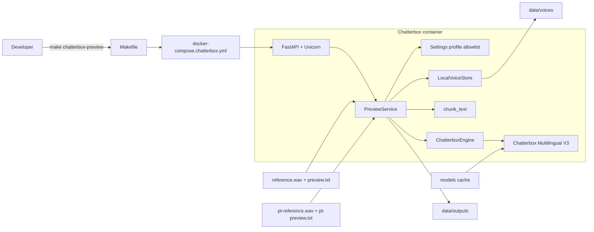
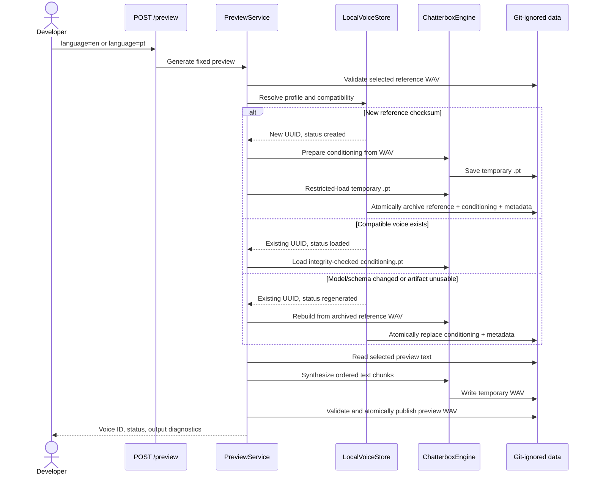
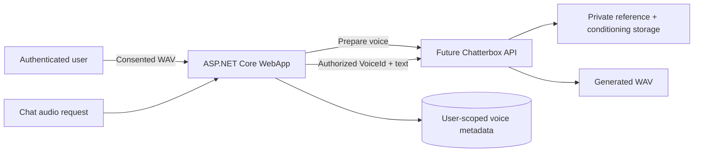

# ChatterboxTtsService Architecture

## Table of Contents

- [Purpose](#purpose)
- [Python Concepts in .NET Terms](#python-concepts-in-net-terms)
- [Architecture](#architecture)
- [Language Profiles](#language-profiles)
- [Voice and Preview Lifecycle](#voice-and-preview-lifecycle)
- [Persistent `.pt` Conditioning](#persistent-pt-conditioning)
- [Storage](#storage)
- [HTTP Routes](#http-routes)
- [Make Commands](#make-commands)
- [Reliability and Security](#reliability-and-security)
- [Testing](#testing)
- [Limitations and Future Integration](#limitations-and-future-integration)

## Purpose

`ChatterboxTtsService` is an isolated Docker proof of concept for creating multiple preserved local voices through fixed English and Portuguese reference slots and generating fixed previews. It is not connected to the ASP.NET Core WebApp, user profiles, premium authorization, chat routing, PostgreSQL, or the existing Supertonic service.

The POC proves that Chatterbox voice conditioning can be prepared once, saved locally, loaded after a container restart, and reused when the preview text changes.

All reference recordings, `.pt` files, metadata, generated audio, and model files remain local and are ignored by Git.

## Python Concepts in .NET Terms

| Python component | Similar .NET concept | Responsibility |
| --- | --- | --- |
| FastAPI | ASP.NET Core Minimal API | Defines HTTP routes and maps exceptions to responses. |
| Uvicorn | Kestrel | Hosts the API on port `5081`. |
| `Settings` / `VoiceProfile` dataclasses | Strongly typed options | Define the allowlisted English and Portuguese inputs. |
| `SynthesisEngine` protocol | C# interface | Makes heavyweight inference replaceable by a fake in tests. |
| `ChatterboxEngine` | Provider service | Loads Chatterbox and prepares, saves, loads, and uses conditioning. |
| `LocalVoiceStore` | Filesystem repository | Owns UUIDs, metadata, checksums, safe paths, and atomic persistence. |
| `PreviewService` | Application service | Coordinates profile selection, conditioning, chunking, and output. |
| Pytest | xUnit | Runs unit and HTTP tests in Docker. |

Python type annotations improve clarity and tooling, but they are evaluated differently from C# compile-time types. Runtime validation is still required for paths, metadata, language IDs, and files.

## Architecture



The Compose project is deliberately separate from the normal application stack. Starting or stopping Chatterbox does not start, stop, or remove WebApp, Supertonic, PostgreSQL, Redis, or Ollama resources.

The model is loaded once per Python process. `GET /health` becomes ready after the pinned model snapshot has been resolved from the persistent cache.

## Language Profiles

The API accepts only these internal profiles:

| Requested language | Chatterbox language ID | Reference | Preview text |
| --- | --- | --- | --- |
| `en` | `en` | `/data/reference.wav` | `/app/config/preview.txt` |
| `pt` | `pt` | `/data/pt-reference.wav` | `/app/config/pt-preview.txt` |

Chatterbox Multilingual V3 calls the general Portuguese language `pt`. The API therefore does not accept `pt-br`. A Brazilian Portuguese reference can still influence the generated accent and voice style, but the model language ID remains `pt`.

Multilingual V3 remains the default. Chatterbox Nano is an opt-in English-only CPU benchmark and requires an existing English voice ID. The Nano run reuses that voice's archived reference; it does not create another identity.

The language profiles never share conditioning. A recording checksum identifies a voice within its language: replacing a reference slot with a different recording creates another UUID and preserves earlier voices. Changing a preview text file changes what a selected voice says; it does not create a new voice or rebuild conditioning.

## Voice and Preview Lifecycle



Only one preview runs at a time. Chatterbox keeps the currently selected conditionals in mutable `model.conds`, so the process-level lock covers conditioning selection and the complete synthesis operation. This prevents concurrent English and Portuguese requests from crossing voices.

Long preview passages are split at sentence and paragraph boundaries. The engine inserts approximately 180 ms between normal chunks and 420 ms at paragraph boundaries before publishing one 16-bit PCM WAV.

## Persistent `.pt` Conditioning

`.pt` is a conventional PyTorch serialization extension, not an audio format. Chatterbox conditionals contain tensor-based information used by T3 and S3Gen, including speaker embeddings, prompt speech tokens, acoustic features, and voice characteristics derived from the reference.

Each voice directory contains:

```text
reference.wav
conditioning.pt
metadata.json
```

After that English voice is tested with Nano, it also contains:

```text
conditioning-nano.pt
conditioning-nano.json
```

Nano's sidecar records its own pinned model revision and conditioning checksum. The original `conditioning.pt` and `metadata.json` continue representing Multilingual V3 and are never replaced by Nano.

The service calls Chatterbox's own `Conditionals.save()` and `Conditionals.load()` methods. The pinned Chatterbox loader uses:

```python
torch.load(path, map_location="cpu", weights_only=True)
```

The metadata records:

- Stable server-generated UUID voice ID.
- Profile language.
- SHA-256 of the reference WAV.
- SHA-256 of `conditioning.pt`.
- Pinned Chatterbox source revision.
- Pinned Hugging Face model revision.
- Model name and application conditioning format version.
- Creation and update timestamps.

The service loads the `.pt` only when all compatibility fields and checksums match. A different root reference creates a different voice. A model/source revision, model name, format version, missing artifact, checksum failure, or load failure regenerates only the selected voice from its archived trusted reference while retaining that voice ID.

Changing only preview text is intentionally absent from the conditioning identity, so new text reuses the existing `.pt`.

## Storage

Compose bind-mounts these ignored host directories:

```text
services/ChatterboxTtsService/data/   -> /data
services/ChatterboxTtsService/models/ -> /models
```

After both profiles have been used, the data layout resembles:

```text
data/
├── reference.wav
├── pt-reference.wav
├── voices/
│   ├── <english-voice-id>/
│   │   ├── reference.wav
│   │   ├── conditioning.pt
│   │   ├── conditioning-nano.pt
│   │   ├── conditioning-nano.json
│   │   └── metadata.json
│   └── <portuguese-voice-id>/
│       ├── reference.wav
│       ├── conditioning.pt
│       └── metadata.json
└── outputs/
    ├── <english-voice-id>/
    │   ├── preview-en.wav
    │   └── preview-en-nano.wav
    └── <portuguese-voice-id>/preview-pt.wav
```

The bind mounts survive container restart, image rebuild, and `make chatterbox-down`. They do not protect against manual deletion, disk failure, or loss of the host directory. Each successful voice keeps its own reference copy, but the whole private data directory should still be backed up when the voice matters.

The model cache is separate from voice conditioning. The cache contains general model/tokenizer artifacts; `conditioning.pt` represents one particular voice.

## HTTP Routes

### `GET /health`

```json
{
  "status": "alive",
  "model_ready": true,
  "device": "cpu",
  "model": "multilingual-v3",
  "model_revision": "5bb1f6ee58e50c3b8d408bc82a6d3740c2db6e18",
  "supported_languages": ["en", "pt"],
  "load_error": null
}
```

### `POST /preview`

English is the default:

```http
POST /preview
POST /preview?language=en
```

Portuguese:

```http
POST /preview?language=pt
```

Select an older preserved Portuguese voice even after replacing the root reference:

```http
POST /preview?language=pt&voice_id=<canonical-uuid>
```

`GET /voices` lists preserved voice IDs; `GET /voices?language=pt` filters them. `GET /progress` reports the active stage, chunk count, monotonic stage percentage, completion, or concise failure.

No request body, arbitrary text, reference path, voice path, or `.pt` upload is accepted. A successful response includes:

```json
{
  "voice_id": "550e8400-e29b-41d4-a716-446655440000",
  "conditioning_status": "loaded",
  "conditioning_path": "/data/voices/550e8400-e29b-41d4-a716-446655440000/conditioning.pt",
  "output_path": "/data/outputs/550e8400-e29b-41d4-a716-446655440000/preview-en.wav",
  "device": "cpu",
  "model": "multilingual-v3",
  "model_revision": "5bb1f6ee58e50c3b8d408bc82a6d3740c2db6e18",
  "language_id": "en",
  "elapsed_seconds": 420.1,
  "output_duration_seconds": 47.5,
  "chunk_count": 4,
  "peak_memory_mb": 6780.0
}
```

`conditioning_status` is:

- `created` when a reference checksum receives a new voice ID and `.pt`.
- `loaded` when compatible persisted conditioning is reused.
- `regenerated` when the stable voice ID is retained but conditioning must be rebuilt.

Expected errors are `422` for unsupported language or invalid/missing reference, `503` while model loading has failed/not completed, and `500` for trusted storage, conditioning, inference, or output failures.

## Make Commands

```bash
make chatterbox-preview
make chatterbox-preview LANGUAGE=en
make chatterbox-preview LANGUAGE=pt
make chatterbox-voices
make chatterbox-voices LANGUAGE=pt
make chatterbox-preview LANGUAGE=pt VOICE_ID=<voice-id>
make chatterbox-preview LANGUAGE=en VOICE_ID=<voice-id> CHATTERBOX_MODEL=nano
```

The preview target validates the selected reference when creating/resolving by checksum, builds/starts the isolated service, prints periodic model-readiness messages, and prints changed stage/chunk percentages during generation. It finally prints the voice ID and output path. An explicit `VOICE_ID` uses that voice's archived reference and does not depend on the mutable root reference slot.

`CHATTERBOX_MODEL` defaults to `v3`. Nano accepts only `en` plus an existing voice ID. Its first run creates `conditioning-nano.pt`; later runs load it. The response includes `real_time_factor` (`elapsed_seconds / output_duration_seconds`) for comparison with the existing Multilingual benchmark. The official Nano model requires a reference longer than five seconds.

The blocking preview request allows seven days by default, so large CPU jobs are not stopped by the former two-hour client deadline. Override it in seconds or use zero for no client deadline:

```bash
CHATTERBOX_PREVIEW_TIMEOUT_SECONDS=86400 make chatterbox-preview
CHATTERBOX_PREVIEW_TIMEOUT_SECONDS=0 make chatterbox-preview
```

Health and progress probes retain short timeouts. Pressing `Ctrl+C` stops only the terminal client; an accepted server-side synthesis can continue. Follow it with `make chatterbox-logs` and do not start another preview until the current serialized operation completes.

After one successful online model download, cached/offline operation can be checked with:

```bash
HF_HUB_OFFLINE=1 make chatterbox-preview
HF_HUB_OFFLINE=1 make chatterbox-preview LANGUAGE=pt
```

Other commands:

```bash
make chatterbox-logs
make chatterbox-test
make chatterbox-down
```

## Reliability and Security

- Reference files must be readable 16-bit PCM mono or stereo WAV files, at least three seconds long, and not silent/near-silent.
- Languages and filenames come from an internal `en`/`pt` allowlist.
- Voice directory names are canonical server-generated UUIDs.
- Resolved voice and output paths must remain beneath their configured private roots.
- Only service-generated `.pt` files are loaded; `.pt` uploads and caller paths are not accepted.
- Metadata structure, revisions, format version, and SHA-256 values are validated.
- Chatterbox restricted `weights_only=True` loading is used as defense in depth.
- Conditioning and metadata are written to temporary files and published as a recoverable pair; failed replacement restores the previous valid pair.
- Preview WAVs are checked for real PCM samples and audible peak level before atomic replacement, so an empty/near-silent result preserves the last valid output.
- Reference, conditioning, or tensor contents are never logged.
- The POC is unauthenticated and must not be exposed to the public internet.

Conditioning is sensitive biometric-derived voice data even though it is not playable audio. Deleting a local voice means deleting its reference recording, `data/voices/<voice-id>/`, and `data/outputs/<voice-id>/`. The POC intentionally has no deletion command, so deletion must be a deliberate local filesystem operation with an appropriate backup decision.

In a future production system, user ownership, consent, authorization, encryption, retention, audit access, and deletion must be designed before accepting uploads. Never include random podcasts, audiobooks, celebrity recordings, or other voices without permission.

## Testing

```bash
make chatterbox-test
```

The Docker test suite replaces the heavyweight engine with `FakeEngine` and uses temporary directories. It verifies:

- English default and Portuguese selection.
- UUID creation, restart reuse, and multiple preserved voices per language.
- Separate voice conditioning and outputs.
- Text changes without conditioning regeneration.
- New-reference versioning plus model/schema invalidation of only the selected voice.
- Missing, corrupt, or unloadable artifact recovery.
- Metadata/checksum validation and path containment.
- Conditioning pair and preview atomic rollback.
- Serialized inference and concise HTTP failures.
- Exact English and Portuguese preview text chunking.

Real model runs remain manual because CPU synthesis on the tested Legion Go takes several minutes and uses several gigabytes of memory.

## Limitations and Future Integration

- Only two mutable local reference slots are supported, but each can create multiple preserved voices.
- Only tracked preview text files can be synthesized; arbitrary request text is out of scope.
- The general multilingual `pt` model is used rather than a dedicated Brazilian Portuguese checkpoint.
- CPU inference is intentionally used; AMD Vulkan/ROCm acceleration is not assumed.
- There is no authentication, database ownership, upload, UI, premium gating, backup, or deletion API.
- Supertonic remains the WebApp's configured TTS provider.

A future product implementation can let an authenticated user upload a consented WAV, prepare conditioning once, store ownership/compatibility metadata in PostgreSQL, keep the reference and `.pt` in private storage, and send `VoiceId + text` to Chatterbox. That requires a separate product-integration spec; it is not part of this POC.


