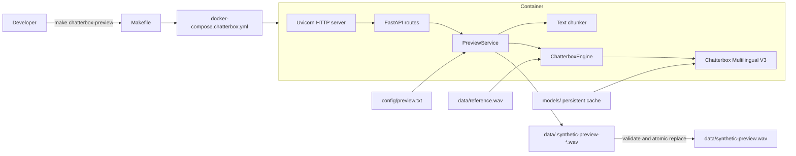
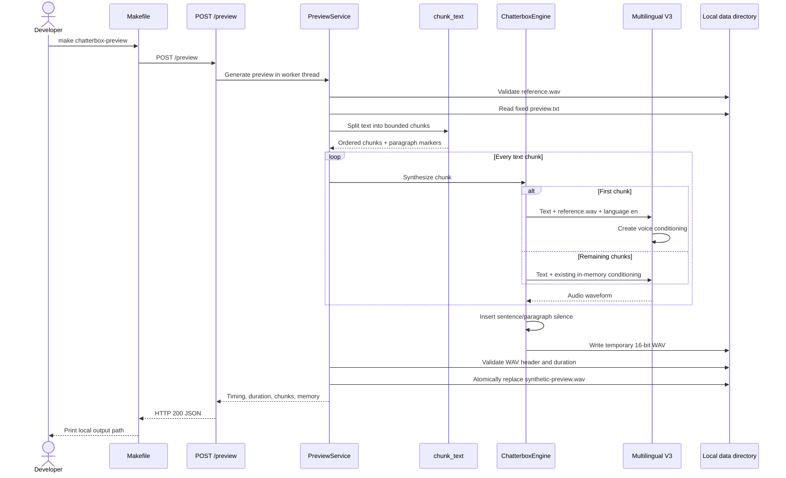
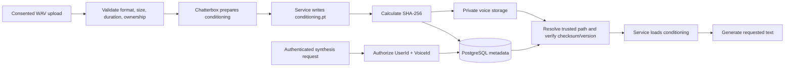
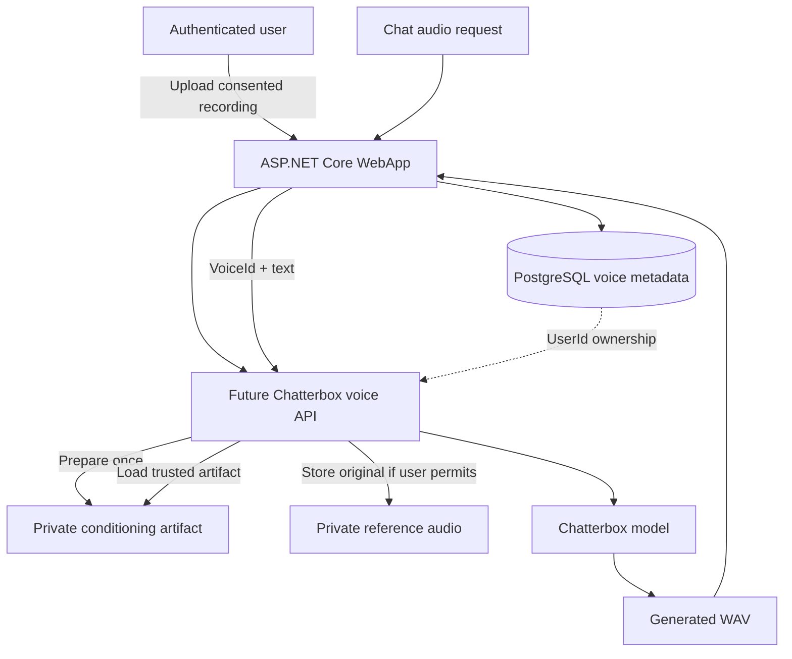

# ChatterboxTtsService Architecture

## Table of Contents

- [Purpose](#purpose)
- [Python Concepts in .NET Terms](#python-concepts-in-net-terms)
- [System Architecture](#system-architecture)
- [Container Startup](#container-startup)
- [Preview Generation](#preview-generation)
- [Voice Conditioning](#voice-conditioning)
- [Conditioning `.pt` Files](#conditioning-pt-files)
- [Security Rules for `.pt` Files](#security-rules-for-pt-files)
- [Files and Responsibilities](#files-and-responsibilities)
- [Storage and Caching](#storage-and-caching)
- [Reliability and Safety](#reliability-and-safety)
- [HTTP Routes](#http-routes)
- [Make Commands](#make-commands)
- [Testing](#testing)
- [Current Limitations](#current-limitations)
- [Future Persistent Custom Voices](#future-persistent-custom-voices)

## Purpose

`ChatterboxTtsService` is an isolated proof-of-concept service that clones the voice characteristics from a local recording and synthesizes a fixed English preview. It runs entirely in Docker and is not connected to the ASP.NET Core WebApp, user profiles, premium authorization, chat routing, or the existing Supertonic service.

The current input and output are:

```text
services/ChatterboxTtsService/data/reference.wav
services/ChatterboxTtsService/data/synthetic-preview.wav
```

The reference recording, generated preview, and downloaded models are local artifacts ignored by Git.

## Python Concepts in .NET Terms

The service uses Python, but its structure maps closely to familiar ASP.NET Core concepts:

| Python component | Similar .NET concept | Responsibility |
| --- | --- | --- |
| FastAPI | ASP.NET Core Minimal API or Web API | Defines HTTP routes and converts exceptions into responses. |
| Uvicorn | Kestrel | Hosts the HTTP application on port `5081`. |
| `Settings` dataclass | Strongly typed options class | Reads and validates paths, language, device, and model revision. |
| `SynthesisEngine` protocol | C# interface | Defines the contract used by the API and fake test engine. |
| `ChatterboxEngine` | Service implementing an interface | Loads the model and performs speech inference. |
| `PreviewService` | Application service | Coordinates validation, chunking, inference, and output replacement. |
| Pytest | xUnit | Runs unit and API tests. |
| Application lifespan function | Hosted-service startup hook | Starts model loading when the API process starts. |

Python does not require a compile step like C#. Type annotations such as `Path`, `str`, and `list[TextChunk]` improve readability and tooling, but Python still evaluates the program at runtime.

## System Architecture



The Compose file is deliberately separate from `docker-compose.yml`. Starting the normal application does not start Chatterbox, and stopping Chatterbox does not affect PostgreSQL, Redis, Ollama, WebApp, or Supertonic volumes.

## Container Startup

When the Chatterbox container starts:

1. Uvicorn starts the FastAPI application on port `5081`.
2. FastAPI starts a background thread named `chatterbox-model-loader`.
3. `ChatterboxEngine.load()` checks that the model has not already been loaded in this process.
4. The engine resolves the pinned Hugging Face snapshot from the persistent cache.
5. On the first online run, missing model files are downloaded into `services/ChatterboxTtsService/models/`.
6. Chatterbox Multilingual V3 is constructed on the CPU.
7. `GET /health` changes `model_ready` from `false` to `true`.
8. The Make command waits for this ready state before requesting synthesis.

The model is loaded only once per running Python process. Stopping the container removes the in-memory model, but it does not remove the persistent model cache.

## Preview Generation



The fixed preview passage is longer than a typical Chatterbox example. `chunk_text()` therefore splits it at paragraph and sentence boundaries, keeping every sentence in order and limiting each chunk to 280 characters. The engine inserts approximately 180 ms between ordinary chunks and 420 ms at paragraph boundaries.

Only one preview can run at a time. `PreviewService` uses a process-level lock so two requests cannot compete for CPU/memory or write the same output simultaneously.

## Voice Conditioning

Voice conditioning is the model's internal representation of characteristics learned from the reference audio, such as speaker identity, accent, pacing, and vocal style. It is not generated speech and should still be treated as sensitive derived voice data.

The current POC behaves as follows:

- Every `/preview` request requires `reference.wav` to exist locally.
- The first text chunk passes `reference.wav` to Chatterbox.
- Chatterbox creates conditioning and keeps it in the model object's memory.
- Remaining chunks in that request reuse the in-memory conditioning.
- A later `/preview` request reads `reference.wav` again and refreshes the conditioning.
- Restarting the container loses all in-memory conditioning.

The model file cache and voice conditioning are different things:

| Artifact | What it contains | Current persistence |
| --- | --- | --- |
| Model cache | General Chatterbox model weights and tokenizer data | Persisted in `models/`. |
| `reference.wav` | Original speaker recording | Persisted locally in `data/`. |
| Voice conditioning | Speaker representation derived from the recording | Memory only in the current POC. |
| `synthetic-preview.wav` | Generated speech | Persisted locally in `data/`. |

## Conditioning `.pt` Files

`.pt` is a conventional file extension for data serialized by PyTorch. It does not identify one universal format: a `.pt` file can contain tensors, model weights, optimizer state, ordinary Python objects, or a combination of them. Its actual structure is determined by the code that created it.

Chatterbox provides `Conditionals.save()` and `Conditionals.load()` methods that can persist the voice conditioning currently held in memory. The saved conditioning contains tensor-based data used by two parts of the model:

- T3 conditioning, including the speaker embedding and reference speech tokens.
- S3Gen conditioning, including prompt tokens, acoustic features, lengths, and the voice embedding used during waveform generation.

This means a conditioning `.pt` file is:

- Not the original WAV recording.
- Not generated speech that a person can play.
- Not the general 3.1 GiB Chatterbox model cache.
- A derived representation of a particular person's voice.
- Normally coupled to the Chatterbox architecture and model revision that created it.

The current POC does **not** create or load conditioning `.pt` files. It rebuilds conditioning from `reference.wav` for every `/preview` request. Persisting conditioning would be a future feature requiring its own API, storage model, authorization, and tests.

A future trusted preparation flow could work like this:



PostgreSQL should normally store metadata rather than the `.pt` bytes themselves. A voice record could contain:

| Field | Purpose |
| --- | --- |
| `VoiceId` | Server-generated identifier; never use an uploaded filename as identity. |
| `UserId` | Owner used for authorization on every operation. |
| `DisplayName` | User-facing name such as “My voice.” |
| `ConditioningPath` | Private storage key resolved only by the server. |
| `ReferenceAudioPath` | Optional private source recording retained for rebuilding. |
| `Sha256` | Integrity check for the service-generated conditioning artifact. |
| `ChatterboxSourceRevision` | Exact source revision that created the artifact. |
| `ModelRevision` | Exact model snapshot used to create it. |
| `FormatVersion` | Application-owned conditioning schema version. |
| `ConsentConfirmedAt` | Records when the speaker confirmed permitted synthetic use. |
| `CreatedAt` / `DeletedAt` | Lifecycle and deletion tracking. |

Keeping the original consented WAV is useful because a future model upgrade may not be able to load conditioning created by an older revision. The service can rebuild a compatible `.pt` file from the original recording. If the user requests deletion, both the recording and every derived conditioning artifact must be deleted according to the product's retention policy.

## Security Rules for `.pt` Files

PyTorch serialization has historically been able to reconstruct Python objects. Loading a malicious serialized file with unsafe deserialization can execute attacker-controlled code inside the Python process. Current Chatterbox's conditioning loader calls `torch.load(..., weights_only=True)`, which significantly restricts deserialization, but it is defense in depth—not permission to accept arbitrary `.pt` uploads.

The main risks are:

| Risk | Example | Required protection |
| --- | --- | --- |
| Unsafe deserialization | An attacker uploads a crafted `.pt` intended to execute code when loaded. | Never accept user-created `.pt` files. Create artifacts only inside the trusted service and keep `weights_only=True`. |
| Cross-user voice access | One user changes a `VoiceId` or storage path to synthesize with another user's voice. | Authorize every lookup with both `UserId` and `VoiceId`; never trust paths from requests. |
| Path traversal | A filename such as `../../other-user/voice.pt` escapes the intended directory. | Generate storage keys server-side, canonicalize paths, and enforce a private storage root. |
| Tampering | A local process or storage failure changes tensors after creation. | Store and verify SHA-256, restrict write permissions, and reject integrity mismatches. |
| Resource exhaustion | A malformed file contains unexpected or extremely large tensor dimensions. | Enforce file-size limits and validate tensor names, shapes, dtypes, and dimensions before inference. |
| Version confusion | Conditioning from another Chatterbox revision loads incorrectly or produces corrupted output. | Store source/model/schema revisions and reject incompatible artifacts; rebuild from the WAV. |
| Voice privacy | Conditioning is copied even though the original recording was protected. | Classify `.pt` as sensitive derived voice data, encrypt it, audit access, and include it in deletion workflows. |
| Accidental publication | Conditioning or reference files enter Git, logs, backups, or a public bucket. | Keep storage private and ignored, avoid logging contents/paths unnecessarily, and review backup retention. |

Implementation rules for a future production service:

1. Accept only audio recordings in the upload API—not `.pt`, `.pth`, pickle, or arbitrary archive files.
2. Validate the recording's type, decoded duration, sample properties, size, and content before model processing; do not rely only on its extension or HTTP content type.
3. Create conditioning inside the isolated Chatterbox service and write it to a service-controlled private directory or object-storage bucket.
4. Use a random server-generated `VoiceId` and storage key. Never reuse the original client filename as a path.
5. Store ownership and revision metadata in PostgreSQL, always querying with the authenticated `UserId`.
6. Calculate a checksum after writing and verify it before loading. For stronger protection against deliberate storage tampering, authenticate the metadata/checksum with a server-held key.
7. Load only from an allow-listed storage root, use `weights_only=True`, map tensors to the expected device, and validate the loaded structure before assigning it to the model.
8. Place strict limits on artifact size, tensor count, tensor shapes, and concurrent model operations.
9. Encrypt recordings and conditioning at rest where practical and protect encryption keys separately from stored artifacts.
10. Provide explicit deletion that removes database metadata, reference audio, conditioning, generated previews, cached copies, and eventually retained backups according to policy.
11. Record consent for every speaker. Your wife's voice can be used as a default only with her informed permission for the intended local or production use and an agreed deletion/revocation process.
12. Do not expose the current unauthenticated POC routes to the public internet.

The safest trust boundary is simple: users may provide validated audio that they own or are authorized to use; only the service may produce conditioning files; only service-produced, integrity-checked conditioning may ever be loaded.

## Files and Responsibilities

| File | Responsibility |
| --- | --- |
| `docker-compose.chatterbox.yml` | Defines the isolated service, port, environment, health check, and persistent mounts. |
| `services/ChatterboxTtsService/Dockerfile` | Builds Python 3.11, CPU-only PyTorch, Chatterbox, API, and test dependencies. |
| `requirements.txt` | Records direct dependencies and the pinned official Chatterbox source revision. |
| `requirements.lock.txt` | Pins the resolved Linux/Python dependency graph. |
| `app/main.py` | Creates FastAPI, defines routes, coordinates preview generation, validates WAV files, and maps errors. |
| `app/engine.py` | Defines the engine contract, loads the pinned model, creates/reuses conditioning, joins waveforms, and writes PCM audio. |
| `app/settings.py` | Reads environment settings and enforces CPU, English, V3, pinned revision, and safe data paths. |
| `app/chunking.py` | Splits long text while preserving sentence and paragraph order. |
| `app/wait_for_ready.py` | Lets the Make command wait for model readiness and fail quickly on load errors. |
| `config/preview.txt` | Stores the exact fixed English preview passage. |
| `tests/` | Tests API behavior, chunking, validation, serialization, and atomic output with a fake engine. |

## Storage and Caching

Compose mounts two host directories:

```text
services/ChatterboxTtsService/data/   -> /data
services/ChatterboxTtsService/models/ -> /models
```

`/models` is also the container's home and cache root. This persists both Hugging Face model files and secondary tokenizer assets. After one successful online run, this command verifies cached operation:

```bash
HF_HUB_OFFLINE=1 make chatterbox-preview
```

The validated local cache is approximately 3.1 GiB. Deleting it does not delete the reference recording, but the next online startup must download the model again.

## Reliability and Safety

The POC includes several protections:

- The reference must be a readable, non-empty 16-bit PCM mono or stereo WAV.
- Reference audio is opened only for reading and its checksum is not changed.
- Synthesis writes to a uniquely named temporary file.
- The temporary output must be a readable, non-empty WAV with a positive duration.
- `os.replace()` replaces the public preview atomically only after validation.
- A failed request leaves the last valid preview untouched.
- Temporary files are removed after success or failure.
- Paths are restricted to direct children of `/data`.
- Inference is serialized with a lock.
- Errors return concise HTTP diagnostics without logging audio contents or model tensors.
- Personal recordings, generated audio, model files, and Python caches are ignored by Git and excluded from the Docker build context.

The service is a local developer POC. It has no authentication and must not be exposed publicly.

## HTTP Routes

### `GET /health`

Reports whether the API process is alive and whether the heavyweight model is ready:

```json
{
  "status": "alive",
  "model_ready": true,
  "device": "cpu",
  "model": "multilingual-v3",
  "model_revision": "5bb1f6ee58e50c3b8d408bc82a6d3740c2db6e18",
  "language_id": "en",
  "load_error": null
}
```

### `POST /preview`

Accepts no request body. It always reads the configured reference recording and fixed preview text. A successful response looks like:

```json
{
  "output_path": "/data/synthetic-preview.wav",
  "device": "cpu",
  "model": "multilingual-v3",
  "model_revision": "5bb1f6ee58e50c3b8d408bc82a6d3740c2db6e18",
  "language_id": "en",
  "elapsed_seconds": 445.684,
  "output_duration_seconds": 47.54,
  "chunk_count": 4,
  "peak_memory_mb": 6786.4
}
```

Expected error categories are:

- `422` for a missing or invalid reference WAV.
- `503` while the model is loading or when model loading failed.
- `500` for inference or output-writing failures.

## Make Commands

```bash
make chatterbox-preview
```

Builds and starts the isolated container, waits for the model, invokes `/preview`, and prints the output location.

```bash
make chatterbox-logs
```

Follows model-loading and synthesis logs.

```bash
make chatterbox-test
```

Runs lightweight tests with a fake engine. The tests do not load or download the real model.

```bash
make chatterbox-down
```

Stops only Chatterbox. It preserves `reference.wav`, `synthetic-preview.wav`, and the model cache.

## Testing

The automated tests replace `ChatterboxEngine` with `FakeEngine`, similar to injecting a mocked C# interface implementation. This keeps tests fast and deterministic while checking:

- Health states and model-load errors.
- Fixed reference and preview selection.
- Response metadata.
- Missing and invalid WAV handling.
- Text completeness, order, and paragraph boundaries.
- Serialized concurrent requests.
- Valid WAV output and atomic replacement.
- Preservation of a prior preview after failure.
- Safe path and fixed CPU/English/V3 settings.

The focused suite currently contains 17 passing tests. Real model generation is validated manually because it needs several gigabytes of artifacts and approximately seven minutes per preview on the tested Legion Go CPU.

## Current Limitations

- Only the fixed text in `config/preview.txt` can be synthesized.
- Only English and CPU inference are enabled.
- Only one local `reference.wav` is supported.
- Voice conditioning is not persisted to disk or a database.
- Each `/preview` request rebuilds conditioning from `reference.wav`.
- There is no authentication, user ownership, upload, consent record, or deletion workflow.
- The service is not connected to chat or user profiles.
- The output filename is shared and replaced after every successful preview.

## Future Persistent Custom Voices

A future product implementation can prepare conditioning once and reuse it for arbitrary text. PostgreSQL should store metadata and ownership; private file/object storage should hold the original audio and conditioning artifact.



Recommended database metadata includes `VoiceId`, `UserId`, display name, storage paths, model/source revision, creation time, consent time, and deletion status. Conditioning files should not be accepted from users because serialized model artifacts can be unsafe to load. Only the service should create them, and a model upgrade may require rebuilding them from the original recording.
